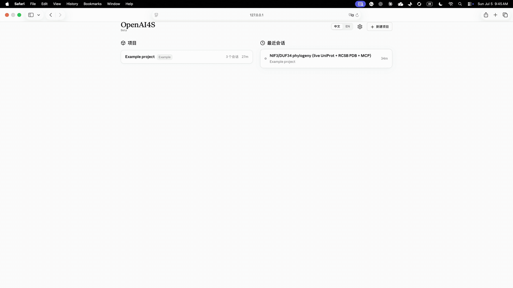
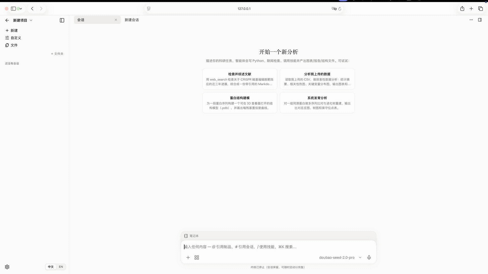
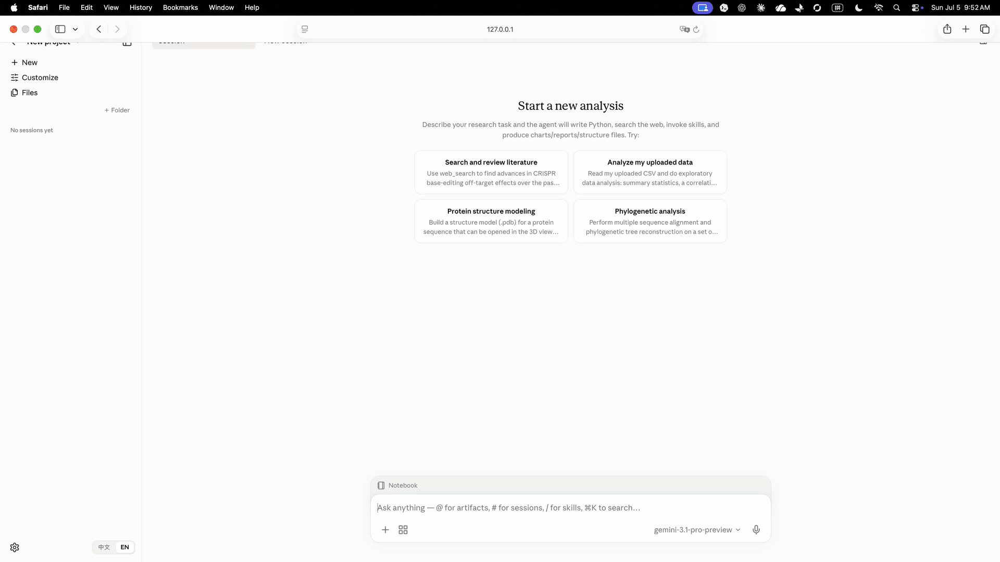
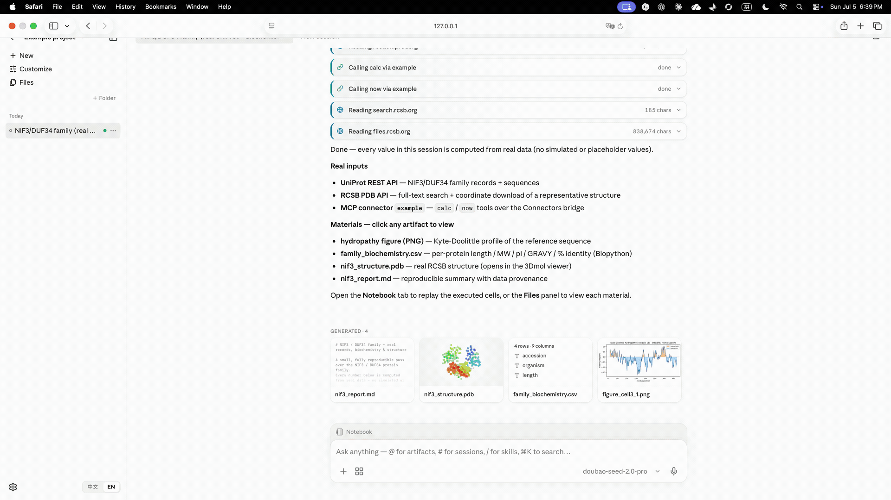
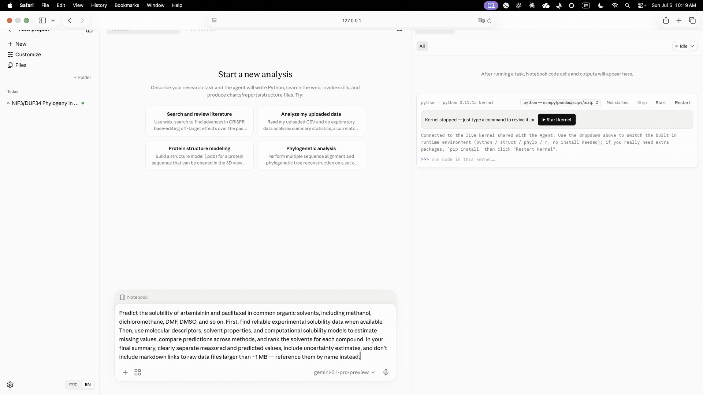
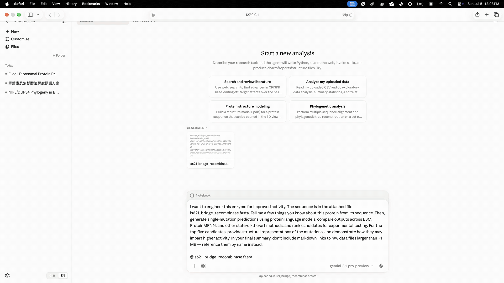

<div align="center">


### 面向科学家的开源 AI

## 💸 9.9 元豆包 API 复刻 Claude Science

**一个开源的混合式科研智能体。**<br/>
<sub>原生 JSON 工具负责编排与权限；持久 Python/R 内核负责科学执行。</sub>

**由北京大学—元空AI联合实验室推出。**<br/>
<sub>Launched by the Peking University–YuanKong Intelligence AI Joint Research Laboratory.</sub>

<p>
  <a href="LICENSE"></a>
  
  
  
  
</p>
<p>
  <a href="https://github.com/PKU-YuanGroup/OpenAI4S/stargazers"></a>
  <a href="https://github.com/PKU-YuanGroup/OpenAI4S/network/members"></a>
  <a href="https://github.com/PKU-YuanGroup/OpenAI4S/issues"></a>
  <a href="https://github.com/PKU-YuanGroup/OpenAI4S/pulls"></a>
</p>

[English](README.md) · **简体中文**

</div>

---

> [!TIP]
> **为什么是 9.9 元?** 不需要昂贵的前沿模型 Key —— OpenAI4S 跑在**豆包**上,用的是 **火山方舟** 最便宜的**「Small」套餐:¥9.9 / 月**。在 UI 里把供应商选成 `ark`,你就用不到一杯咖啡的钱得到了一个 Claude Science 级的智能体。

<div align="center">

<br/>
<sub>火山方舟 · Agent Plan(个人版)—— 入门的 <b>Small</b> 套餐仅 <b>¥9.9 / 月</b>。</sub>
</div>

---

## 🧬 JSON 编排，Code-as-Action 科学执行

OpenAI4S 刻意保留两个动作平面。供应商原生 **JSON tool call** 处理确定性编排、权限、元数据、外部服务和人工审批；**Python/R Code-as-Action** 在持久内核中执行计算、探索、分析、仿真与长时任务。Python Cell 运行期间可以同步调用内核中的 `host` API；R 是独立的持久分析通道。

工具和代码并非二选一，它们各自承担适合的职责。纯工具或对话型任务可以通过 Engine 自有、严格结构化的 `finalize_response` 完成。科学 Python Cell 保留 `host.submit_output(...)` 契约，包括结构化 Artifact 与指标。`host.submit_output` 是唯一能从 Cell **内部**发出的完成信号；先执行过 Cell 后，后续单独且有效的 `finalize_response` 仍可关闭 Engine。

<table>
<tr><th></th><th>JSON 控制平面</th><th>Python/R 科学平面</th></tr>
<tr><td align="right"><b>适用场景</b></td><td>工作流、权限、元数据、服务</td><td>计算、分析、仿真</td></tr>
<tr><td align="right"><b>动作单元</b></td><td>一个有序原生工具批次</td><td><b>一个完整代码 Cell</b></td></tr>
<tr><td align="right"><b>组合方式</b></td><td>可审计 schema 与资源策略</td><td><code>for</code>、<code>if</code>、库；Python 还支持 Cell 中途 Host RPC</td></tr>
<tr><td align="right"><b>状态</b></td><td>追加式 Action Ledger</td><td>内核内存 + 版本化 Artifact</td></tr>
<tr><td align="right"><b>完成方式</b></td><td>Engine 自有 <code>finalize_response</code></td><td>Python：<code>host.submit_output(...)</code>；R：无 Cell 内完成信号</td></tr>
<tr><td align="right"><b>扩展方式</b></td><td>具名 <code>Tool</code> 子类</td><td>导入库或加载 Skill</td></tr>
<tr><td colspan="3">

```python
# ReAct 需约 14 次往返(read → … → filter → sort → plot)。   OpenAI4S:一个代码 cell。
hits   = [f for f in files if pattern in host.read_file(f)]
top3   = sorted(hits, key=os.path.getsize, reverse=True)[:3]
frames = [pd.read_csv(f) for f in top3]      # 10 万行的 DataFrame 留在内核里……
host.save_artifact(plot(frames))             # ……上下文里只留 "<DataFrame 100000×20>"
```

</td></tr>
</table>

---

## 📣 更新

- **`2026-09`** 🧭 **`v0.3.0` —— 新工作台，以及第一个 Windows 安装包** —— Preact/TypeScript 工作台取代 `app.js` 单体成为默认 UI，本次 release 也在 Linux tarball 之外首次发布 **Windows/WSL2 zip**。每个本地守护进程现在都要求访问令牌：`OPENAI4S_REQUIRE_TOKEN=0` 这个 loopback 豁免已被移除。交互式 HTML 报告运行在独立的沙箱源上；Notebook cell 保留自己产出的精确 Artifact 版本；长上下文压缩真正落地，并能在重启后恢复；委派的子代理继承父会话的环境，并留下持久、可导出的 cell 记录；Auto Mode 以原子方式准入预算，并会停下没有进展的运行。单细胞 RNA 分析 Skill 让总数达到 604。Apple Silicon 的 **macOS 镜像**是 ad-hoc 签名的预览版，未经公证。数据库 schema 从 27 升到 32，首次启动前请先阅读 **[从 0.2.x 升级](docs/upgrading_zh.md)**。
- **`2026-08-24`** 🚀 **`v0.2.0` —— 多平台发布** —— 一个 release，两个桌面安装包：Apple Silicon **`.dmg`** 与内嵌同一套 Python 与科学栈的可移动 **Linux `x86_64` tarball**（Windows/WSL2 zip 已构建、正在稳定化，将随后续版本发布）。底层新增：带 Guardian 审查边界的 **Auto Mode**、诚实的**完成证据对账**（崩溃的 cell 不再可能渲染成干净的成功）、**MCP Streamable HTTP** 传输（含火山引擎 DataPro 连接器与豆包联网搜索）、**Anthropic Messages SSE 流式**、锁定的 **561 个 bioSkills 配方集合**（共 603 个 Skill，可用 `npx` 装到任何地方）、工作台的轨迹账本视图、Docker/Kubernetes 部署、`openai4s --version`，以及让运行中的 R cell 在每个平台都能可靠中断的信号修复系列。
- **`2026-08-04`** 🔭 **`main` —— 通往 `v0.2.0` 的路上** —— **只读会话共享**（经出站 relay 隧道，`openai4s share` / `openai4s relay`）、**七个规范化的公共数据库连接器**（检索结果自带来源与时间）、带版本的 **`/api/v1`** 接口（keyset 分页、统一错误信封、可续传的 WebSocket 游标）、**环境即事务**（`openai4s env plan|apply|rollback`）、脱敏的 `doctor` / `diagnostics` 支持包、默认关闭且可撤销的遥测、逆合成规划 Skill，以及一套 **10 workflow / 20 case 的基准**——它跑在真实的 Store、内核与 dispatcher 上。Linux 与 Windows 桌面包在此构建并验证——Linux 包随上面的 `v0.2.0` 发布，Windows 包将随后续版本发布。
- **`2026-07-15`** 🍎 **`v0.1.0` —— macOS 应用** —— 一键、免工具链的 Apple Silicon `.dmg`，内嵌 Python 与完整默认内核科学栈（rdkit · scanpy · 单细胞栈），并支持 PyPI 安装（`pip install openai4s`）与自动化发布。**第一次用？→ [上手指南](docs/startup-guide.md)。**
- **`2026-07-06`** 🎉 **代码开源** —— 纯标准库 Code-as-Action 引擎、科研 Web 应用、24 个科学 Skill、BYOC 远程计算。

---

## 😮 亮点

- **🧬 混合动作引擎** —— 基于类的原生 JSON 工具负责编排，持久 Python/R 内核执行科学任务。CLI/Web 中的前台语言 slot 惰性启动；tool/finalize 路由本身不会启动它，但个别工具仍可管理专用 worker。
- **📒 Ledger-first 运行时** —— action group/event 和终止事实以追加方式记录；执行尝试、generation 生命周期、用量与 completion record 可持久和重建。
- **🐍 纯标准库核心** —— 引擎**和** Web 服务器都是纯标准库(`http.server` + 手写 WebSocket，无框架、无依赖)。LLM 客户端仅用 `urllib` 直接对接 OpenAI / Anthropic / Gemini。
- **🔌 一行切换多供应商** —— `ark`(doubao · glm · kimi · deepseek · minimax)加官方 `chatgpt · claude · gemini`,都由一个 `host.llm` 统一封装;在 UI 里即可切换。
- **🖥️ 科研工作台** —— 实时流式事件、版本化 Artifact、溯源、Action Timeline，以及**默认只读的 Notebook**。只有显式开启开发标志后，才能对共享 Python/R 内核输入多行代码。
- **🔐 分层本地执行防护** —— 严格子进程环境 allowlist、持久审批、与 generation 绑定的一次性 `host.bash` capability，以及 macOS Seatbelt/Linux bubblewrap 沙箱适配器；降级与 fail-closed 状态会显式呈现。
- **🔬 605 个内置 Skill** —— 44 份由 OpenAI4S 筛选维护的 GPU/模型科学、科研工作流与平台操作配方，加上固定版本、MIT 许可的 GPTomics/bioSkills 全部 561 份配方。Skill 是**代码配方**,不是 JSON schema；大型第三方集合按需搜索，在常驻 prompt 中只占一行。用户自撰的 Skill 只落在数据目录里，无法顶替内置 Skill 的信任等级。
- **☁️ BYOC 远程计算** —— 在 provider 已配置且可达时，可通过 `ssh:<alias>` 或内置 **NVIDIA NIM** 集成投送 GPU 作业。通用远程计算仍属 Prototype；`host.fold` 遵守严格的不伪造策略。
- **🔗 只读会话共享** —— 把一个会话发布成快照，拿到链接的人可以查看并导入自己的本地实例，全程经由**你自己运行**的 relay。守护进程从不监听公网端口，只向外拨号。记忆、权限状态与 Key 一律不外流，残留密钥会让发布 fail closed。→ [Web 共享](docs/webshare.md)
- **🔎 带来源的科学检索** —— 七个规范化的公共数据库连接器（UniProt · RCSB PDB · Ensembl · ChEMBL · PubChem · arXiv · OpenAlex）。检索到的记录自带来源与时间，但不带取回它的 API Key。
- **🧰 不止能跑，还能运维** —— 带版本的 `/api/v1`（keyset 分页、统一错误信封、correlation ID、可续传的 WebSocket 游标）、启动即要求本地凭据、脱敏的 `doctor` / `diagnostics` 支持包，以及默认关闭、一撤销就连同身份一起销毁的遥测。

---

## 📦 当前已交付的能力

当前代码树的能力地图——按平面列出已实现且可达的部分。

| 平面 | 已实现 |
|---|---|
| **控制与编排** | 基于类的原生 `Tool` · 追加式 Action Ledger · 带持久状态机的 plan/review · 会归档原始切片的上下文压缩 · 可中途叫停的并发子代理委派（fanout 48、depth 4）· 子代理无法自行放宽的 Specialist 白名单 · MCP 连接器 · 跨会话记忆 |
| **科学执行** | 持久的 Python **与** R 内核 · cell 执行中途的同步 `host` RPC · 对象级数据血缘 · 版本化 Artifact · 按内核 *generation* 记录的环境溯源（绝不借用守护进程的）· 后台执行 · 605 个 Skill（44 个精选维护 + 561 个固定版本 bioSkills）· 带 ABA 安全看门狗恢复的 FIFO 执行协调器 |
| **数据与检索** | 七个规范化公共数据库连接器（UniProt · RCSB PDB · Ensembl · ChEMBL · PubChem · arXiv · OpenAlex），记录自带来源与时间 · 覆盖其中三个的每日金丝雀 · 以 Agent Plan Key 授权的**豆包搜索 Custom 版**作为联网搜索主选 · Tavily 与免密钥搜索作为备用 · 托管的 DataPro 专业数据集检索 |
| **工作台** | 实时流式 · Action Timeline · 默认只读的 Notebook · 分支 fork/激活/revert · 带明确 Partial/Failed 状态的验证式恢复 · 锁定到所指版本的 `@file` 引用 · 2D 化学/基因组/序列/MSA/LaTeX 渲染器 · Markdown 与 `.ipynb` 导出 |
| **共享与可移植** | 经由你自己运行的 relay 的只读会话共享 · 隔离的可移植 Session 包 · 可选的、接到同一批内核上的 Jupyter KernelSpec 桥 |
| **运维、安全与发布** | `/api/v1` 与启动凭据 · Seatbelt/bubblewrap 沙箱适配器，降级与 fail-closed 状态显式呈现 · 无人值守时默认拒绝的持久审批 · 脱敏诊断 · 可撤销遥测 · 环境即事务 · 跑在真实 Store、内核与 dispatcher 上的 13 workflow/46 case 基准 · 公开前先验证产物的分阶段发布流水线 |

---

## 🎬 效果演示

<table>
<tr>
  <td width="50%"><b>Live API 工作流</b>:从 UniProt / RCSB 到 3D 结构和报告<br/></td>
  <td width="50%"><b>真实数据分析</b>:人胰岛素 INS 从 UniProt / RCSB 到可复现报告<br/></td>
</tr>
<tr>
  <td width="50%"><b>可视化 Artifact 编辑</b>:一句话把 confidence 阈值线抬到 75<br/></td>
  <td width="50%"><b>注释驱动图表编辑</b>:圈选区域并重绘图例配色<br/></td>
</tr>
<tr>
  <td width="50%"><b>计划模式科研分析</b>:青蒿素与紫杉醇溶解度预测<br/></td>
  <td width="50%"><b>蛋白质工程</b>:从序列到突变候选与结构解释<br/></td>
</tr>
</table>

---

## ⚡ 快速开始

```bash
git clone https://github.com/PKU-YuanGroup/OpenAI4S && cd OpenAI4S
./setup.sh     # 一次性:用 uv 创建环境
./start.sh     # 启动 Web UI(http://127.0.0.1:8760/)
```

`setup.sh` 用 **uv** 创建轻量控制面 `.venv`。如需完整的 Python + R 科学计算内核，请先安装 `micromamba`、`mamba` 或 `conda`，然后改用 `./setup.sh --with-kernel-envs`；已有环境可用 `./setup.sh --update-kernel-envs` 同步，且不会删除用户自行安装的包。`start.sh` 从环境中启动守护进程 + Web UI。启动无需 API Key —— **在 UI 里设置你的模型**(Customize → Models)。不启动 UI 跑单个任务:`uv run openai4s run "Compute the mean of [4,8,15,16,23,42] and submit it." -v`。

### macOS

> [!NOTE]
> **`v0.3.0` 附带的是 macOS 预览镜像，不是经过公证的镜像。** [v0.3.0 release 页面](https://github.com/PKU-YuanGroup/OpenAI4S/releases/tag/v0.3.0)上的 `OpenAI4S-0.3.0-macos-arm64.dmg` 仅支持 Apple Silicon，只做了 ad-hoc 签名、未经公证，所以第一次打开会被 Gatekeeper 拦下，处理步骤见[上手指南](docs/startup-guide.md#zh)。它是在发布流程之外构建并挂上去的：发布流程仍然只在 `.dmg` 经过 Developer ID 签名并完成公证时才上传它，而这些凭据目前还不存在。请使用这个固定页面，不要去最新 Release 里找，因为由发布流程产出的 release 不带镜像。Intel Mac，或不想运行未公证的应用时，请按下面的方式从 PyPI 安装，或使用上面的源码方式运行。如果之前用的是 v0.2.0 应用，请先阅读[从 0.2.x 升级](docs/upgrading_zh.md)：0.3.0 会升级数据目录，之后 0.2.0 不能再打开它。

请从 PyPI 安装到一个单独的虚拟环境中。Apple Silicon 与 Intel 都适用，需要 Python 3.10 或更新版本：

```bash
python3 -m venv ~/.venvs/openai4s && source ~/.venvs/openai4s/bin/activate
pip install "openai4s[science]"   # numpy · pandas · matplotlib · scikit-learn；需要 RDKit 时用 [science,chemistry]
openai4s serve                    # 启动守护进程，并用访问令牌打开工作台
```

数据写在 `~/.openai4s`。如果关掉了标签页，`openai4s url` 会再次打印带令牌的工作台 URL。R 内核需要一个 Conda 家族管理器（`micromamba`、`mamba` 或 `conda`），运行一次 `openai4s setup` 即可构建。

**首次运行 —— 先配模型，再配搜索。** 启动不带任何 Key，所以打开工作台之后：

1. **模型 API** —— 打开 **设置 ⚙ → 模型**，选协议（**ark 兼容协议** 对应豆包/GLM/Kimi/DeepSeek/MiniMax，或 **OpenAI** / **Anthropic 兼容协议**），粘贴 **API Key**，点 **新增**，再点 **设为当前**。最省钱：用火山方舟 ¥9.9/月 套餐的 `ark` 协议。
2. **搜索 API** *（可选、推荐）* —— 打开 **设置 ⚙ → 网络**，保持 **允许联网** 打开，把火山方舟 **Agent Plan Key** 粘进主选的**豆包搜索 Custom 版**卡片 → **保存凭证**。当前 Ark 模型已使用同一个 Key 时会自动复用。Tavily 与免密钥引擎仍作为备用；豆包专用健康检查不会把备用结果冒充豆包成功。

完整流程（安装 → 模型 → 搜索 → R 内核，以及 v0.2.0 预览镜像的 Gatekeeper 步骤）见：**[上手指南](docs/startup-guide.md#zh)**。

### Linux 应用（无需任何工具链）

> [!NOTE]
> Linux 安装包自 `v0.2.0` 起随每个 release 发布。Windows/WSL2 安装包自 `v0.3.0` 起发布，见下方 Windows 一节。更早的版本（`v0.1.0` 只带 macOS 镜像，`v0.2.0` 没有 Windows 包）请用上面的源码方式，或 `pip install openai4s`。

从 [最新 Release](https://github.com/PKU-YuanGroup/OpenAI4S/releases/latest) 下载 `OpenAI4S-<version>-linux-x86_64.tar.gz`，解包到任意位置直接运行。它内嵌自带的 Python 和预装科学栈，形态是一个可任意移动的目录：

```bash
tar -xzf OpenAI4S-*-linux-x86_64.tar.gz && cd OpenAI4S-*-linux-x86_64
./OpenAI4S          # 启动守护进程并打开 http://127.0.0.1:8760/
./install.sh        # 可选：把 `openai4s` 挂到 PATH，并注册应用菜单项
```

`install.sh` 是单用户级的、不需要 root——它只往 `$HOME` 里写；`./uninstall.sh` 会撤销这些改动，而 `~/.openai4s` 里的数据原样保留。建议装上 `bubblewrap`（`apt install bubblewrap`）让 cell 在沙箱里跑；没有它，默认的 `OPENAI4S_KERNEL_SANDBOX=auto` 会明确报告内核处于降级、未隔离状态。目前只发布 `x86_64`——arm64 Linux 请改用 PyPI 安装（`pip install openai4s`）。

### Windows（经由 WSL2）

下载 `OpenAI4S-<version>-windows-x86_64.zip`，解压后双击 `OpenAI4S.cmd`。首次运行会检查 WSL2 与可工作的 bubblewrap 0.8.0+ 沙箱，校验并安装随包 Linux payload，创建 `~/.local/bin/openai4s`，在 WSL 中启动守护进程，再用 Windows 浏览器打开带本地登录引导的安全 URL。应用本体不下载、不 `pip`、不装工具链；支持基线是 Ubuntu 24.04，启动器可配置国内 PyPI/Conda 镜像以及 WSL 可访问的代理。详见双语 [Windows/WSL2 指南](docs/windows-wsl.md)。

`v0.3.0` 是第一个发布这个安装包的版本，它的验收证据只覆盖 x86_64 上的 WSL2 和测试所用的 Ubuntu 24.04 发行版。[WSL2 一致性审计](docs/windows-wsl-parity-audit_zh.md)的最后一节（「修复验收记录 — 2026-09-07」）列出以下尚未验证的范围：

- 与 macOS 并排运行的一致性对比。对比中的 macOS 一侧来自源码阅读，并未实际运行。
- Windows on ARM、其他发行版，以及测试所用之外的 WSL 网络模式。
- 真实的供应商登录与推理。科学家流程是在 `OPENAI4S_NOTEBOOK_REPL=1` 下运行的，没有调用真实模型。
- Conda 环境准备，因此 Windows 上的 R 和其他命名环境都未经验证。R 只是作为测试前提装进了测试发行版。
- 全部领域配方。
- Windows 整机重启。只测试了重启 WSL 发行版，重启后能重新打开已保存的结果和已存的凭据。
- 冷启动性能。未经修改的完整浏览器 smoke 未通过：它超过了 20 秒的排队准入等待。并发负载下还出现过 WSL 服务连接超时。

**原生 Windows 不受支持，而且程序会直接拒绝在那里启动内核**，不是「先警告再照跑」——内核要拉起 POSIX 子进程，R 通道靠 shell 重定向走文件描述符 3 和 4，沙箱也没有 Windows 后端。WSL2 报告自己是 Linux，所以这个包跑的就是其他平台跑的同一个构建。如果你还没有 WSL2，启动器会停下来并给出那条确切的命令（管理员 PowerShell 里的 `wsl --install`）。详见：**[平台支持矩阵](docs/platforms.md)**。

### 🐳 Docker 与 Kubernetes

```bash
docker compose up -d --build          # http://127.0.0.1:8760/
docker compose exec openai4s openai4s url   # 带令牌、可直接打开的 URL
```

镜像由本仓库构建——Debian-slim 上的 CPython、wheel，以及 `science` extra——以非特权用户运行，只有一个挂在 `/data` 的卷。模型 key 用 `OPENAI4S_SECRET_LLM_LLM_API_KEY` 传入（在集群里就是一个 `Secret`）；镜像从环境读取凭据，不会把任何凭据形状的东西写到卷上。上集群则是 `kubectl apply -f deploy/kubernetes.yaml`：一个单副本 Deployment、一个 `ReadWriteOnce` 声明、一个 ClusterIP Service，探针打在 `/health` 上。

发布版镜像由 `publish-image.yml` 推送到 GitHub Packages，名为 `ghcr.io/pku-yuangroup/openai4s:<version>` 与 `:latest`（linux/amd64，自 `0.2.0` 起）；只有通过与每个 PR 相同的 `container_smoke.sh` 冒烟的镜像才会被推送。如果 `docker pull ghcr.io/pku-yuangroup/openai4s:latest` 要求你登录，请照上面的方式从检出的源码自行构建。公开它之前有两件事值得知道。在容器内绑定 `0.0.0.0` 会让访问令牌变成强制、同时关掉防 DNS 重绑定的 `Host` 白名单，于是挡在那些会执行代码的端点前面的就只剩令牌——这也是为什么 compose 只发布到 loopback、Service 只用 `ClusterIP`。另外，非特权容器无法给 bubblewrap 它所需要的命名空间，因此内核沙箱会可见地降级、由容器充当边界；那是一道更粗的边界，**[容器指南](docs/docker.md)** 写清楚了它不再覆盖什么。

### 🧩 把 Skills 带去任何地方（`npx`）

内置的 605 个 Skill 是配方——文字、代码，以及跑通它们所需的操作知识——其中没有任何东西是 OpenAI4S 专属的。npm 发布版 **`@pku-yuangroup/openai4s-skills@0.2.0`** 包含 **603 个 Skill：42 个精选 + 561 个固定版本 bioSkills**。以下命令固定安装该发布版本：

```bash
npx @pku-yuangroup/openai4s-skills@0.2.0 install --all                  # v0.2.0：42 个精选 Skill
npx @pku-yuangroup/openai4s-skills@0.2.0 install --collection bioskills # v0.2.0：561 个固定版生信配方
npx @pku-yuangroup/openai4s-skills@0.2.0 install alphafold2 boltz --target claude
npx @pku-yuangroup/openai4s-skills@0.2.0 list
npx @pku-yuangroup/openai4s-skills@0.2.0 uninstall --all
```

`npx @pku-yuangroup/openai4s-skills <command>` 使用 npm 上的最新发布版。若要使用当前仓库目录（605 个 Skill：44 个精选 + 561 个 bioSkills），可直接从 GitHub 运行；这种写法跟随默认分支：

```bash
npx github:PKU-YuanGroup/OpenAI4S install --all                  # 44 个精选 Skill
npx github:PKU-YuanGroup/OpenAI4S install --collection bioskills # 561 个固定版生信配方
```

两种来源使用相同的目标目录与覆盖规则。`--target claude` 写入 `~/.claude/skills`，`--target openai4s` 写入 `<data_dir>/user-skills`，`--dir <path>` 则写入你指定的任意位置；在往目标写任何东西之前，解析出的绝对路径都会先打印出来，而 `--dry-run` 到此为止、不再写入。每个已安装文件的 SHA-256 都会记进 Skills 旁边的清单，因此重装会拒绝覆盖你改过的、或不是它自己装的 Skill，卸载也只删它自己写下的文件。[`skills/`](skills/) 下每个精选 Skill 页面和集合根目录页面都带一节**安装**，命令里已经填好它自己的名字，所以你跳到哪一页，就可以在哪一页直接装。

如果你本来就在用本检出源码运行 OpenAI4S，那 605 个你已经全有了——同名时自带 Skill 优先于数据目录里的那个。这条命令是为反方向准备的。

---

## 📚 文档

中英双语的标准公开文档发布在 **[openai4s.org/docs](https://openai4s.org/docs/)**。文档源码与 issue 追踪位于 [Nobody-Zhang/openai4s-docs](https://github.com/Nobody-Zhang/openai4s-docs)；下表链接指向与源码仓库同步保留的代码就近文档。

| 文档 | 内容 |
|---|---|
| [**上手指南**](docs/startup-guide.md#zh) | macOS 全流程：安装 v0.3.0 预览镜像（Apple Silicon，ad-hoc 签名，含 Gatekeeper 步骤）或从 PyPI 安装、配置模型，以及用一个 Agent Plan Key 授权豆包搜索（Tavily/免密钥备用） |
| [**从 0.2.x 升级**](docs/upgrading_zh.md) | 在 schema 27 → 32 迁移之前备份数据库、为什么不支持退回 0.2.x，以及现在总是必需的访问令牌 |
| [**架构**](docs/architecture.md) | 混合动作路由、Action Ledger、`host` RPC 与惰性内核 |
| [**后端扩展指南**](docs/backend-extension-guide.md) | 新 Tool、Host service、repository 与 session 行为应归属的位置 |
| [**模型后端 bring-up**](docs/model-backend-bringup_zh.md) | 本地/远程 GPU 选择、checkpoint staging、真实推理 canary 准入与 connector 可移植性 |
| [**Skills**](docs/skills.md) | 43 个精选 Skill + 561 个固定版本 bioSkills + 如何自撰 |
| [**远程计算**](docs/compute.md) | BYOC GPU 作业、`host.fold`、自动预置 |
| [**科学连接器**](docs/science-connectors.md) | 七个公共数据库、各自的过滤条件与检索溯源 |
| [**Web 应用**](docs/webapp.md) | UI 功能、Action Timeline、只读 Notebook、Artifact 与实现状态 |
| [**Web 共享**](docs/webshare.md) | 只读会话共享、信任模型，以及如何运行自己的 relay |
| [**Jupyter 适配器**](docs/jupyter.md) | 可选的独立 Python/R KernelSpec、安装命令与兼容边界 |
| [**配置**](docs/configuration.md) | 模型供应商、环境变量、conda 环境、CLI |
| [**Docker / Kubernetes**](docs/docker.md) | 镜像、`compose.yaml`、集群清单，以及通配绑定究竟改变了什么 |
| [**平台支持**](docs/platforms.md) | 各操作系统的支持等级，以及原生 Windows 为何拒绝启动内核 |
| [**Windows / WSL2**](docs/windows-wsl.md) | Ubuntu 24.04 安装、沙箱自检、生命周期命令、国内镜像与 localhost 代理说明 |
| [**安全**](docs/security.md) | 纵深防御安全层与远程访问说明 |

---

## 🗺️ 路线图

### 已交付

- [x] 交付下一代工作台地基：分支激活与追加式 Revert/Undo 投影、带明确 Partial/Failed
  状态的验证式恢复、依赖级过期传播、持久化委派、隔离的可移植 Session 包、检查点化的
  plan/review/memory 状态，以及专用的 2D 化学/基因组/序列/MSA/LaTeX 渲染器。内存中的
  任意命名空间对象有意不做序列化；除非有安全配方能重建并验证它们，否则恢复始终是
  Partial，而且只有带可证明检查点映射的记录才提供 Fork，更早的历史会返回 409。
- [x] 经由你自己运行的出站 relay 实现只读会话共享：守护进程从不监听公网端口，残留密钥
  会让发布 fail closed。
- [x] 端到端科研工作流的**可执行**基准 —— 13 workflow / 46 case 跑在真实的 Store、内核
  管理器、host dispatcher 与计算管理器上；声明为 `failure` / `permission_denied` /
  `recovered` / `provenance` 的用例，一旦运行*成功*即判定失败。对外发布可横向比较的
  公开成绩仍在后面。
- [x] 环境即事务（`openai4s env plan|apply|rollback`）：generation 全新构建、验证通过后
  才被原子地指向，因此 Artifact 的溯源可以指名一个不可变的环境。

### 下一步

- [ ] **经过公证的 macOS 镜像与 arm64 安装包。** Linux 安装包自 `v0.2.0` 起发布，Windows/WSL2 安装包自 `v0.3.0` 起发布，但 macOS 镜像仍是 ad-hoc 签名的预览版，首次打开会被 Gatekeeper 拦下，Linux 与 Windows 也只发布 `x86_64`。有了 Developer ID 签名并经过公证的 `.dmg`，再加上 arm64 Linux 与 Windows on ARM 安装包，每个受支持的平台才都能免工具链安装。
- [ ] **NVIDIA 科学计算套件** —— 在现有 NVIDIA NIM 集成之外，把 **BioNeMo**（生物分子基础模型）与 **Parabricks**（GPU 加速的基因组学流水线）作为一等公民接入 Skill 与 BYOC 后端。
- [ ] 本地 GPU 模型服务,让结构/设计类 Skill 无需远程计算即可运行。
- [ ] SSH + NVIDIA NIM 之外的更多 BYOC 提供方(Modal / SLURM)。
- [ ] 在可用平台上加强 bubblewrap 之外的 Linux 隔离（例如 seccomp），并扩展打包后沙箱冒烟验证。
- [ ] DuckDuckGo 之外的免密钥 `web_search`(抗限流)。

---

## 💡 如何贡献

OpenAI4S 是一个让 **Code-as-Action** 范式保持开源的社区项目。

提 PR 前请先阅读 [`.github/CONTRIBUTING.md`](.github/CONTRIBUTING.md) —— 它定义了分支命名、PR 检查清单([`.github/pull_request_template.md`](.github/pull_request_template.md))、代码所有权([`.github/CODEOWNERS`](.github/CODEOWNERS))、评审与发布政策,以及离线测试政策。

### 开发环境配置

需要 **Python ≥ 3.10** 与 [**uv**](https://docs.astral.sh/uv/)。

```bash
git clone https://github.com/PKU-YuanGroup/OpenAI4S && cd OpenAI4S
./setup.sh                          # uv sync --locked --extra science + pre-commit hook
./setup.sh --with-kernel-envs       # 可选：完整 Python + R 内核环境
uv run pytest                       # 离线测试套件(LLM 被 mock)
uv run pre-commit run --all-files   # 全量格式化 + lint
```

代码风格由 **pre-commit** 强制执行 —— `black`、`isort`(`--profile black`)、`ruff`(版本锁定在 [`.pre-commit-config.yaml`](.pre-commit-config.yaml))。运行时依赖:核心**零依赖**(纯标准库);可选 `science` extra 锁定 `numpy>=1.24 · pandas>=2.0 · matplotlib>=3.7`。

### 欢迎的贡献

- **新 Skill** —— 在 `skills/` 下放一个 `SKILL.md`(+ 可选 `kernel.py`)—— 代码配方,而非 schema。
- **新供应商** —— 在 [`openai4s/llm/providers/`](openai4s/llm/providers/) 添加 wire adapter 并更新 provider definition/registry，或添加 BYOC 计算提供方。
- **引擎与 UI** —— 核心是纯标准库、可读性强;Web 应用无框架。

请保持核心零依赖,把可选科学库导入包在 `try/except ImportError` 里,并在提 PR 前确保 `uv run pytest` 与 `uv run pre-commit run --all-files` 通过。

---

## 👍 致谢与相关工作

- **Claude Science**(Anthropic)—— 作为闭源参考架构,OpenAI4S 以开源方式独立复现了它的 Code-as-Action 设计、持久内核、宿主 RPC 协议与安全层。
- **CodeAct** —— *「Executable Code Actions Elicit Better LLM Agents」* —— 以代码作为统一动作接口。
- **ReAct** —— *「Synergizing Reasoning and Acting in Language Models」* —— 本项目刻意背离的 `tool_use` 基线。
- 各科学 Skill 站在 **ColabFold / AlphaFold、ESM、OpenFold、Boltz、Chai、ProteinMPNN、DiffDock、Evo2、Borzoi、scGPT、scVI-tools** 以及开放数据服务(NCBI、UniProt、RCSB PDB、EBI、OpenAlex、Crossref)之上。

---

## 🔒 许可证

以 **MIT License** 发布 —— 见 [`LICENSE`](LICENSE)。

---

## ✏️ 引用

```bibtex
@misc{zhang2026openai4scodeactionscience,
      title={OpenAI4S: Code as Action, Science as Sessions},
      author={Gongbo Zhang and Hao Li and Yu Wang and Mujie Lin and Liuzhenghao Lv and Yicheng Mao and Yimi Wang and Jun Zhu and Minhan Tang and Zhengxiang Jiang and Yusong Wang and Jiayu Yao and Kunpeng Ning and Dawei Pang and Yonghong Tian and OpenAI4S Community and Yuyang Liu and Li Yuan},
      year={2026},
      eprint={2609.15096},
      archivePrefix={arXiv},
      primaryClass={cs.AI},
      url={https://arxiv.org/abs/2609.15096},
}
```

---

## 🤝 社区贡献者

<!-- CONTRIBUTORS:START -->
<a href="https://github.com/Nobody-Zhang" title="Nobody-Zhang"></a>
<a href="https://github.com/wangyu-sd" title="wangyu-sd"></a>
<a href="https://github.com/HowardLi1984" title="HowardLi1984"></a>
<a href="https://github.com/Linmj-Judy" title="Linmj-Judy"></a>
<a href="https://github.com/YuyangSunshine" title="YuyangSunshine"></a>
<a href="https://github.com/CyrusAuyeung" title="CyrusAuyeung"></a>
<a href="https://github.com/Lyu6PosHao" title="Lyu6PosHao"></a>
<a href="https://github.com/ClarenceYC" title="ClarenceYC"></a>
<a href="https://github.com/muzimu217" title="muzimu217"></a>
<a href="https://github.com/WenyuLiang" title="WenyuLiang"></a>
<a href="https://github.com/Grace-xyx" title="Grace-xyx"></a>
<a href="https://github.com/Devin-jun" title="Devin-jun"></a>
<a href="https://github.com/ChampionZhong" title="ChampionZhong"></a>
<a href="https://github.com/cursoragent" title="cursoragent"></a>
<a href="https://github.com/yusowa0716" title="yusowa0716"></a>
<a href="https://github.com/riiiiiiin" title="riiiiiiin"></a>
<a href="https://github.com/jiangzx25" title="jiangzx25"></a>
<a href="https://github.com/stau-7001" title="stau-7001"></a>
<a href="https://github.com/EQSTLab" title="EQSTLab"></a>
<a href="https://github.com/difficulttopickaname" title="difficulttopickaname"></a>
<a href="https://github.com/Pandasama2025" title="Pandasama2025"></a>
<!-- CONTRIBUTORS:END -->

<sub>由 <code>scripts/update_contributors.py</code> 每日根据 GitHub <a href="https://github.com/PKU-YuanGroup/OpenAI4S/graphs/contributors">贡献者图谱</a>与维护中的公开署名名单自动生成。</sub>

---

<div align="center">
<sub><b>OpenAI4S</b> · 代码即行动,内核即环境。 · <a href="README.md">English</a> · 友情链接 https://linux.do </sub>
</div>
