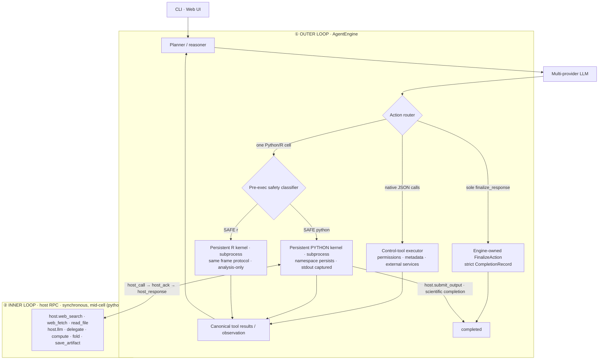

# Architecture — hybrid control plane and science runtime

OpenAI4S drives the model with one outer agent loop and two deliberately
different action channels:

- **Native JSON tool calls are the orchestration control plane.** They handle
  deterministic metadata operations, external services, permissions, and
  workflow control through provider-native structured calls.
- **Python/R Code-as-Action is the scientific execution plane.** Real
  computation runs in persistent language kernels. Python may synchronously
  call back into host services while a Cell is still executing; R remains an
  independent analysis channel without mid-Cell Host RPC.

The channels never compete in one step: structured calls take priority;
otherwise exactly one complete Python/R cell may run. A sole, valid
`finalize_response` call is routed as an Engine-owned `FinalizeAction`; it may
close a tool-only response or a run that executed Cells earlier. A Python Cell
can instead complete from inside the kernel with `host.submit_output(...)`.
Ordinary prose, a normal tool result, an R Cell, cancellation, or maximum-turn
stop is not completion.



- **① Outer loop** — [`agent/engine.py`](../openai4s/agent/engine.py)
  owns the provider-neutral state machine. [`agent/actions.py`](../openai4s/agent/actions.py)
  chooses a native tool batch, Engine-owned `FinalizeAction`, one Python/R
  cell, or no action.
  [`agent/runtime.py`](../openai4s/agent/runtime.py) connects the engine to the
  local LLM client, compaction, kernels, dispatcher, and CLI transcript;
  [`server/agent_run.py`](../openai4s/server/agent_run.py) projects the same
  engine events and actions onto persistent Web sessions and WebSocket events.
- **② Inner loop** — *within a single cell*, agent code can call `host.llm(...)` / `host.delegate(...)` / `host.compute(...)` any number of times. Each is a synchronous `host_call → host_ack → host_response` RPC on a channel **separate from stdout capture**, so the cell blocks, the host services the call mid-execution, and the cell resumes. **This inner RPC loop does not exist in a `tool_use` architecture** — there, actions are atomic and never call back into the host mid-execution.

`AgentEngine` imports no concrete kernel, dispatcher, store, or server. Those
are ports assembled by entry-point adapters. The Engine is ledger-first: an
append-only action group is opened before execution, tool results and Cell
attempt milestones close it canonically, and terminal state is appended rather
than inferred from the UI transcript. This keeps terminal states, history
ordering, provider replay, and action priority testable without starting
infrastructure.
For Web sessions, tool/cell-only replies receive a deterministic public action
notice that never exposes hidden reasoning or raw arguments. On successful
submission, the Gateway projects the structured output, completion bullets,
and actual Artifact-version delta into the final assistant message before the
terminal frame event; a provider cannot leave the user with an empty reply.

## The `host` singleton

Inside the Python science kernel, audited Host capabilities are exposed through
the in-kernel `host` singleton
([`openai4s/sdk/host.py`](../openai4s/sdk/host.py)):

```python
host.web_search(...)   host.web_fetch(...)                           # networked tools
host.bash(...)          # shell — runs INSIDE the kernel process, never on the host
host.read_file / write_file / edit_file / grep / glob / list_dir     # filesystem (workspace-jailed)
host.llm(...)          host.delegate(...)    host.collect(...)       # models & sub-agents
host.compute.create(...).submit_job(...)   host.fold(...)            # remote GPU (BYOC) + folding
host.save_artifact(...) host.artifacts(...) host.view_image(...)     # versioned artifacts
host.skills.*  host.env.use(...)  host.mcp.call(...)  host.query(...) # skills, envs, MCP, read-only SQL
host.submit_output(...)                         # scientific-cell completion
```

## Key design points

- **Lazy persistent namespaces** — a Tool/Finalize-only CLI run or Web session
  does not spawn Python or R; the first Cell starts only its selected language,
  whose namespace then persists across Cells until stop, restart, crash, idle
  release, or the end of a one-shot CLI run.
- **Append-only Action Ledger** — provider declarations, canonical tool
  results, and terminal events are append-only. Execution attempts, usage, and
  kernel generations keep durable lifecycle records that may update in place;
  all remain independent of chat and Notebook projections.
- **stdout/stderr captured** so `print` never corrupts the protocol wire; **per-cell linecache tags** give accurate `error_lineno`.
- **Synchronous host RPC mid-execution** — `host.llm(...)` blocks the cell, the host services it, the cell resumes.
- **`getrusage`-based accounting** (wall / cpu / peak_rss) per cell.
- **Bounded-depth delegation** — `host.delegate(...)` spawns concurrent sub-agents running the same loop (fanout cap 48, session cap 1000); children at `MAX_DEPTH` (4) become leaves that cannot re-delegate.
- **Context compaction** — older turns are summarized past a token threshold; raw slices archived to disk.
- **One scientific writer per session** — a FIFO execution coordinator exposes
  an exact owner, queue positions, and scoped cancellation; interrupts target an
  execution ID, owner, and frozen kernel lease rather than a session-global PID.

The engine is **pure Python stdlib**: the kernel is a subprocess speaking a hardened JSON-per-line protocol, the LLM client speaks OpenAI / Anthropic / Gemini wires over `urllib`, and the daemon is `http.server` + a hand-rolled WebSocket — no framework, no third-party dependency in the core.

At spawn, each worker environment is rebuilt from a strict allowlist rather
than copied from the daemon, so provider/API/cloud secrets and loader injection
variables do not cross into Python, R, or their subprocesses. A pure-stdlib OS
sandbox adapter wraps kernels with Seatbelt on macOS or bubblewrap on Linux,
write-confines them to workspace/private temp, and blocks raw network by
default. `auto` mode degrades visibly if its real self-test fails;
`OPENAI4S_KERNEL_SANDBOX=enforce` fails closed. Durable approval and the
generation-bound one-shot `host.bash` capability are separate policy layers;
see [Security](security.md).

Durable approval preserves the decision, not a Python call stack. A live
decision resumes the exact blocked gate. After daemon restart, the surviving
request is surfaced directly from SQLite; approval records an argument-free
`permission_resolution` Action Ledger marker, states that the old operation
did not execute, and requires an explicit fresh continuation/replan. A
restart-only `once` grant is exact to conversation/tool/target, expires after
15 minutes, and is atomically consumed only by a matching fresh `ask` action.
Stored approval payloads are never replayed as execution arguments.

## Native JSON control tools

[`openai4s/tools/`](../openai4s/tools) defines every deterministic control
operation as a named `Tool` class, following the CoreCoder-style explicit
catalogue. Each class keeps its public name, schema, safety policy, and real
`execute()` behaviour together in the corresponding file. `TOOL_TYPES` is the
single ordered composition root; the LLM adapters translate its instances to
OpenAI Chat, OpenAI Responses, Anthropic, or Gemini wire formats. Provider
responses normalize to one lossless tool-call type containing the local ID,
wire ID, raw arguments, parsed arguments, parse error, and opaque provider
metadata.

The control executor routes each valid call through the same `HostDispatcher`
as in-kernel `host.*`, so permissions, egress, injection screening, activity
events, and audit logging remain shared. It writes one canonical `role=tool`
history item for every call, including parse errors and calls rejected by the
per-turn limit. The assistant declaration plus all of its tool results remain
an atomic group during context compaction.

A leading lane of class-declared read-only calls may run in bounded parallel
waves when their resource keys do not conflict. The first mutating or unknown
call is a barrier, later calls stay sequential, and results are written back in
the provider's original order. Parallel completion order therefore never
changes the canonical history group.

There is deliberately no registered shell tool and no registered
`submit_output` tool. `finalize_response` is also not a registry `Tool`: its
closed schema and execution live in `agent/finalize.py`, so plugins cannot
replace the Engine's terminal contract. Shell runs only inside the Python
kernel, and real scientific work continues through persistent Python/R cells.
The old fenced `tool`-block parser remains a
silent compatibility path for saved prompts and older clients, but it is no
longer advertised to the refactored agent.

Native `Tool` classes that declare `writes_files=True` are wrapped by the Web
adapter in a per-call workspace transaction. Every write/edit is diffed and
registered as a versioned Artifact immediately, including repeated edits to
the same path. This wrapper exists at the model control-tool boundary—not in
`HostDispatcher`—so an in-kernel `host.write_file()` is still captured exactly
once by its scientific Cell transaction and retains Cell provenance.

`HostDispatcher` is the shared orchestration envelope, not the implementation
home for every capability. It retains Host-RPC argument decoding, permissions
and human approval, audit/replay recording, injection screening, and activity events,
then calls the selected class with a `ControlToolContext`. File tools are typed
against the workspace path port; environment tools are typed against the
active-runtime hooks. This is a maintainable API boundary for trusted built-in
code, not an in-process security sandbox. [`host/files.py`](../openai4s/host/files.py)
owns path confinement and late-bound session workspace selection, while
read/write/edit/glob/grep/list behaviour stays in the corresponding tool
classes.

To add a built-in control tool, define one `Tool` subclass with `execute()` and
add its type to `TOOL_TYPES`; plugins may call `register_tool()` during
application bootstrap with a new, non-conflicting host method. The dispatcher
resolves it generically, so no new `_m_*` branch is required. New tools require
permission by default and may declare their permission target, direct
secret-path argument, and untrusted-output screening policy on the class.
Network tools must enable result screening before registration succeeds.
Model-originated calls use `Tool.invoke()` and must never call `execute()`
directly, so class extensibility cannot bypass the shared policy envelope.
Runtime hot-unload is intentionally unsupported.

## Backend ownership

The public compatibility files are composition boundaries, not catch-all
implementation files. New behaviour goes to the owning class below:

| Boundary | Owns | Implementations |
|---|---|---|
| `agent/` | the single provider-neutral outer loop and action routing | `AgentEngine`, actions, ports, local/Web adapters |
| `tools/` | JSON control-plane schema, policy, and behaviour | one named `Tool` subclass per capability; `TOOL_TYPES` is the only built-in instantiation point |
| `host_dispatch.py` | permission, approval, audit/replay, injection screening, and RPC routing | thin `_m_*` compatibility adapters |
| `host/` | host capability behaviour | LLM, files, completion, data/lineage, delegation, progress, skills, MCP, endpoints, credentials, remote capability/science services |
| `sdk/` | worker-facing `host.*` API | compatible host facade plus the independent compute namespace/job handles |
| `store.py` | one SQLite connection, schema, migrations, query guard, and public facade | forwards domain operations without duplicating SQL |
| `storage/` | persistence behaviour and transaction boundaries | frame/artifact plus Action Ledger, attempts, kernel generations, approvals, capability state, snapshots/branches, recovery, metadata/settings, plan/review, connector, and memory repositories |
| `server/` | persistent Web-session operations | execution coordinator, Cell/artifact transactions, Timeline, session domain/checkpoints/recovery/export/renderers, plan/review/skills/title; `gateway.py` exposes the currently wired subset over stdlib HTTP/WebSocket |

### Schema versioning

The database carries its version in `PRAGMA user_version`, with an auditable
record in `schema_migrations(version, name, checksum, applied_at)`; read both via
`Store.schema_state()`. Migrations live in
[`storage/migrations.py`](../openai4s/storage/migrations.py) and run inside one
explicit transaction, so **a database is either fully at version N or still fully
at version N-1** — an interrupted upgrade leaves no in-between state, and
re-running is safe. An upgrade integrity-checks first, backs up the file with
SQLite's backup API (kept on failure, removed on success), and refuses to migrate
a database that is already damaged.

Version 1 is the legacy baseline: the historical catch-up pass that used to
re-probe every table on *every* open. Retrofitting a version onto databases that
never had one works because that pass is idempotent by predicate — it adds only
absent columns and every backfill is guarded by a `WHERE` selecting only rows
that still need it. So it converges once, gets stamped, and is never re-derived
again. To add a migration: write the step, register it in `Store._migrate`'s map
under the next number, and bump `SCHEMA_VERSION`. Steps must not commit.

Two PRAGMAs are deliberately left alone, documented in `Store._apply_pragmas` so
the reasoning is not lost: `journal_mode` stays on the rollback journal (WAL is
the usual answer to the real multi-process access here — `openai4s run` and
`openai4s init` open the database from their own process — but measurement showed
no reader blocking to fix, and changing a live database's on-disk format on
folklore is a bad trade), and `synchronous` stays FULL because this database holds
an audit ledger. `foreign_keys` is ON, which is a no-op today: the schema declares
no `REFERENCES` at all, so the pragma only ensures a future constraint would
actually bite rather than read as documentation.

Repositories share the `Store` connection and `RLock`; services use narrow
ports or late-bound providers for replaceable session state. Compatibility
facades keep existing imports, SDK calls, REST/WS payloads, and saved databases
working while making each algorithm directly testable. See the
[backend extension guide](backend-extension-guide.md) for the required path for
new tools, host capabilities, persistence, and Web-session behaviour.

Store and Skill lifetimes are explicit. `Store.close()` is idempotent and
removes only itself from the process cache; a later `get_store()` for the same
database path creates a fresh connection owner. Long-lived default
`SkillLoader` instances therefore resolve capability repositories through the
current Store generation rather than retaining a closed repository. Bundled
Skills stay under `skills/` and win collisions; all Host/Web-authored documents
are confined to `<data_dir>/user-skills`. Host authoring preserves the
`draft → personal` lifecycle, while Web Customize documents retain `user`
origin and cannot claim a trusted bundled origin.

## Session kernel ownership

Each Web session owns one [`KernelSupervisor`](../openai4s/kernel/supervisor.py)
with independent, lazy Python and R slots. The supervisor never executes code
and never reads a protocol frame: each `Kernel` remains the sole synchronous
reader for its worker. It only owns lifecycle identity, active-environment keys,
manual-stop state, a session-monotonic ordinal, and a durable UUID generation
identity.

Lifecycle replacement is build-first. A new worker and its dispatcher must be
live before the session publishes them and shuts down the old pair, so a failed
environment switch leaves the usable runtime intact. Every user turn, Notebook
cell, lifecycle operation, and recovery operation holds an exact FIFO execution
ticket. Stop/cancel targets that ticket's owner and frozen lease; cancelling a
queued writer never interrupts the current writer. The watchdog freezes a
`KernelLease` and uses identity-checked kill/restart/abandon operations,
preventing a stale helper from
damaging a newer worker. Python sidecar bootstrap runs once per new generation,
outside the supervisor lock; R never runs Python bootstrap.

Watchdog policy lives one layer higher in
[`execution/watchdog.py`](../openai4s/execution/watchdog.py). It is a pure,
protocol-neutral boundary: timeout budget, permission-pause accounting, exact
interrupt, hard recovery, and bootstrap callback are inputs; WebSocket events,
SQLite logging, artifacts, and `host.submit_output()` are deliberately absent.
Finishing a watched Cell only yields an observation. Completion emitted from
inside that Cell is recognized only through the signal set by
`host.submit_output()`; the separate Engine-owned `FinalizeAction` never enters
the watchdog or starts a kernel and may be accepted on a later model step.

[`server/cell_run.py`](../openai4s/server/cell_run.py) owns the Web cell
transaction: allocate identity, prepare the language runtime, emit the existing
Notebook stream, apply the safety gate, execute through the watchdog, capture
figures/files, and finally append the execution log. Its request/result values
live in [`execution/models.py`](../openai4s/execution/models.py). This ordering is
intentional: even when `host.submit_output()` fires mid-cell, artifact capture
and logging finish before control returns to `AgentEngine`, which then observes
the completion signal. The transaction-allocated cell ID is passed into the
kernel execute frame, so worker provenance, captured artifacts, and the
execution log share one identity; background and system cells that are outside
this transaction continue to receive independent kernel-generated IDs.
The direct protocol-only `host.submit_output(...)` Cell still executes through
this complete transaction and remains in the raw audit log. It is not a
scientific analysis step, so its live source is suppressed and the Notebook
projection filters it out. A Cell that computes, reads, writes, or prints in
addition to submitting remains visible.

Every allocated Python/R Cell transaction also receives a positive,
session-monotonic `state_revision`. The current implementation deliberately
shares the durable Cell ordinal, while naming it separately in storage and on
the wire so a display index is not confused with a recoverable object snapshot.
The revision is persisted on the execution attempt before language preparation;
successful, refused, interrupted, unavailable-runtime, and worker-failure rows
retain the same revision in the execution log. Live
`notebook_cell_start`/`notebook_cell_finished` events and reopened Notebook
entries carry that revision plus the exact worker `generation_id`. Reopened
generation identity is joined from the immutable execution-attempt association,
never inferred from `kernel_id` text. An older revision may therefore be shown
as stale relative to the current session cursor, but this does **not** claim its
Python/R variables can be inspected or restored.

[`server/artifacts.py`](../openai4s/server/artifacts.py) owns the durable
workspace side of that transaction: deliverable diffing, Python figure export,
one environment/provenance snapshot per producing cell, version registration,
immutable byte snapshots, and restore. Kernel system execution, remote
provenance draining, event transport, and HTTP serialization remain injected
Gateway ports, so the manager has no dependency on `SessionRunner`,
`HostDispatcher`, or `WSHub`.

Artifact ownership separates three identifiers: `frame_id` is the actual
producer (including a delegated child), `root_frame_id` is the session and
artifact-collection boundary, and `project_id` is inherited from that root.
The Store resolves this scope from the frame tree for every write; Web session
state uses the same resolver. Additive startup repair corrects historical child
frames/artifacts that were accidentally assigned to `default` or to a child as
their collection root, while unframed legacy uploads keep their old scope.

Object-level file lineage starts inside the Python worker, where the real
execution cwd is known. [`kernel/provenance.py`](../openai4s/kernel/provenance.py)
normalizes reader/writer arguments to an absolute identity path plus a
filename relative to the kernel's stable execution root before calling
`prov_resolve_path` or `prov_record`. A later `os.chdir()` changes where a
relative path resolves but not the artifact namespace root. The Web and CLI
runtime adapters also inject their workspace, interpreter, and environment into
independent background-kernel factories, so the host never guesses where a
relative path came from. Store lookup first uses the exact live path, then a
physical-path fallback for legacy relative rows and symlink aliases.

## The R execution channel

An R Cell runs on a **persistent R kernel** — `kernel/r_worker.R` spawned by [`kernel/r_kernel.py`](../openai4s/kernel/r_kernel.py) through the *same* manager as the python worker (`Kernel(argv=…)`), speaking the same `execute`/`response` frames with the same result contract (`stdout/stderr/error/interrupted/trace.error_lineno/usage`). The R interpreter resolves from the selected env's `Rscript` → the prebuilt `r` env → `PATH`; `host.env.use("r")` retargets the channel. Differences from the python kernel, by design: the R kernel is an **analysis kernel** — no `host` object, no mid-cell RPC, completion stays on the python control plane — and its plots are captured through the workspace diff (`ggsave()` into the working directory), not a figure device. The two namespaces are separate; cells exchange data through workspace files.

## The Notebook as a read-only execution trace

The web UI's right-hand Notebook is, by default, a **read-only scientific execution trace** of the kernel: it renders analysis cells with their stdout/stderr/artifacts, but hides a direct protocol-only `host.submit_output(...)` Cell. The raw execution record remains available for auditing. Arbitrary in-Notebook entry is gated behind `OPENAI4S_NOTEBOOK_REPL` (see [Security](security.md)); when explicitly enabled, the developer input is multiline, selects Python or R, and uses Shift+Enter to append a new Cell through the same execution queue. Executed source and older revisions remain immutable. Runtime segments in the trace are labeled by `kernel_id`: `python` for the default env, `python — struct` / `python — phylo` etc. when the agent switches conda env, so a single session's trace shows which environment each cell ran under.

While the model is still streaming its first Python/R fence, the Notebook shows
one transient, replace-in-place draft block. It is neither an execution attempt
nor history: it may change until the response closes, disappears when no valid
action is routed, and is replaced by the immutable server-identified Cell at
execution start. Incomplete fences never execute. Reconnect replay retains only
the newest draft revision plus the structured live-Cell lifecycle.

The selected conda env is **persisted per-session** in `frames.runtime_env` and used on the next lazy start. Each worker generation has a durable UUID, parent identity, bootstrap/environment manifests, state, and activity timestamps; an optional idle TTL never releases an active, approval-paused, recovery, or background session. Mind the persistence boundary: **workspace files persist** across a restart, but **in-memory Python/R variables do not** unless a verified recovery recipe rebuilds them.

## Optional Jupyter adapter

[`adapters/jupyter/`](../openai4s/adapters/jupyter) is a standalone ecosystem
adapter, not another core runtime. Its pure-stdlib layer describes, exports, and
installs standard `openai4s-python` / `openai4s-r` KernelSpecs. When one is
launched, the bridge lazily imports the optional `ipykernel`/ZeroMQ stack and
maps Jupyter execute/stream/error/interrupt/shutdown messages onto the existing
Python or R `Kernel` manager. The manager/worker JSON-line protocol is unchanged.

The adapter intentionally owns an independent namespace and has no
`HostDispatcher`: it does not attach to a Web session, expose Host RPC, capture
Gateway Artifacts, or participate in the Action Ledger/recovery pipeline. Core
imports and daemon startup still succeed when Jupyter is absent. See
[Optional Jupyter compatibility](jupyter.md).

## Checkpoint, recovery, export, and renderer status

The domain foundations and their primary product controls are implemented;
remaining limits are stated explicitly rather than presented as recovered
state:

| Capability | Implemented now | Still partial / not wired |
|---|---|---|
| Action Timeline | Append-only ledger, redacted/field-bounded projection, maximum-500 latest windows with older/newer cursors, `GET /frames/{id}/action-timeline`, safe Timeline cards with runtime/queue status, and an explicit UI control that pages backward from the first loaded ordinal. | Incremental WS action replay remains limited; the browser keeps a bounded recent window while preserving the latest actions. |
| Checkpoint / branch / revert | SQLite repositories, workspace content-addressed snapshots, immutable checkpoints, conflict-aware revert preview/apply/undo, visible branch activation, and one shared append-only history projector for provider messages, UI conversation, and Notebook Cells. New checkpoints atomically capture full plan/review/memory state; activation restores that state together with workspace, Artifact heads, environment and policy. Every durable Cell and user-message boundary best-effort captures an internal cursor checkpoint. | Old checkpoints without the structured state sidecar remain usable but activation reports `Partial` and preserves live plan/review/memory instead of guessing. Assistant-message fork and a dedicated message-level fork control are not yet wired. |
| Kernel recovery | Python and R generations persist versioned bootstrap manifests. The exact worker records interpreter/runtime, prefix, complete installed-package manifest, locale, SDK/provenance/Host protocol versions and a content hash. Successfully imported Python Skill sidecars are captured from executed bytes, hash-checked, ordered, and reloaded from the frozen manifest. `POST /frames/{id}/recovery/actions/{restore\|retry\|restart_fresh}` performs exact FIFO admission, build-first candidate restore, CAS/Artifact validation, replay-safety checks, state validation, and atomic publish. | A checkpoint with prior Cells still defaults to `namespace_coverage=unverified`; without an explicit replay/symbol coverage recipe it ends Partial. Arbitrary namespace objects are never serialized or claimed as restored. |
| Notebook / Jupyter compatibility | Deterministic Python and R `.ipynb` generation, a stable ZIP bundle, visible download, pure-stdlib KernelSpec export/install, and an optional standalone `ipykernel` wire bridge over the unchanged Python/R manager protocol. | Separate single-notebook selectors remain API-only. The Jupyter bridge has an independent namespace and does not expose Web-session sharing, Host RPC, Gateway artifacts/ledger/recovery, rich display/comm, debugger, completion, inspection, or history. |
| Scientific renderers | Safe catalog/selection routes bind image/table/3D molecule/2D chemistry/genome/sequence/MSA/PDF/LaTeX/text/download descriptors to immutable Artifact versions; dedicated chemistry, genome, sequence/MSA and LaTeX components consume those descriptors in the UI. | Renderer availability remains data- and browser-dependent; unsupported kinds fall back to a safe metadata/download view and never execute Artifact content. |

These boundaries are intentionally usable independently: completing Gateway
and UI wiring should add adapters, not move checkpoint, recovery, export, or
renderer algorithms back into `gateway.py`.
