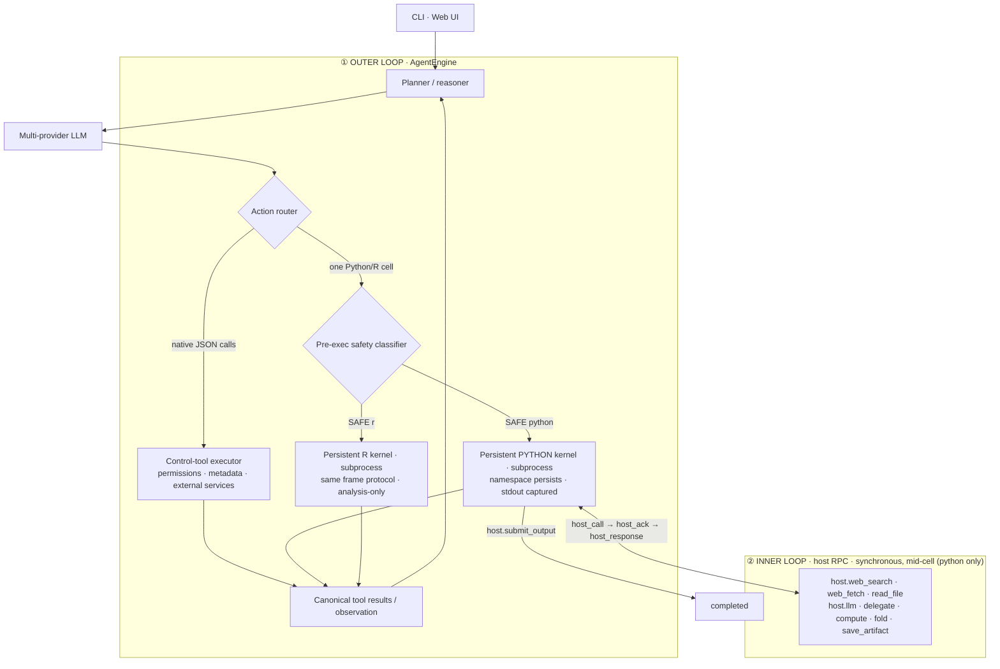

# Architecture — hybrid control plane and science runtime

OpenAI4S drives the model with one outer agent loop and two deliberately
different action channels:

- **Native JSON tool calls are the orchestration control plane.** They handle
  deterministic metadata operations, external services, permissions, and
  workflow control through provider-native structured calls.
- **Python/R Code-as-Action is the scientific execution plane.** Real
  computation runs in persistent language kernels and may synchronously call
  back into host services while a cell is still executing.

The channels never compete in one step: structured tool calls take priority;
otherwise exactly one complete Python/R cell may run. A task succeeds only
when a Python cell calls `host.submit_output(...)`. A tool result, prose reply,
R cell, cancellation, or maximum-turn stop is not completion.



- **① Outer loop** — [`agent/engine.py`](../openai4s/agent/engine.py)
  owns the provider-neutral state machine. [`agent/actions.py`](../openai4s/agent/actions.py)
  chooses a native tool batch, one Python/R cell, or no action.
  [`agent/runtime.py`](../openai4s/agent/runtime.py) connects the engine to the
  local LLM client, compaction, kernels, dispatcher, and CLI transcript;
  [`server/agent_run.py`](../openai4s/server/agent_run.py) projects the same
  engine events and actions onto persistent Web sessions and WebSocket events.
- **② Inner loop** — *within a single cell*, agent code can call `host.llm(...)` / `host.delegate(...)` / `host.compute(...)` any number of times. Each is a synchronous `host_call → host_ack → host_response` RPC on a channel **separate from stdout capture**, so the cell blocks, the host services the call mid-execution, and the cell resumes. **This inner RPC loop does not exist in a `tool_use` architecture** — there, actions are atomic and never call back into the host mid-execution.

`AgentEngine` imports no concrete kernel, dispatcher, store, or server. Those
are ports assembled by entry-point adapters. This keeps terminal states,
history ordering, and action priority testable without starting infrastructure.

## The `host` singleton

Everything the agent can do is a call on the in-kernel `host` singleton ([`openai4s/sdk/host.py`](../openai4s/sdk/host.py)):

```python
host.web_search(...)   host.web_fetch(...)                           # networked tools
host.bash(...)          # shell — runs INSIDE the kernel process, never on the host
host.read_file / write_file / edit_file / grep / glob / list_dir     # filesystem (workspace-jailed)
host.llm(...)          host.delegate(...)    host.collect(...)       # models & sub-agents
host.compute.create(...).submit_job(...)   host.fold(...)            # remote GPU (BYOC) + folding
host.save_artifact(...) host.artifacts(...) host.view_image(...)     # versioned artifacts
host.skills.*  host.env.use(...)  host.mcp.call(...)  host.query(...) # skills, envs, MCP, read-only SQL
host.submit_output(...)                                              # the only way to end a task
```

## Key design points

- **Persistent namespace** across cells (real kernel semantics); big objects stay in kernel memory.
- **stdout/stderr captured** so `print` never corrupts the protocol wire; **per-cell linecache tags** give accurate `error_lineno`.
- **Synchronous host RPC mid-execution** — `host.llm(...)` blocks the cell, the host services it, the cell resumes.
- **`getrusage`-based accounting** (wall / cpu / peak_rss) per cell.
- **Bounded-depth delegation** — `host.delegate(...)` spawns concurrent sub-agents running the same loop (fanout cap 48, session cap 1000); children at `MAX_DEPTH` (4) become leaves that cannot re-delegate.
- **Context compaction** — older turns are summarized past a token threshold; raw slices archived to disk.

The engine is **pure Python stdlib**: the kernel is a subprocess speaking a hardened JSON-per-line protocol, the LLM client speaks OpenAI / Anthropic / Gemini wires over `urllib`, and the daemon is `http.server` + a hand-rolled WebSocket — no framework, no third-party dependency in the core.

## Native JSON control tools

[`openai4s/tools/`](../openai4s/tools) declares deterministic operations such
as list/read/glob/grep/web/env/edit/write once, then the LLM adapters translate
those declarations to OpenAI Chat, OpenAI Responses, Anthropic, or Gemini wire
formats. Provider responses normalize to one lossless tool-call type containing
the local ID, wire ID, raw arguments, parsed arguments, parse error, and opaque
provider metadata.

The control executor routes each valid call through the same `HostDispatcher`
as in-kernel `host.*`, so permissions, egress, injection screening, activity
events, and audit logging remain shared. It writes one canonical `role=tool`
history item for every call, including parse errors and calls rejected by the
per-turn limit. The assistant declaration plus all of its tool results remain
an atomic group during context compaction.

There is deliberately no native shell tool and no native `submit_output` tool.
Shell runs only inside the Python kernel, and real scientific work continues
through persistent Python/R cells. The old fenced ` ```tool ` parser remains a
silent compatibility path for saved prompts and older clients, but it is no
longer advertised to the refactored agent.

## Session kernel ownership

Each Web session owns one [`KernelSupervisor`](../openai4s/kernel/supervisor.py)
with independent, lazy Python and R slots. The supervisor never executes code
and never reads a protocol frame: each `Kernel` remains the sole synchronous
reader for its worker. It only owns lifecycle identity, active-environment keys,
manual-stop state, and a session-monotonic generation.

Lifecycle replacement is build-first. A new worker and its dispatcher must be
live before the session publishes them and shuts down the old pair, so a failed
environment switch leaves the usable runtime intact. Cell execution holds the
session `turn_lock`; stop first requests cancellation/interrupt, then crosses
that same lock before shutdown. The watchdog freezes a `KernelLease` and uses
identity-checked kill/restart/abandon operations, preventing a stale helper from
damaging a newer worker. Python sidecar bootstrap runs once per new generation,
outside the supervisor lock; R never runs Python bootstrap.

Watchdog policy lives one layer higher in
[`execution/watchdog.py`](../openai4s/execution/watchdog.py). It is a pure,
protocol-neutral boundary: timeout budget, permission-pause accounting, exact
interrupt, hard recovery, and bootstrap callback are inputs; WebSocket events,
SQLite logging, artifacts, and `host.submit_output()` are deliberately absent.
Finishing a watched cell only yields an observation—the `AgentEngine` still
recognizes task success exclusively through the completion signal set by
`host.submit_output()`.

## The R execution channel

An ` ```r ` cell runs on a **persistent R kernel** — `kernel/r_worker.R` spawned by [`kernel/r_kernel.py`](../openai4s/kernel/r_kernel.py) through the *same* manager as the python worker (`Kernel(argv=…)`), speaking the same `execute`/`response` frames with the same result contract (`stdout/stderr/error/interrupted/trace.error_lineno/usage`). The R interpreter resolves from the selected env's `Rscript` → the prebuilt `r` env → `PATH`; `host.env.use("r")` retargets the channel. Differences from the python kernel, by design: the R kernel is an **analysis kernel** — no `host` object, no mid-cell RPC, completion stays on the python control plane — and its plots are captured through the workspace diff (`ggsave()` into the working directory), not a figure device. The two namespaces are separate; cells exchange data through workspace files.

## The Notebook as a read-only execution trace

The web UI's right-hand Notebook is, by default, a **read-only execution trace** of the kernel: it renders each cell the agent ran with its stdout/stderr/artifacts, but there is **no user REPL** — arbitrary in-Notebook code entry is gated behind `OPENAI4S_NOTEBOOK_REPL` (see [Security](security.md)). Runtime segments in the trace are labeled by `kernel_id`: `python` for the default env, `python — struct` / `python — phylo` etc. when the agent switches conda env, so a single session's trace shows which environment each cell ran under.

The selected conda env is **persisted per-session** in `frames.runtime_env` and **re-seeded on resume** — reopening a session restarts the kernel in the same env. Mind the persistence boundary: **workspace files persist** across a restart, but **in-memory Python variables do not** — a resumed (or restarted) kernel starts with a fresh namespace.
