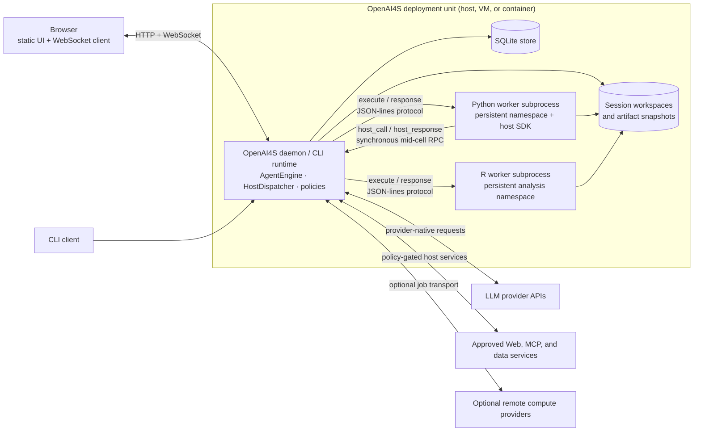

# Architecture overview

OpenAI4S has a pure-standard-library Python control-plane core in which
provider-native JSON tools handle orchestration and permissions, while lazy,
persistent Python and R subprocesses form the scientific execution plane. The
R protocol worker requires `jsonlite`, and scientific environments may contain
optional third-party packages.

This page remains the target of the historical `docs/architecture.md` link. It is an overview; the linked pages are the canonical detail for each runtime boundary.

## Status vocabulary

Architecture statements use these labels deliberately:

| Label | Meaning |
|---|---|
| **Contract** | A behavior contributors must preserve unless they intentionally migrate the protocol and its tests. |
| **Implemented** | Present in the current code and wired into the normal CLI or Web path. |
| **Best-effort** | Implemented, but failure is tolerated or the result depends on the operating system or external service. |
| **Partial** | A foundation or subset exists; callers must not infer an end-to-end guarantee beyond the stated subset. |

## Runtime at a glance

There is no required application container. The diagram's `OpenAI4S deployment unit` may be a host process, VM, or operator-managed container. Python and R remain separate child processes inside that unit; a container boundary is not a substitute for the kernel sandbox.

The model-facing outer loop chooses one action channel for each assistant reply:

1. an ordered batch of provider-native JSON tool calls;
2. a sole Engine-owned `finalize_response` action;
3. otherwise, the first complete Python or R fenced cell; or
4. no executable action, which produces a corrective observation rather than completion.

Within a Python cell, the injected `host` singleton may synchronously call the Host many times before that one cell returns. R uses the same manager-level execute/response contract but intentionally has no `host` object and no mid-cell Host RPC.

## Stable invariants

These are the shortest useful review checklist for changes to the runtime:

1. **One provider-neutral outer state machine.** CLI and Web compose [`AgentEngine`](https://github.com/PKU-YuanGroup/OpenAI4S/blob/main/openai4s/agent/engine.py); they do not implement competing routing loops.
2. **Native calls have routing priority.** If a reply includes provider-native calls, fenced code in the same reply does not execute. A `FinalizeAction` is selected only when `finalize_response` is the sole native call.
3. **One cell per model step.** With no native call, only the first complete top-level Python/R fence in document order runs. An incomplete fence never runs.
4. **Completion is explicit.** A validated sole `finalize_response` or Python `host.submit_output(...)` can complete a run. Prose, an ordinary tool result, a successful Python/R cell, cancellation, and turn exhaustion cannot.
5. **One protocol reader per worker.** The concrete `Kernel` owns its worker's synchronous frame loop. The supervisor never reads frames, and the Python worker permits only one in-flight Host RPC transaction.
6. **Workers are lazy and process-persistent, not magically recoverable.** Tool/finalize-only work starts no language worker. A live worker preserves its namespace; stopping, replacing, crashing, idle-releasing, or restarting it clears in-memory variables. Workspace and durable records are separate and survive.
7. **The Web control plane outlives language workers.** The session dispatcher, approvals, action history, messages, and delegation state are not owned by the Python or R process.
8. **Provider history is canonical and total.** Each declared native call receives exactly one canonical tool result, including malformed, refused, limited, cancelled, or interrupted calls. Results retain provider order.
9. **One admitted writer per Web session.** Agent turns, developer REPL cells, lifecycle operations, and recovery mutations use FIFO execution tickets. Cancellation targets an exact execution owner and, while a cell runs, a frozen kernel lease.
10. **Core imports stay dependency-free.** The engine, transport, kernel manager, and Web server use the Python standard library. Optional scientific packages must remain optional at core import sites.

## Reading paths

### For contributors

Read in this order:

1. [System context and boundaries](architecture/system-context.md) — processes, trust boundaries, durable state, and external systems.
2. [Action routing and completion](architecture/action-routing.md) — the exact outer-loop decision table and canonical history rules.
3. [Kernels and Host RPC](architecture/kernels-and-host-rpc.md) — worker lifetime, frame ownership, Python/R differences, and resource accounting.
4. [Web runtime](architecture/web-runtime.md) — FIFO admission, `turn_lock` coexistence, watchdog recovery, Cell transaction order, and user-visible projection.
5. [Backend extension guide](backend-extension-guide.md) — where a new Tool, Host capability, repository, or Web service belongs.

For changes to the kernel protocol, run `uv run pytest tests/test_kernel.py`. For routing changes, start with `tests/test_agent.py` and the action/ledger tests. Web, watchdog, streaming, or artifact changes also require a real-browser pass against `./start.sh`; unit tests cannot demonstrate WebSocket ordering or figure capture end to end.

### For deployment and operations

Read [System context and boundaries](architecture/system-context.md), [Web runtime](architecture/web-runtime.md), [Security](security.md), and [Configuration](configuration.md). Operationally important boundaries are:

- the daemon is loopback-bound by default and is not an untrusted multi-tenant service;
- `auto` sandbox mode can report a degraded boundary, while `enforce` fails closed;
- SQLite, workspaces, and artifact snapshots are durable; Python/R memory is not;
- a configured kernel idle TTL releases processes, not session history;
- the Web control plane can serve tool-only work without allocating a scientific worker.

## Current implementation status

| Area | Status | Scope |
|---|---|---|
| Outer action engine | **Contract / Implemented** | Shared by CLI and Web through ports and adapters. |
| Native tool and structured-finalization routing | **Contract / Implemented** | Native priority, sole-finalize rule, one canonical result per call. |
| Python persistent worker and mid-cell Host RPC | **Contract / Implemented** | Synchronous RPC over an isolated JSON-lines protocol. |
| R persistent worker | **Implemented** | Independent analysis namespace; no Host RPC or in-cell completion. |
| Web FIFO admission and exact cancellation | **Implemented** | Coexists with a compatibility `turn_lock`; exact ticket/lease identity is authoritative. |
| Resource measurements and automatic cleanup | **Best-effort** | Measurement semantics vary by language and OS; idle release is opt-in. |
| Namespace recovery after worker loss | **Partial** | Verified recipes may rebuild selected state; arbitrary Python/R objects are never claimed as restored. |
| Reconnect event replay | **Partial** | A bounded current-turn WebSocket window is replayed; durable completed views come from stored projections. |
