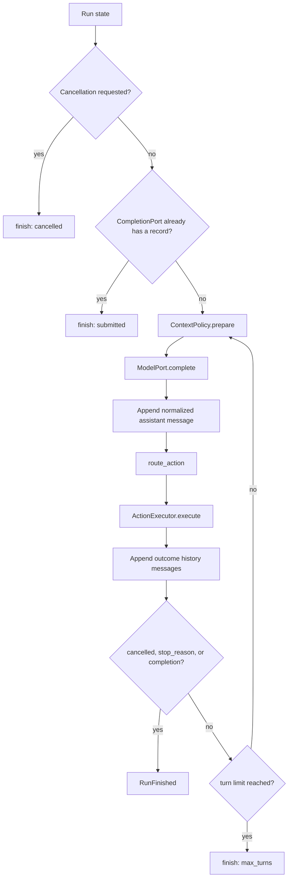

# Action routing and completion

The outer loop is deliberately small: prepare context, ask the model, choose one action channel, execute it, append a canonical outcome, and repeat until an explicit terminal condition occurs.

The canonical routing implementation is [`agent/actions.py`](https://github.com/PKU-YuanGroup/OpenAI4S/blob/main/openai4s/agent/actions.py); the state machine is [`agent/engine.py`](https://github.com/PKU-YuanGroup/OpenAI4S/blob/main/openai4s/agent/engine.py). CLI and Web behavior may differ in projection and lifecycle, but not in the routing priority described here.

## Outer-loop contract



The engine appends the assistant declaration before execution and appends the executor's history messages afterward. This order matters for provider replay: a native tool declaration must be followed by its result messages, while a cell declaration must be followed by its observation.

Cancellation is checked before a model request and after each execution. Adapters also prevent a late response from a blocking provider call from dispatching a new action after cancellation.

## Routing decision table

`route_action(content, tool_calls)` applies the following rules in order:

| Condition in one assistant reply | Selected action | What does not run |
|---|---|---|
| Exactly one native call named `finalize_response` | `FinalizeAction` | Any fenced code in the same reply |
| One or more native calls in every other combination | Ordered `NativeToolBatch` | Any fenced code in the same reply |
| No native calls; at least one closed executable fence | The first `CodeCell` in document order | Every later Python/R fence |
| No native calls; no closed executable fence | No action | Prose and incomplete fences are not executed |

This is a **Contract / Implemented** boundary.

Important consequences:

- Native calls win even when their JSON is malformed. Parse failures become canonical tool errors; they do not fall through to code.
- `finalize_response` is special only when it is the sole native call. If it appears beside another call, the whole reply is a normal native batch. Because finalization is Engine-owned rather than a registered Tool, the ordinary executor rejects that batch entry instead of completing the run.
- Python fences accept a bare info string, `python`, or `py`. R requires `r` (case-normalized by the fence scanner).
- Only backtick fences are executable. The scanner understands nested examples and selects a closed top-level block; an unterminated action fence never executes.
- If the model emits several complete cells, only the first executes. The observation includes a system note that later cells did not run.
- The historical fenced `tool` syntax is a compatibility fallback used only after no native call and no Python/R cell was routed. It is not advertised as the primary control surface.

## Why native calls have priority

Provider-native calls are declarations in the provider's assistant message. Executing code from the same message as well would create two concurrent interpretations of one model step and make provider replay ambiguous. Priority makes one reply map to one action channel:

```text
assistant native declaration -> one ordered canonical result per call

or

assistant fenced cell -> one execution observation
```

The priority is about determinism, not capability. Native Tools are intended for bounded orchestration and policy-controlled operations; cells provide language control flow, libraries, persistent memory, and—in Python—synchronous Host RPC.

## Native batch execution

A `NativeToolBatch` preserves provider order and call identity. Each normalized call retains:

- local call ID and optional provider wire ID;
- name and original ordinal;
- raw argument text;
- parsed argument object or parse error; and
- opaque provider metadata.

The executor must produce exactly one `role=tool` history message for every declaration. That totality rule covers:

- valid calls;
- malformed JSON or non-object arguments;
- schema failures and unknown tools;
- calls beyond the per-turn limit;
- permission refusal;
- cancellation before a remaining call starts; and
- executor exceptions.

Every result carries the call ID, wire ID, tool name, bounded text, and `is_error`. A missing result is synthesized explicitly by the Action Ledger reducer rather than leaving a half-open provider group.

### Scheduling

Execution is sequential unless a Tool class positively declares a call read-only and supplies resource keys. A leading read-only lane may execute in bounded parallel waves when keys do not conflict. The first mutating or unclassified executable call is a barrier; that call and later calls remain sequential. Preflight errors stay in their original positions and do not suppress later canonical results.

Physical completion order never changes history order. The executor writes results in the provider's original ordinal order.

This scheduling behavior is **Implemented**. Parallelism is an optimization, not part of a Tool's semantic contract; Tools must not depend on thread completion order.

## Cell execution outcome

A routed `CodeCell` passes the adapter's safety gate and then exactly one language runtime. Its response is formatted as an `[Observation]` containing captured stdout, stderr, error/trace information, and usage when available. That observation is appended to provider history as a `role=user` message for the next reasoning step.

A cell error is an observation, not automatically a terminal run error. The model can issue a repair action on the next turn. Likewise, a successful cell is not automatically completion.

Web Cell execution has a larger transaction—durable attempt, worker generation, streaming, artifact capture, immutable Cell record—but returns the same conceptual observation to `AgentEngine`. See [Web runtime](web-runtime.md).

## Completion contracts

There are two valid completion paths.

### Engine-owned `finalize_response`

`finalize_response` is provider metadata supplied by the Engine, not an instance in the Tool registry. A sole native call becomes `FinalizeAction`. The executor:

1. closes the provider declaration with exactly one canonical tool result;
2. validates parse success and the closed completion schema;
3. validates that `completion_bullets` describe completed work; and
4. returns a completion record only if validation succeeds.

The required arguments are a non-empty `summary` and one to four `completion_bullets`; findings, metrics, artifacts, limitations, and next steps are optional structured fields. Unknown properties are rejected. A malformed finalization produces a repairable tool error and does not complete the run.

`FinalizeAction` does not start a kernel and may close a tool-only conversation or a run that used scientific cells on earlier turns.

### Python `host.submit_output(...)`

The injected Python `host` SDK sends `submit_output` through the normal mid-cell Host RPC path. The Host validates and records the completion payload. The outer adapter observes the dispatcher's completion signal only after the Cell transaction returns; in the Web path, file/figure capture and the durable Cell record therefore finish before the Engine accepts completion.

R has no Host RPC and cannot submit completion directly. An R analysis must be followed by either a Python submission cell or a later sole `finalize_response` action.

### Events that are not completion

The following never imply success:

- assistant prose, including a seemingly final answer;
- a normal native Tool result;
- a Python or R response with no error;
- an R cell of any kind;
- cancellation;
- a safety refusal;
- plan-mode capture; or
- reaching `max_turns`.

Cancellation and turn exhaustion are terminal stop reasons with no completion record. This distinction prevents the UI from presenting partial execution as a successful scientific result.

## Canonical Action Ledger

The live message list is not the only source of history. Runtime adapters emit typed events to an append-oriented Action Ledger:

1. an action group is opened around the assistant declaration;
2. normalized declarations and redacted canonical arguments are recorded;
3. every native result or cell observation is appended;
4. execution attempts and generation lifecycle are associated separately; and
5. a terminal group records the run's stop reason and completion, if any.

The reducer reconstructs provider history as complete units. For native/finalize groups it emits the assistant declaration followed by one result per call. For cell/no-action groups it emits the assistant message followed by observations. A corrupt or structurally incomplete group is omitted instead of leaking an ambiguous partial provider message.

Context compaction preserves assistant declarations and their Tool results as atomic groups. Large outputs may be externalized, but compaction must not split a provider call from its result.

## Status and limits

| Behavior | Status | Limit |
|---|---|---|
| Routing priority and first-complete-cell rule | **Contract / Implemented** | One action channel per assistant reply. |
| Sole structured finalization | **Contract / Implemented** | Invalid or mixed finalization is not completion. |
| Canonical native results | **Contract / Implemented** | One result per declaration in provider order. |
| Read-only prefix parallelism | **Implemented** | Only class-declared, resource-compatible calls; maximum concurrency is bounded. |
| Legacy fenced Tool parsing | **Compatibility-only** | Retained for saved prompts/older clients; not the advertised interface. |
| Context compaction | **Best-effort** | Archive or summarization failure preserves live context; a low-yield breaker avoids repeated futile compaction. |
| Plain-prose fallback | **Implemented as a nudge** | It asks the model to issue a valid completion/action; it never silently accepts prose as terminal. |
