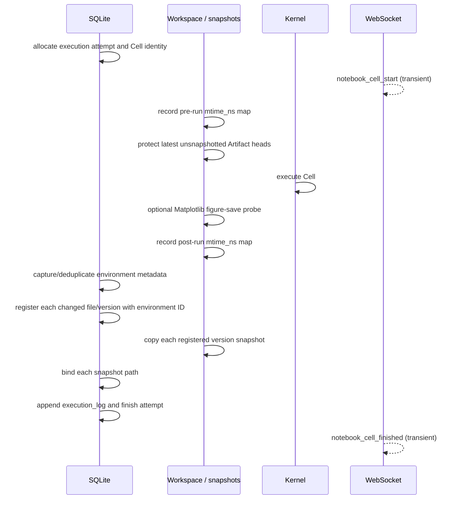

# Artifacts and provenance

An OpenAI4S Artifact is a logical deliverable, not merely a file path. One
`artifact_id` owns a sequence of version rows; `latest_version_id` selects the
current head. A version records a filename, content type, size, checksum, live
path, optional immutable `snapshot_path`, producing Cell, environment snapshot,
and lineage edges.

The implementation provides strong identities and checksums, but workspace
capture and object-level provenance are best-effort. A missing Artifact or
lineage edge is not proof that no file write or dependency occurred.

## Logical object, live file, and frozen bytes

Three representations can coexist:

| Representation | Purpose | Mutability |
|---|---|---|
| `artifacts` row | Logical name, ownership, priority, and current head. | The head and display metadata change. |
| `artifact_versions` row | Version identity, checksum/size, producer, and storage metadata. | Content identity is not replaced, but snapshot binding can be backfilled and the current metadata-only rename rewrites stored filenames. |
| Workspace `path` | The file that code and users currently edit. | Mutable and may be overwritten outside OpenAI4S. |
| `snapshot_path` | Frozen bytes for one version under trusted Artifact storage. | Treated as immutable; restore verifies root, size, and SHA-256 before use. |

A recorded version without `snapshot_path` is not equivalent to an immutable
snapshot: its `path` can still point at the mutable workspace. `protect_latest()`
tries to backfill such a head before a later Cell or native file tool can
overwrite it. This is a repair aid, not a substitute for checking
`snapshot_path` when restore-grade immutability is required.

Artifact restore never rewinds `latest_version_id` to an old row. It verifies
the historical snapshot, protects and verifies the current head, atomically
replaces the live file, appends a fresh version, and adds a lineage edge from
the historical source version to the new restored version. If the database
compare-and-swap fails, it attempts to restore the previous live bytes and
removes the uncommitted new snapshot.

## Automatic workspace capture

The Web Cell transaction in `server/cell_run.py` and `server/artifacts.py`
uses this order:

The diagram shows ordering, not one transaction. In particular, automatic
capture registers a version before `write_version_snapshot()` copies and binds
its snapshot. A crash or copy error in that window can leave a version with
only a mutable live path. Snapshot copying is best-effort and catches
filesystem errors; the next `protect_latest()` may repair the gap if the live
bytes still match and have not been replaced.

The pre/post scan records `st_mtime_ns` for regular files under the workspace.
It excludes hidden paths, dependency trees such as `node_modules`,
`site-packages` and `venv`, bytecode, package metadata directories, and nested
Git repositories. A path is captured when it is new or its mtime differs.

This has explicit limitations:

- an overwrite that preserves the same mtime is invisible;
- a deletion is not versioned, because the post-run scan iterates files that
  still exist;
- a rename appears as a new path while disappearance of the old path is not a
  deletion event;
- writes outside the session workspace are not found by this scan;
- a worker or capture failure can leave real workspace bytes without an
  Artifact row;
- a native Tool declaring `writes_files=True` is scanned in a `finally` block,
  but capture failure is logged and does not replace that Tool's result;
- environment and remote-compute provenance is attached only when a changed
  file is captured, and its collection is itself best-effort.

The Matplotlib probe runs only for Python Cells. R output is captured by the
same file-diff path but never by a Python figure probe.

## Write-path ordering

Different entry points deliberately have different staging order. Review the
relevant path before changing recovery claims.

| Entry point | Current ordering | Failure implication |
|---|---|---|
| Cell or `writes_files=True` native Tool | pre-scan → protect old heads → execute → post-scan → SQLite version → snapshot copy/bind | A committed version may temporarily or permanently lack a snapshot. Capture failure does not undo the original file write. |
| Python provenance writer | writer closes/saves → `prov_record` registers a provisional version and lineage → end-of-Cell capture can finalize the same matching version with snapshot/environment data | Provenance can exist before normal capture, but failures are swallowed and the final capture can still be absent. |
| `host.save_artifact()` | read source → copy snapshot → register/finalize version with snapshot path → later Cell capture reuses it when identity, checksum, Cell, and path match | The snapshot is removed if registration fails; cleanup is still filesystem best-effort. |
| Web upload | write live upload → save version row → write/bind snapshot | A database failure can leave an unregistered upload; a later snapshot failure can leave a live-only version. |
| Web text edit | best-effort protect current bytes → write live text → append version → write/bind new snapshot | Filesystem success is not rolled back if the database append fails. |
| Artifact restore | verify historical and current bytes → create verified new snapshot → atomically replace live file → SQLite compare-and-swap and fresh version | The service explicitly rolls back live bytes and deletes the new snapshot on persistence failure; rollback failure is reported separately. |

## Rename and edit semantics

The Web rename operation is metadata-only. It validates that the proposed
relative name would stay inside the workspace, then updates the logical
Artifact and every version's `filename`. It does **not** move the live file,
change stored `path` or `snapshot_path`, or append a version. Code must not
present this operation as a POSIX rename.

This distinction affects later edits: the editor resolves a live path from the
current logical filename. After a metadata rename, that can be a different path
from the historical version's stored live path, leaving the old physical file
in place. Operators should inspect both metadata and paths before reconciling a
renamed Artifact.

Web editing is restricted to recognized text extensions or text/JSON/CSV/XML/
JavaScript-like media types; image and known binary formats are rejected. It
appends a version but, as described above, the live-file write and SQLite
append are not one transaction. Direct workspace edits bypass this API and are
visible only if a later capture detects their mtime change.

## What object-level provenance actually observes

`openai4s/kernel/provenance.py` runs inside the Python worker. It monkeypatches
a finite set of APIs when their optional libraries are importable:

- built-in `open()` reads and writes;
- `json.loads()`;
- pandas CSV, Parquet, JSON, pickle, and Excel readers;
- pandas `DataFrame`/`Series` slicing and selected `to_*` writers;
- NumPy `load()` and `save()`;
- Matplotlib `Figure.savefig()`.

On a supported read, the worker resolves the physical path to the latest known
Artifact version and attaches that `version_id` to the returned object. Selected
operations preserve the tag. On a supported write, the worker reports the tags
still present on the exact object or string being written. The Host then
registers the output and inserts `input_version_id → output_version_id` edges in
the same SQLite transaction as that version record.

The mechanism is not general Python taint tracking:

- it is installed only in the Python worker; R has no equivalent object tagger;
- arbitrary libraries, serializers, constructors, copies, joins, reductions,
  scalar arithmetic, container indexing, and user-defined transformations can
  drop tags;
- `json.loads()` tags the returned root object, but generic traversal of all
  descendant values is not instrumented;
- built-in file writes see only tags on the strings/bytes passed to `write()` or
  `writelines()`;
- pandas tag propagation covers `__getitem__`, not every pandas operation;
- path resolution and Host recording failures are intentionally swallowed so
  provenance cannot break scientific code;
- `OPENAI4S_PROVENANCE_OFF=1` disables the instrumentation;
- the Cell execution record currently does not discover a complete generic
  `files_read` list; the lineage graph relies on observed version edges.

Consequently, a lineage edge is positive evidence that a supported path
observed a tag. The absence of an edge means “not observed,” not “independent.”
Do not use this graph alone for regulatory reproducibility, security
non-interference, or a complete bill of data dependencies.

## Lineage and environment records

For every captured output version, OpenAI4S can also associate:

- `producing_cell_id`, linking to immutable Cell source and result;
- the actor `frame_id` and root session scope;
- an `env_snapshot_id` containing the local runtime/package snapshot and any
  drained remote-compute provenance;
- explicit input-version edges observed by provenance;
- a restore edge when a historical version becomes a new head.

Environment snapshots are content-addressed and deduplicated. They describe the
environment observed for the producing capture; they do not reproduce a
container or prove every dynamically loaded library was represented.

## Contributor and operator rules

- Preserve the separation between logical Artifact identity, mutable live path,
  and verified snapshot bytes.
- Never advertise a version as restoreable merely because its live `path`
  exists; require a trusted, checksum-valid `snapshot_path`.
- If adding a writer integration, document exactly where tags are read, where
  they can be lost, and whether its file write precedes or follows persistence.
- Keep Artifact version insertion and lineage-edge insertion in one SQLite
  transaction.
- Do not make provenance exceptions fail user computation.
- Test same-name versioning, snapshot failure, workspace drift, expected-head
  races, rollback failure, rename path divergence, and capture finalization of
  provisional provenance versions.

The owning modules are `openai4s/server/artifacts.py`,
`openai4s/storage/artifacts.py`, `openai4s/artifact_restore.py`,
`openai4s/kernel/provenance.py`, and `openai4s/host/data.py`.
