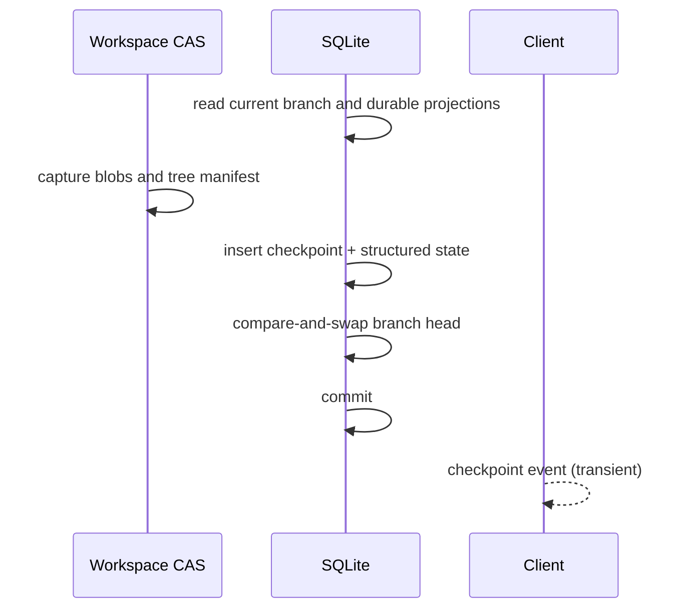
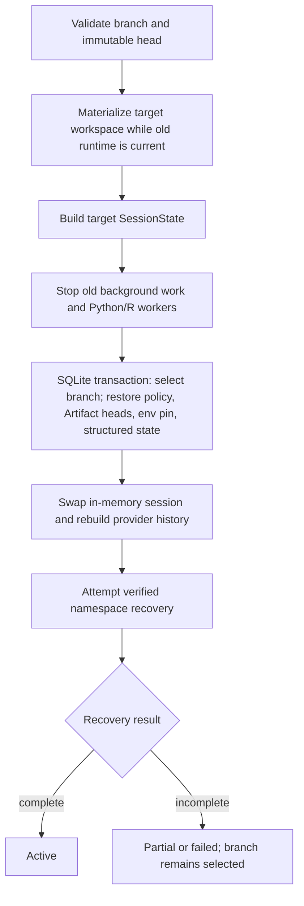

# Checkpoints and recovery

An OpenAI4S checkpoint is a durable reconstruction boundary. It identifies a
logical history prefix, a content-addressed workspace tree, selected Artifact
versions, environment and policy state, runtime bootstrap manifests, and a
recipe for rebuilding the Python/R namespace. It is not a memory dump and does
not freeze a running process.

Restoring a checkpoint is consequently a staged operation:

1. restore the durable and filesystem projections;
2. construct fresh kernel candidates;
3. replay only Cells classified as safe;
4. validate the reconstructed state;
5. publish the candidates only if validation is complete.

Workspace bytes, SQLite state, kernel memory, and WebSocket delivery remain
separate commit domains throughout this sequence. See
[Failure boundaries](failure-boundaries.md) for the resulting crash windows.

## What a checkpoint contains

| Field | Purpose |
|---|---|
| History cursors | Inclusive Action Ledger and Cell boundaries plus the public-message boundary used by branch projection. |
| `workspace_tree_id` | SHA-256 identity of a Workspace CAS tree manifest. |
| `artifact_versions` | Version identities that should become logical Artifact heads. |
| `environment_pins` | Selected Python/R environment names for future workers. |
| `generation_refs` | Source generation identities and frozen bootstrap manifests. |
| Capability and permission state | Session capability overrides and conversation-scoped permission rules. |
| Recovery recipe | Hydration, safe Cell replay, required symbols, expected Artifact hashes, environment requirements, and namespace-coverage state. |
| Metadata | Reason, source boundary, revert projection, and other bounded control data. |
| Structured-state snapshot | A separately checksummed body for plans, review steps and annotations, review settings, and project memories. |

Checkpoint creation inserts the checkpoint row, captures its structured-state
snapshot, and advances the branch head in one SQLite transaction. A branch-head
compare-and-swap prevents two in-process writers from silently publishing
different successors to the same head.

The checkpoint deliberately excludes:

- live Python and R objects;
- open files, sockets, subprocesses, threads, and background jobs;
- provider connections and WebSocket delivery state;
- files excluded or skipped by Workspace CAS capture;
- arbitrary external service state;
- a complete dependency graph for code that was not observed by the finite
  provenance and static-analysis layers.

`generation_id` records which worker incarnation supplied a bootstrap manifest
or was recovered from. It is lifecycle evidence, not proof that the old
namespace survived.

## Workspace CAS

`WorkspaceCAS` stores immutable blobs and tree manifests by SHA-256. Capture
walks the session workspace without following symlinks and, by default, records
regular files up to 64 MiB each. It excludes `.git`, `.openai4s`, `.venv`,
`__pycache__`, `node_modules`, and secret-shaped files such as `.env`,
private-key/certificate containers, and common credential filenames. Skipped
entries and their reasons remain in the tree manifest.

Checkpoint capture holds the CAS in-process lifecycle lock from tree capture
through the SQLite checkpoint insert. CAS garbage collection takes the same
lock, so it cannot remove a newly written tree in that in-process publication
window. This is not a cross-process or database/filesystem transaction: a
database failure can leave unreferenced content-addressed blobs or a tree
manifest, and an unsupported second daemon is not coordinated by this lock.

Restore first computes a three-way preview:

- **target** — the requested checkpoint tree;
- **baseline** — the tree the workspace is expected to match;
- **observed** — a fresh capture of the current workspace.

Managed files changed since the baseline become conflicts. New untracked files
are preserved. Files present in the baseline but intentionally absent from the
target are deleted only when they have not changed externally.

Each restored file is written to a sibling temporary file, flushed, and
published with `os.replace`; replacement of one file is atomic. The tree as a
whole is not atomic: writes happen sequentially, then deletions. A process
failure can therefore leave a partially materialized tree.

## Checkpoint creation boundaries

Manual checkpoints capture current state. The Web runtime also attempts to
create source-bound checkpoints after exact public-message boundaries and after
durably logging agent/user Cells. Source identity makes this operation
idempotent: asking for the same root/source-kind/source-ID tuple returns the
existing checkpoint.

Automatic checkpointing is best-effort. Failure to capture a source-bound
checkpoint does not retroactively fail the already completed message or Cell.
Forking from that exact UI boundary then fails closed because no matching
checkpoint identity exists; OpenAI4S does not guess a nearby state.

The Workspace CAS capture precedes SQLite publication:

Only the three SQLite mutations shown above share a transaction. The CAS tree
already exists before that transaction, and the UI event is delivered after
durable publication.

## Fork, revert, and activation

These operations reuse checkpoint data but have different publication rules.

### Fork

A fork materializes the source checkpoint tree into a new, isolated branch
workspace before it creates the branch row. A newly forked branch initially
points to its parent's immutable checkpoint and is inactive/view-only until
activation. Failure after materialization but before SQLite insertion can leave
an orphan branch workspace; it does not create an active branch.

### Revert and continue

Revert does not delete history or move a branch head backward. It appends new
records:

1. preview the target tree against the current checkpoint tree;
2. capture an **undo checkpoint** of the current state, advancing the head;
3. preview again to close the edit race;
4. apply the target workspace tree;
5. append a **revert checkpoint** containing the target cursors and state, with
   a history-projection descriptor telling readers where new physical rows
   resume;
6. transactionally activate the revert checkpoint's SQLite projections;
7. stop existing kernels and require namespace recovery before more live work.

The abandoned message, Action Ledger, and Cell rows remain physically present
for audit. Branch-aware readers show the target prefix followed by work written
after the new continuation boundary.

The undo checkpoint is intentionally published before target bytes are
applied. If later stages fail, it is the durable recovery point for the prior
state. The live workspace may nevertheless need to be rematerialized from that
head because the multi-file target restore is not globally atomic.

### Branch activation

Activation runs under the session's exact FIFO lifecycle ticket:

Preparation completes before the old workers are stopped. SQLite activation
validates every target record before its first mutation, then selects the
branch and restores session capabilities, conversation permission rules,
Artifact heads, the Python environment pin, and available structured state in
one transaction. It cannot include the already materialized workspace or the
subsequent in-memory swap.

The selected branch remains selected when namespace recovery is partial or
fails. This is intentional: the API must not report an old branch as active
after its workers and projections have been replaced. Callers must inspect the
returned `status` and namespace dimension; `current_branch_id` alone does not
mean that a usable kernel exists.

## Structured domain state

For current local checkpoints, `checkpoint_state_snapshots` stores canonical
JSON plus a SHA-256 digest for plans, review steps and annotations, review
settings, and project memories. Activation verifies and restores this snapshot
inside the same SQLite transaction as the other checkpoint projections.

Compatibility is deliberately conservative:

- a historical checkpoint without a structured-state snapshot is reported as
  partial/unavailable for that dimension; current live structured state is
  preserved rather than falsely attributed to the old checkpoint;
- a revert clones the target's exact snapshot when it exists and does not
  manufacture one when the target predates this feature;
- imported snapshots are validated, identity-remapped, and quarantined before
  they can participate in a trusted runtime;
- the current branch-activation response also evaluates legacy metadata
  summaries for plans and memories. A checkpoint with an exact structured
  snapshot can therefore still receive a conservative `partial` activation
  status when those legacy summaries are present.

Treat `partial` as a real operator signal even when the underlying data is
available: inspect the per-dimension result rather than overriding it from a
single database row.

## Recovery recipe and replay policy

`server/recovery_recipe.py` derives a versioned recipe from durable Cell
records, not from a live namespace. Static analysis tracks variable reads,
writes, deletes, uncertain mutations, source hashes, and producer dependencies.
Workspace and Artifact hydration are separate steps and never justify replaying
side effects.

A namespace-affecting Cell is marked replay-safe only when all checks pass,
including:

- its recorded source hash matches its stored source;
- it completed successfully and its policy permits replay;
- required variable producers are resolvable;
- its language has a frozen bootstrap manifest;
- it uses only recognized safe Host calls;
- it has no detected direct filesystem, process, network, nondeterministic, or
  file-writing effect.

Unsafe or uncertain Cells remain in the recipe with `replay_policy: never` and
an explanation. Recovery skips them; it never converts “conditional” or
unknown code into permission to run.

Namespace coverage has three values:

| Value | Meaning | Recovery consequence |
|---|---|---|
| `empty` | No durable Cell affected the language namespace. | A fresh bootstrapped namespace can be complete. |
| `verified` | Every namespace-affecting Cell needed for the final symbols has a replay-safe chain. | Candidate may publish after all other validation passes. |
| `unverified` | At least one namespace-affecting Cell is manual, unsafe, failed, uncertain, or otherwise unreconstructable. | Validation records `namespace_unverified`; candidate is shut down and status is `partial`. |

This is a positive verification model. A recipe can still be conservative
because static analysis and dependency observation are finite. It must never
claim completeness from the mere presence of old generation rows.

## Build-first recovery pipeline

For each language manifest, recovery performs these phases and writes bounded,
redacted journal entries as separate SQLite commits:

1. **restore started** — freeze the recovery identity and source generation;
2. **build** — create an unpublished candidate worker;
3. **bootstrap** — verify interpreter/runtime expectations and load frozen
   sidecars/init hooks;
4. **hydrate** — verify the checkpoint tree and Artifact versions already
   materialized in the selected workspace;
5. **replay** — execute only explicitly safe, hash-matching Cells;
6. **validate** — check namespace coverage, required symbols, Artifact hashes,
   and environment requirements;
7. **publish** — adopt the candidate as the branch's live generation.

If validation has any issue, the unpublished candidate is shut down. In an
ordinary recovery attempt, the previously published worker remains unchanged.
During branch activation the old branch's workers were already stopped before
SQLite publication, so a partial target recovery can correctly leave the newly
selected branch with no live worker.

Python and R candidates are recovered in manifest order. The session result is
`active` only if every expected language publishes; a later-language failure
after an earlier language succeeds is `partial`, not a fabricated all-or-nothing
kernel transaction.

The public recovery actions are:

- `restore` — attempt the selected checkpoint recipe;
- `retry` — repeat a restorable partial/failed attempt under a new recovery ID;
- `inspect_log` — read the bounded recovery journal;
- `continue_view_only` — use durable projections without claiming a live
  namespace;
- `restart_fresh` — after explicit confirmation, publish an intentionally
  empty fresh namespace rather than claiming restoration.

Imported/quarantined sessions allow only an explicitly confirmed fresh restart
to establish a trusted runtime.

## Restart reconciliation

On daemon startup, kernel generations left `active` or `busy` by an older daemon
instance are marked `abandoned`, and incomplete execution attempts are closed
as abandoned. OpenAI4S never attaches to an unknown surviving process or infers
that its memory is valid. A later usable namespace must come from verified
recovery or an explicitly fresh restart.

The owning modules are `openai4s/storage/snapshots.py`,
`openai4s/storage/checkpoint_state.py`, `openai4s/storage/activation.py`,
`openai4s/server/session_branching.py`, `openai4s/server/recovery_recipe.py`,
`openai4s/kernel/recovery.py`, and `openai4s/server/recovery_runtime.py`.
