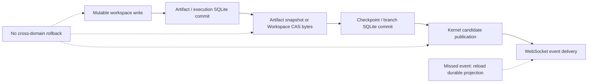

# Failure boundaries

OpenAI4S coordinates several stateful systems but does not pretend they form
one transaction. SQLite records, live workspace files, Workspace CAS blobs,
Artifact snapshots, Python/R processes, and browser events each have their own
publication point. Correct recovery starts by identifying which boundary was
crossed before a failure.

The safe default is to preserve durable audit records, fail closed on ambiguous
replay, and reconstruct derived views. Do not “repair” a session by deleting
physical history or declaring a generation active because its process once
existed.

## Sources of authority

Use the narrow authority appropriate to the question:

| Question | Authoritative source | Not sufficient |
|---|---|---|
| Which logical branch/head is selected? | SQLite branch selection and checkpoint head. | In-memory `SessionState`, a browser tab, or workspace directory name. |
| What provider history should be sent? | Branch-aware Action Ledger reducer. | Public chat messages or raw provider payload fragments. |
| What should Chat/Notebook display? | Branch-aware `messages` and `execution_log` projections. | WebSocket events retained by one client. |
| What bytes define a checkpoint workspace? | Checksum-valid Workspace CAS tree and blobs. | The current mutable workspace. |
| What bytes define a restorable Artifact version? | Trusted `snapshot_path` with matching size/checksum. | A version row whose only `path` is mutable. |
| Is a kernel namespace usable? | A currently published exact generation/lease, or successful verified recovery. | A `kernel_generations` row, PID, or branch selection alone. |
| Did a client receive an update? | Client acknowledgement/reload behavior. | The fact that the underlying database transaction committed. |

The practical model is a chain of local commits with explicit compensation,
not one rollback arrow:

Actual paths do not always use this exact order—for example,
`host.save_artifact()` stages snapshot bytes before its version row, while
automatic capture registers a version before copying the snapshot. The table
below names those differences explicitly.

## Failure and repair matrix

| Interrupted window | Durable truth | Possible residue / symptom | Safe next action |
|---|---|---|---|
| SQLite exception before a repository commit | The current transaction is rolled back; earlier commits remain valid. | No intended rows from that transaction, but prior filesystem work may remain. | Retry only after checking external side effects. Never assume SQL rollback reverted files or a provider call. |
| SQLite commit succeeds but WebSocket delivery fails | The committed projection is authoritative. | A stale Chat, Notebook, Timeline, Files, checkpoint, or recovery view in one browser. | Reload the HTTP/read projection or reconnect. Do not repeat the mutation merely to recreate an event. |
| Action group or execution attempt is incomplete after a crash | Existing ledger events and monotonic attempt milestones remain. | Missing native-tool observations, an open attempt, or an interrupted provider turn. | Restart reconciliation closes stale attempts; the ledger reducer supplies canonical interruption/cancellation observations. Inspect the Timeline, then start a new action if needed—never re-execute a mutation from arguments alone. |
| Worker dies during a Cell | The allocated attempt and any previously committed milestones remain; no live namespace is trustworthy. | Partial stdout, workspace writes, subprocess effects, or files that were never captured as Artifacts. | Stop/restart or use verified recovery. Inspect the workspace before rerunning; register or remove residue deliberately. A rerun may duplicate external effects. |
| Workspace file write succeeds before Artifact registration | The file exists, but SQLite has no corresponding logical/version record. | Unregistered upload/edit/tool/Cell output. | Re-save/register through a supported path or rerun capture after inspecting bytes. Do not create a version row with an invented checksum or producer. |
| Automatic Artifact version commits before snapshot copy/bind | The version row is valid metadata, but its live `path` is mutable. | `snapshot_path` is absent; later overwrite can destroy the historical bytes. | If the live checksum still matches, `protect_latest()` or a supported re-save can backfill a snapshot. Do not advertise restoreability until the trusted snapshot verifies. |
| Snapshot bytes are staged before version registration | No version references those bytes if registration fails. | An orphan snapshot from `host.save_artifact()` or an Artifact-restore attempt; normal paths try to delete it. | Let path-specific compensation run. If cleanup also failed, inspect trusted snapshot storage and remove only bytes proven unreferenced. |
| Workspace CAS tree is written before checkpoint publication | No checkpoint references the unpublished tree. | Unreferenced content-addressed blobs/tree after database failure. | Retry checkpoint creation. Reclaim only through CAS reference-scanning garbage collection under its lifecycle lock; shared blobs must remain. |
| Source-bound automatic checkpoint capture fails | The completed message/Cell remains durable; no exact checkpoint exists for that source. | Fork control at that boundary is unavailable or fails closed. | Create a later manual checkpoint or rerun an explicitly safe action. Never map the UI boundary to a nearby checkpoint by guess. |
| Fork workspace materializes before branch-row insertion | No branch exists in SQLite. | An isolated orphan directory containing valid checkpoint bytes. | Confirm no branch references the directory, then remove or rematerialize it through the fork workflow. Do not activate it by editing SQLite manually. |
| Multi-file Workspace CAS restore stops mid-apply | The prior SQLite branch/checkpoint remains authoritative unless a later commit occurred. | Some target files replaced, later writes/deletes unapplied, untracked files preserved. | Quiesce writers, preview the authoritative head against the observed workspace, resolve managed-file conflicts, and rematerialize. A single-file `os.replace` guarantee does not make the tree atomic. |
| Revert publishes its undo checkpoint, then target workspace apply or revert-checkpoint creation fails | The branch head is the undo checkpoint until the new revert checkpoint commits. | Workspace may contain some or all target bytes while SQLite projects the undo state. | Treat the undo head as the recovery point. Inspect the revert operation and preview, restore that head's tree, then retry the revert. |
| Revert checkpoint commits but projection publication fails | The new branch head exists; selected capabilities, permissions, Artifact heads, or structured state may still reflect the prior projection. | Branch-aware history head and materialized “current” tables disagree. | Retry checkpoint activation for that exact branch head under the lifecycle ticket. Do not append another revert merely to force projection updates. |
| Branch activation materializes target workspace or stops old workers before SQLite publication | The previously selected branch remains authoritative if activation did not commit. | Target workspace exists; old workers may be ended; in-memory runtime may be unavailable. | Retry activation or reopen the previous branch runtime from its durable head. Do not infer selection from which workspace exists. |
| Branch activation SQLite commit succeeds before in-memory swap/history seed/recovery | The target branch and its SQLite projections are selected. | Process-local session is stale or missing; no target kernel; browser may show a failure. | Recreate/reload the target `SessionState`, rebuild provider history from the branch-aware ledger, then run recovery. Report `partial`/`failed` until namespace validation succeeds. |
| Recovery candidate fails before publication | No candidate generation is live; in an ordinary recovery the previously published worker is unchanged. | Durable recovery journal ends `partial`, `failed`, or `cancelled`; temporary candidate is shut down. | Inspect issues, correct environment/bytes/recipe inputs, then use `retry`. During branch activation, remember the old workers were already stopped. |
| One language publishes and a later language recovery fails | The successfully published language is live; the session recovery is not complete. | Python active with R absent, or another mixed-language partial state. | Treat the session as `partial`, inspect per-language results, and retry or explicitly restart fresh. Do not collapse language generations into one fictitious transaction. |
| Candidate publishes but terminal journal/event write fails | The exact candidate lease may already be live even though the final status event is missing. | Journal reports an earlier phase or `publish_journal_failed`; UI appears stale. | Inspect current exact leases/generation rows and bounded journal before taking action. Reload the client. Do not blindly start a second worker. |
| Daemon exits with live generation/attempt rows | Rows describe the last known owner, not a reusable namespace. | `active`/`busy` generations and in-progress attempts from the dead daemon. | Startup reconciliation marks them `abandoned`. Recover from a checkpoint or confirm `restart_fresh`; never attach based only on PID or row state. |
| Two processes write the same data directory | No supported global owner exists; the process-local `RLock` and CAS lock do not coordinate them. | SQLite contention, branch compare-and-swap failures, filesystem races, or snapshots bound to unexpected bytes. | Stop the extra process, preserve all files, and audit SQLite heads, workspaces, CAS, and Artifact snapshots offline. Resume with one daemon only. |

## Kernel and execution failure semantics

The kernel manager uses one protocol-frame reader and an exact generation lease.
A respawn increments generation identity. A late response, interrupt, or
background completion from an old generation must not be accepted as belonging
to the replacement worker.

Within the Python worker, one lock covers the complete `host_call` request and
response transaction. If the worker or manager fails mid-call, neither side may
infer that the remote capability did or did not execute merely from the absence
of a response. Capability-specific audit records and external idempotency keys,
where available, are the evidence. This is why recovery recipes reject Cells
with side-effecting or unknown Host calls.

Cell completion also has a narrow meaning. A successful structured completion
or `host.submit_output()` is not interchangeable with an executed Cell, native
Tool result, max-turn stop, cancellation, or plain model prose. Failure handling
must preserve those terminal distinctions rather than manufacture an answer
from partial execution.

## Operator recovery procedure

When the reported state and visible files disagree:

1. **Quiesce the writer.** Stop additional user execution, background jobs, and
   any second daemon. Do not edit SQLite while the daemon is live.
2. **Record identities.** Capture `root_frame_id`, selected `branch_id`, head
   `checkpoint_id`, current generation leases, last execution attempt, and last
   recovery ID.
3. **Read durable projections.** Inspect the branch/head, Action Timeline,
   recovery journal, and per-dimension activation result. Reload the browser so
   missed WebSocket events are not confused with persistence loss.
4. **Verify bytes.** Check the head Workspace CAS tree and blobs, then Artifact
   snapshot root, size, and checksum. Treat mutable workspace files as observed
   state, not historical authority.
5. **Preview before restore.** Use conflict-aware workspace preview. Preserve
   untracked files and resolve managed-file divergence explicitly.
6. **Choose one semantic action.** Retry exact recovery, activate the exact
   durable head, restore from the undo checkpoint, continue view-only, or
   explicitly confirm a fresh namespace. Do not combine them through manual row
   edits.
7. **Re-read all projections.** Confirm branch selection, workspace tree,
   Artifact heads, provider-history reconstruction, structured state, and exact
   kernel leases before resuming execution.

If a repair can duplicate an external effect—shell command, file upload, remote
compute, provider-side write, or credential operation—stop and require human
confirmation. A database retry is not an idempotency guarantee for another
system.

## Backup and restore boundary

A copy of the SQLite database alone is not a complete OpenAI4S backup. A
session-consistent backup needs, at minimum, the database, session workspaces,
Workspace CAS, Artifact snapshot storage, and configuration/user-authored
content required by the deployment. Kernel memory cannot be backed up as a
supported durable representation.

For a coherent offline copy, stop the single daemon and background writers,
then copy the complete data directory as one set. A live filesystem copy can
observe SQLite, workspace, CAS, and snapshots at different publication points.
After restore, run normal startup reconciliation and verified checkpoint
recovery; do not relabel stale generation rows as active.

## Contributor checklist for new mutations

For every operation that crosses a commit domain, document and test:

1. the durable source of authority;
2. the exact order of filesystem, SQLite, worker, external-service, and event
   actions;
3. the residue if failure occurs after each action;
4. whether compensation is possible and how compensation failure is surfaced;
5. the idempotency key or compare-and-swap guard;
6. restart reconciliation and client reload behavior;
7. whether a partial state must block future execution;
8. whether audit history remains available after logical branch projection.

The most relevant implementations are `openai4s/store.py`,
`openai4s/storage/snapshots.py`, `openai4s/storage/activation.py`,
`openai4s/server/artifacts.py`, `openai4s/artifact_restore.py`,
`openai4s/server/session_branching.py`, `openai4s/server/recovery_execution.py`,
`openai4s/kernel/recovery.py`, and `openai4s/kernel/manager.py`.
