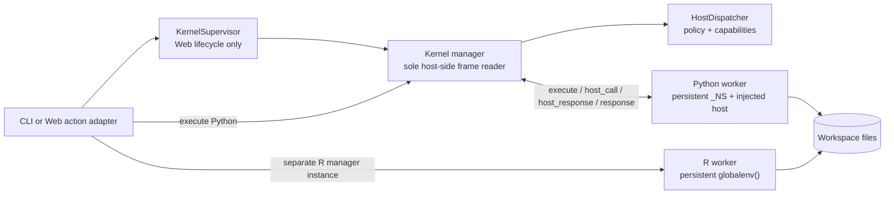
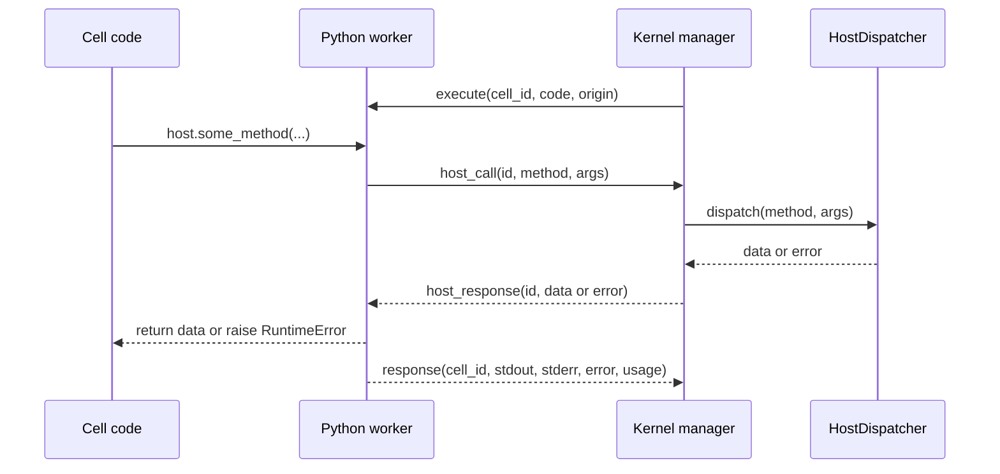

# Kernels and Host RPC

OpenAI4S executes scientific cells in long-lived child processes. The host-side `Kernel` manager owns one worker and one synchronous JSON-per-line protocol transaction; the Web `KernelSupervisor` owns language-slot lifecycle but never reads a frame.

## Process model

In the Web runtime there is one independently lazy slot for `python` and one for `r`. Each slot contains its own concrete `Kernel` manager and subprocess. The diagram collapses those two manager instances for readability.

The worker namespace is process memory:

- imports, variables, and functions survive later cells on the same worker generation;
- Python and R namespaces never share objects directly;
- files in the session workspace are the supported interchange mechanism between languages; and
- restart, replacement, crash, timeout reset, idle release, or daemon exit destroys the affected namespace.

## Lazy and persistent lifetime

### One-shot CLI

The local agent wraps Python in `LazyKernel`. Tool-only and `FinalizeAction` turns do not spawn it. The first Python cell starts a worker, runs bootstrap once, and reuses that namespace for later Python cells in the same `Agent.run(...)` call. R is also started only on its first R cell and reused for that run. Both are shut down when the one-shot run closes.

This behavior is **Contract / Implemented**. “Persistent” in the CLI means persistent across model turns inside one run, not across separate CLI invocations.

### Web sessions

The Web session first creates a session-scoped `HostDispatcher` only when control-plane work needs it. The dispatcher is independent of either language slot and survives a kernel stop or replacement within the daemon process.

`KernelSupervisor.ensure(language, key, factory)` reuses a live worker when its runtime key still matches. For a missing, dead, or environment-mismatched slot, `ensure` constructs and records a live replacement before publishing it and shutting down the old worker. A failed candidate therefore leaves an already-usable old environment worker in place. Explicit `restart`, by contrast, restarts the existing manager and creates a new namespace; it is not the same build-first environment-switch path.

Each published Web worker generation receives a durable UUID and lifecycle record in addition to the manager's in-memory generation counter and authorization generation. A daemon restart marks older-daemon live rows abandoned; it does not claim their processes or namespaces survived.

Manual stop, session close, and an optional `OPENAI4S_KERNEL_IDLE_TTL` can release workers without deleting messages, Cells, workspaces, or artifacts. TTL zero disables automatic release. Idle sweeping refuses to release an active turn, pending approval, recovery, or active background execution.

These Web lifetime rules are **Implemented**. General namespace restoration is **Partial**: a verified recovery recipe may rebuild and validate selected state, but arbitrary live objects are not serialized.

## The language-neutral frame protocol

The manager sends one `execute` frame with a cell ID, source, and origin. It then blocks in a single reader loop until the matching final `response`. During that loop it may receive:

- `stdout_chunk` frames for live Python output;
- `host_call` frames from Python;
- bounded diagnostic `log` frames; and
- one final `response` frame.

The response contract includes the cell ID, captured `stdout`, captured `stderr`, `error`, `interrupted`, trace information, guard information, and a `usage` object. A Web caller supplies the durable Cell ID so worker response, provenance, artifacts, and execution attempt refer to one identity.

`Kernel._protocol_transaction_lock` permits only one host thread to write a request and consume frames from a worker at a time. Idle variable inspection uses a dedicated request but acquires that lock without waiting; it fails Busy rather than becoming a second reader. `KernelSupervisor` coordinates identities and signals only—it does not proxy `execute` or inspect the pipe.

This one-reader rule is a **Contract**. Adding another reader thread, reading a response in the supervisor, or sending a second execute request while a Cell owns the transaction can desynchronize the worker.

### Protocol versus user output

The protocol pipe is isolated from ordinary process stdout:

- the Python worker moves the real protocol streams to protected descriptors and aliases raw fd 1 to process stderr;
- the R launcher puts protocol output on fd 3 and input on fd 4, redirects stdin to `/dev/null`, and aliases fd 1 to process stderr; and
- language-level cell output is captured and returned as structured data (and Python stdout can also be streamed as frames).

This protects the JSON wire from `print` and many stray native writes. It does not promise that every raw C-level write becomes attributed Cell output: the manager continuously drains process stderr into a bounded diagnostic tail so a noisy child cannot fill the OS pipe and deadlock the worker.

## Python Host RPC

Python's namespace receives an injected `host` singleton built from the worker's `host_call` function. The normal sequence is exactly:

There is no normal `host_ack` step. The worker accepts an ID-matched `host_ack` as a compatibility pre-response and keeps waiting, but the current manager sends `host_response` directly. Documentation or integrations must therefore model the contract as `host_call → host_response`, with `host_ack` compatibility-only.

### RPC transaction discipline

The worker has two distinct locks:

- the protocol write lock protects one frame write at a time; and
- `_HOST_CALL_LOCK` is held from writing `host_call` until reading its matching `host_response`.

Only one Host RPC may be in flight from a worker. This matters if user code starts threads: concurrent SDK calls serialize at the worker transaction lock. The host-side execute loop remains the sole reader and services each `host_call` synchronously before continuing to wait for the Cell response.

Call IDs route responses. The worker tolerates a bounded number of malformed or wrong-ID inbound frames before reporting protocol desynchronization. Serialized Host-call payloads above 15 MB are rejected in the worker before transmission.

The manager translates the dispatcher's single-key `{"error": message}` soft-fail value into an error-bearing `host_response`; the SDK call raises `RuntimeError`. A mapping that contains `error` plus other keys is ordinary data. Dispatcher exceptions also become error responses instead of killing the reader loop.

### Capability boundary

`host.*` is an RPC facade, not direct access to daemon objects. Capability families include files, Web/data access, sub-models and delegation, artifacts, skills, environments, read-only queries, progress, MCP, credentials, and remote compute. The Host applies the capability's permission and audit policy before returning.

`host.submit_output(...)` is also a Host RPC. It records the scientific completion signal; it does not short-circuit the worker. The rest of the Cell transaction—including Web artifact capture and durable recording—finishes before the outer engine accepts completion.

Object-level provenance hooks are Python-specific and cover supported instrumented operations. They are **Partial coverage**, not a universal data-flow proof for arbitrary extension modules or side effects.

## R execution channel

R is a first-class persistent analysis worker driven by the same `Kernel` manager class with a different `argv`. Its result shape is intentionally compatible with Python, but its execution capabilities differ:

| Capability | Python | R |
|---|---|---|
| Persistent namespace | Yes, worker `_NS` | Yes, R `globalenv()` |
| Mid-cell `host.*` RPC | **Implemented** | Intentionally absent |
| In-cell completion | `host.submit_output(...)` | Absent |
| Live stdout chunks | **Implemented** | Final captured output; no equivalent streaming Host RPC loop |
| Variable Inspector | Idle-only, safe bounded summaries | Idle-only, safe bounded summaries |
| Object-level lineage hooks | Python-only, partial coverage | Absent |
| Artifact discovery | Workspace diff plus Python figure capture | Workspace diff; plots must be saved to files |
| Runtime dependency | Selected Python interpreter | A real `Rscript`; worker parsing normally uses the prepared R environment's `jsonlite` |

R interpreter resolution checks the selected environment, then discovered R-capable environments (preferring the environment named `r`), then `Rscript` on `PATH`. It never silently substitutes Python. If no R runtime is available, the adapter returns a soft error observation so the model can choose another action.

## Interrupt, timeout, and restart semantics

`Kernel.interrupt()` sends one SIGINT to the exact worker PID. Python arms a one-shot handler only around user code; an externally delivered SIGINT is reported as `interrupted=True` without pretending it is an ordinary user exception. R maps the signal to its interrupt condition. An interrupt may preserve the worker and earlier namespace when the language unwinds cleanly.

The Web watchdog freezes a `KernelLease` before running a Cell. On timeout or cancellation it:

1. interrupts only that current lease;
2. waits a grace period;
3. kills only that lease if it remains stuck;
4. restarts it if the reader thread exits, or abandons it if the reader remains wedged; and
5. raises a timeout that explicitly says earlier variables were cleared after hard recovery.

Every destructive supervisor operation checks that the lease still matches language, key, generation, and worker identity. A stale watchdog cannot kill a newer replacement (the ABA-safety property).

Interrupt delivery and hard kill are necessarily **Best-effort** at the OS boundary. Exact identity checks are **Contract / Implemented**.

## Resource accounting is language- and platform-specific

The shared response keys do not imply one measurement implementation.

### Python

- wall time is a per-cell elapsed-time delta;
- CPU time is a delta of `getrusage` self plus child user/system time; and
- peak RSS uses Linux `VmHWM` when available, otherwise `ru_maxrss` with macOS unit conversion.

The worker attempts a Linux peak-RSS reset through `/proc/self/clear_refs`, but availability and kernel behavior vary. On fallback platforms, `ru_maxrss` is a process-lifetime high-water mark rather than a precise per-cell peak.

### R

- wall time is a `Sys.time()` delta;
- CPU time is a `proc.time()` delta including self and child fields; and
- peak RSS reads Linux `VmHWM`; on non-Linux systems the current worker reports `0` when no supported source exists.

R does not reset its process high-water mark per Cell. Therefore `peak_rss_kb` can reflect an earlier R cell.

All three metrics are **Best-effort telemetry**, not billing or isolation guarantees. Contributors must preserve the response keys and non-negative values, but must not describe peak RSS as exact per-cell memory usage on every platform.

## Contributor checklist

When changing worker or manager code:

- keep one synchronous frame reader per concrete `Kernel`;
- keep `_HOST_CALL_LOCK` around the complete request/response transaction;
- keep protocol writes serialized and raw stdout off the protocol descriptor;
- preserve explicit cell IDs and one final response per execute request;
- do not add a normal ACK dependency;
- retain `argv` across restart so R cannot respawn as Python;
- never auto-close matplotlib figures in the worker—the Web artifact layer captures unsaved figures after the response; and
- run `uv run pytest tests/test_kernel.py` plus a real Web Cell smoke test for streaming, figure capture, interruption, or Host RPC changes.

## Status summary

| Area | Status |
|---|---|
| One-reader JSON-lines protocol | **Contract / Implemented** |
| Python `host_call → host_response` RPC | **Contract / Implemented** |
| `host_ack` | **Compatibility-only** |
| Lazy Python/R worker slots | **Contract / Implemented** |
| Persistent namespace within a live generation | **Implemented** |
| R Host RPC | **Intentionally absent** |
| Wall/CPU/RSS telemetry | **Best-effort** |
| Provenance coverage | **Partial** |
| Arbitrary namespace recovery | **Partial / not claimed** |
