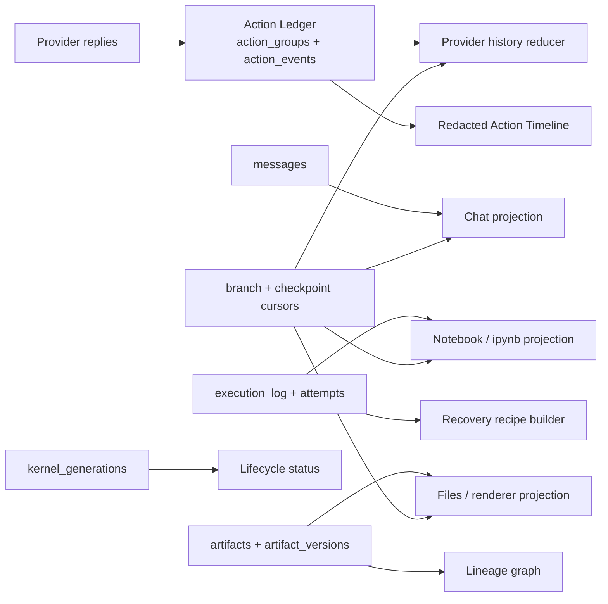

# Projections and persistence

OpenAI4S does not have one serialized “session object.” A session is reconstructed
from several durable records and live resources, each with a narrower purpose.
The Action Ledger feeds provider history and the Action Timeline; public messages
feed chat; execution records feed the Notebook; Artifact rows and snapshots feed
the Files surface; and kernel-generation rows describe process lifecycle. These
views are related by stable identifiers, but they are not interchangeable.

The most important operational rule is:

> SQLite, workspace files, Artifact snapshots, kernel memory, and WebSocket
> delivery are separate commit domains. OpenAI4S has no distributed transaction
> spanning them.

## Identity and scope

| Identifier | Meaning | Important non-meaning |
|---|---|---|
| `project_id` | Groups root sessions and selected project-scoped state such as context and memories. | It is not a kernel, workspace, or transaction boundary. |
| `frame_id` | Identifies one durable actor record. A Web session begins with a root frame; delegated agents receive child frames. | A child frame is not a separate Web session. |
| `root_frame_id` | Identifies the canonical session boundary inherited by child frames. On a root frame, it equals that frame's own `frame_id`. It scopes messages, Cells, Artifacts, permissions, and delegation budgets. | It does not identify the currently selected branch. |
| `branch_id` | Selects one logical history within a root session. The initial branch normally uses the `root_frame_id`; forks use `br-…` identities. | It is not a copied database or a Git branch. |
| `generation_id` | A durable UUID for one Python or R worker incarnation on one branch. Restart, replacement, recovery, or respawn creates a new generation. | It does not prove that an in-memory namespace was restored. |

Other identities are deliberately narrower. `group_id` and `event_id` order the
Action Ledger; `producing_cell_id` identifies a physical Cell attempt;
`state_revision` is the session-monotonic Cell boundary; `artifact_id` names a
logical deliverable; and `version_id` names one recorded set of bytes. Do not
reuse one of these as a substitute for another.

`kernel_id` in older execution and UI payloads is a display/runtime label. Use
`generation_id` or an exact `KernelLease` when lifecycle identity matters.

## Durable records and their consumers

### Action Ledger and provider history

`action_groups` and `action_events` are the canonical record of model-facing
actions and observations. Groups preserve provider declarations, normalized
actions, canonical results, wire reconstruction state, usage, and ordering.
For a native Tool batch, the group and every proposed-call event are inserted
in one SQLite transaction. Result events append as execution progresses. A
reducer in `openai4s/agent/ledger.py` reconstructs the batch as provider-safe
messages after daemon restart.

The reducer is defensive. If a crash leaves an action group without an expected
observation, it supplies a canonical interruption or cancellation observation;
it does not send a half-open tool batch back to a provider. Execution attempts
are associated with ledger groups but are not immutable event rows: they are
allocated before work and fill previously empty milestones monotonically.

Provider history is rebuilt after a newly composed system prompt. The system
prompt can therefore reflect current project context, enabled Skills, memory,
connectors, and environments while prior action/observation groups retain their
durable order. The public `messages` table is not used as provider replay
history.

### Chat, Notebook, Timeline, and Artifacts

These are purpose-specific projections:

- `messages` stores public user/assistant prose. The Web message route projects
  the selected branch and includes exact fork-checkpoint identities where they
  exist.
- `execution_log` stores complete Cell source, result, resource accounting,
  dependency metadata, and produced-file names. The Notebook filters out hidden
  system/scratch Cells unless pinned and hides protocol-only completion Cells.
  `.ipynb` export is a deterministic, read-only projection split by language.
- the Action Timeline is a bounded, redacted view of the Action Ledger. It
  intentionally omits raw arguments and provider wire state.
- `artifacts` stores logical heads; `artifact_versions` stores version metadata
  and paths. The Files view is not the workspace directory listing.
- `frame_steps`, plans, review state, compaction archives, permission requests,
  recovery journal entries, and delegation rows serve their own UI and audit
  views. Their presence does not make them provider history.

Writing one projection does not implicitly update all others. For example, a
Cell can have a durable execution record even when a transient Notebook event
was missed, and a workspace file can exist without a registered Artifact if
capture failed.

## Branch-aware history

Branches do not duplicate historical rows. `project_branch_records()` combines
an inherited checkpoint prefix with branch-local append-only rows:

1. recursively project the parent or revert target checkpoint;
2. include local rows through that checkpoint's cursor;
3. append rows written after the branch head's physical continuation cursor.

The cursor units differ by projection and must not be mixed:

| Projection | Checkpoint cursor | Interpretation |
|---|---|---|
| Action groups | `action_cursor` | Inclusive Action Ledger ordinal. |
| Public messages | `message_cursor` | Physical row-count boundary, normalized to the last included zero-based `seq`. |
| Cells / Notebook | `cell_cursor` | Inclusive `state_revision` (falling back to historical `cell_index`). |

A revert appends a new checkpoint with a `history_projection` descriptor. Rows
from the abandoned interval remain in SQLite for audit, but branch-aware readers
exclude them and append only new rows after the recorded resume boundary. Code
that reads `messages`, `execution_log`, or `action_groups` directly can therefore
see physical history that the active branch intentionally hides. Product-facing
readers must use the branch projector.

## SQLite ownership and concurrency

`Store` owns one `sqlite3.Connection` per resolved database path in the current
process. Every repository receives that same connection and the same
`threading.RLock`. The connection uses `check_same_thread=False`; the shared
lock, rather than SQLite's default thread check, serializes in-process access.

This design gives composite repositories a useful boundary: a checkpoint row,
its structured state snapshot, and its branch-head update can commit together;
branch activation can update the selected branch, conversation policy,
Artifact heads, environment pin, and restorable structured state in one SQLite
transaction.

The guarantee stops at the process boundary:

- the `RLock` coordinates threads only in one daemon;
- `get_store()` is a process-local singleton, not a distributed lock;
- the current Store does not configure WAL mode or a cross-process busy policy;
- the daemon pidfile prevents the normal CLI from starting a second daemon, but
  it is an operational guard rather than a database-level lease.

Do not run multiple OpenAI4S daemons against the same data directory. External
readers should use supported read APIs or an offline copy, not an independent
writer connection.

`Store.close()` is idempotent and evicts only that exact cached Store. A later
`get_store()` for the same path creates a new connection generation. Long-lived
services must therefore resolve Store-backed repositories through the current
owner rather than retaining a repository from a closed Store.

## What a SQLite commit does not cover

| Resource | Owner | Commit/publication point |
|---|---|---|
| SQLite records | `Store` and `storage/` repositories | Repository or composite-service transaction commit. |
| Live workspace | kernel, file tools, Artifact manager, Workspace CAS restore | Individual filesystem writes or `os.replace`; multi-file operations are not all-or-nothing. |
| Artifact snapshot bytes | Artifact manager or Host data service | File copy/write followed or preceded by a separate SQLite binding, depending on the path. |
| Python/R namespace | worker process and `KernelSupervisor` | A live worker pointer; namespace state disappears with that worker. |
| Recovery candidate | recovery orchestrator | Published only after candidate validation; journal entries are separate commits. |
| Web client state | WebSocket hub and browser | Event delivery to each connected client; durable writes are not rolled back on disconnect. |

For crash windows and repair guidance, see [Failure boundaries](failure-boundaries.md).
For the byte-level Artifact rules, see
[Artifacts and provenance](artifacts-and-provenance.md). For checkpoint
publication and namespace recovery, see
[Checkpoints and recovery](checkpoints-and-recovery.md).

## Contributor invariants

When adding persistence or a new projection:

1. choose one canonical durable source and name every derived view;
2. carry `root_frame_id` and `branch_id` explicitly through branch-sensitive
   writes and reads;
3. keep a multi-row invariant inside one repository transaction when possible;
4. never describe a filesystem, worker, or WebSocket action as part of that
   SQLite transaction;
5. make replay and repair idempotent or fail closed;
6. preserve physical audit rows when changing a logical branch projection;
7. add tests for restart reconstruction, incomplete records, projection
   filtering, and a failure at every external commit boundary.

The owning implementations are `openai4s/store.py`, `openai4s/storage/`,
`openai4s/agent/ledger.py`, `openai4s/storage/branch_projection.py`, and the
read services under `openai4s/server/`.
