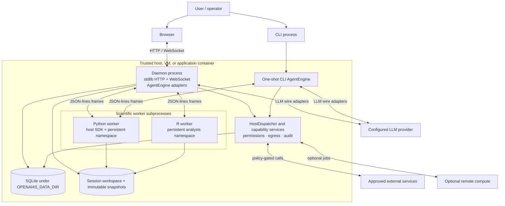

# System context and boundaries

OpenAI4S is a single-host scientific agent system with optional external providers. Its core deployment unit owns orchestration, policy, persistence, and worker lifecycle; language kernels are isolated child processes, not independent services.

## Scope and status

| Statement | Status |
|---|---|
| One daemon serves the static UI, REST endpoints, and WebSocket traffic | **Implemented** |
| The same provider-neutral engine is composed for CLI and Web runs | **Contract / Implemented** |
| Python and R execute in separate subprocesses with independent memory | **Contract / Implemented** |
| Core startup and imports require only the Python standard library | **Contract / Implemented** |
| OS-level confinement is enforced on every supported host | **Best-effort** in `auto`; **Contract** only when the operator selects `enforce` and startup succeeds |
| Multi-node active-active daemon operation | **Partial / unsupported as a deployment guarantee** |

## People and external systems

| Actor or system | Interaction with OpenAI4S | Trust implication |
|---|---|---|
| Researcher or developer | Uses the browser workbench or one-shot CLI; may approve risk-bearing actions | User input is task data, but approval is an explicit authority boundary. |
| Operator | Selects bind address, model credentials, sandbox mode, storage location, environments, and remote compute | The operator controls the host and is trusted to configure it correctly. |
| LLM provider | Receives provider history and returns prose, native tool calls, and code cells | Model output is untrusted input to routing, schema validation, permission checks, and safety gates. |
| Web, data, MCP, and connector services | Are reached through Host-side capabilities | Returned content is untrusted data and may be injection-screened; access remains policy-gated. |
| Remote compute provider | Optionally executes explicitly submitted jobs | It is outside the local kernel boundary and has its own transport, credential, and result-validation rules. |
| Local filesystem and SQLite | Hold session state, artifacts, snapshots, approvals, and audit records | They are the durable source for product projections; kernel memory is not. |

## Deployment and process view

The diagram shows alternatives, not a requirement to run the Web daemon and one-shot CLI against the same active session. A local CLI run owns its lazy workers for that run. A Web session owns lazy worker slots for longer-lived use.

## Runtime components and ownership

| Component | Owns | Does not own |
|---|---|---|
| `agent/engine.py` | Turn state, context preparation, model call, action routing, execution outcome, terminal reason | Concrete tools, kernels, SQLite, WebSockets, or UI text |
| `agent/actions.py` | Lossless normalized call types and the routing decision | Tool behavior or completion rendering |
| `tools/` | Native JSON schemas, tool policy metadata, and concrete built-in behavior | Shell execution or scientific-cell completion |
| `host_dispatch.py` and `host/` | Shared Host envelope and capability services: permission, audit, files, models, delegation, data, and compute | Worker frame reading or Web session admission |
| `kernel/manager.py` | One worker process and its synchronous protocol transaction | Session-level lifecycle policy or durable generation identity |
| `kernel/supervisor.py` | Web-session Python/R slots, exact leases, replacement, stop, and generation lifecycle | Protocol frames and Cell execution |
| `server/cell_run.py` | One Cell transaction from identity allocation through capture and durable record | Deciding whether the whole agent run is complete |
| `server/execution_coordinator.py` | Web-facing FIFO admission, cancellation binding, and execution-state projection | Code execution or process signaling without an injected exact lease operation |
| `store.py` and `storage/` | One SQLite connection facade and domain repositories | Kernel variables or files outside the configured storage/workspace scope |
| `server/webui/` | Static browser presentation | Canonical runtime state |

Compatibility facades such as `gateway.py`, `host_dispatch.py`, `store.py`, and `sdk/host.py` compose these components. New algorithms belong in the owning service or repository rather than being added to a facade.

## Trust boundaries

### 1. Model output to action execution

Model replies are not executable by default. The router accepts provider-normalized native calls or the first complete Python/R fence. Native arguments are parsed and validated; agent-authored cells pass the configured pre-execution safety gate. Completion has a separate closed schema.

This is a **Contract**. A new provider adapter must normalize calls without discarding call IDs, raw arguments, parse failures, ordinal, or provider metadata.

### 2. Daemon to language worker

Workers receive a rebuilt allowlisted environment rather than a copy of the daemon environment. Provider keys, cloud credentials, OAuth data, and loader-injection variables must not leak through ordinary inheritance. The manager communicates over a JSON-per-line pipe isolated from user stdout.

The child environment allowlist and one-reader protocol are **Contract / Implemented**. OS sandbox behavior is deployment-dependent: `auto` may continue while reporting sandbox status `unavailable`, `enforce` fails before worker start if confinement is unavailable, and `off` is an explicit trusted-host choice. See [Security](../security.md).

### 3. Worker code to privileged Host capabilities

Python receives an injected `host` SDK. Calls cross back to the daemon, where `HostDispatcher` applies capability-specific policy, approvals, audit, egress, injection screening, and path rules. `host.bash` is unusual: the Host authorizes a short-lived, one-use token bound to command and worker generation, while the subprocess is launched by the worker, not by the Host.

The shared Host policy envelope is **Implemented**. It is not an in-process sandbox for buggy trusted Tool classes; built-in extensions remain trusted application code.

R has no `host` SDK and cannot cross this boundary mid-cell.

### 4. Web client to daemon

The default bind is `127.0.0.1`. The product is designed for a trusted local user or access through a protected tunnel. Binding to a non-loopback interface expands the threat model and requires the documented access-token and reverse-proxy controls; it does not turn the daemon into a hardened multi-tenant service.

Loopback default and optional access-token checks are **Implemented**. Safe public multi-tenancy is **Partial / not claimed**.

### 5. Durable records to live runtime

SQLite records, workspace files, content-addressed snapshots, artifact versions, and append-only action groups are durable. They can reconstruct product views and provider history. They do not serialize arbitrary Python or R objects.

Durable projection is **Implemented**. Verified recovery may rebuild selected state from manifests and safe recipes, but general namespace restoration is **Partial**. Operators must treat daemon restart, kernel replacement, timeout reset, and idle release as memory-loss boundaries.

## Durable and ephemeral state

| State | Lifetime | Operational consequence |
|---|---|---|
| Messages and canonical Action Ledger groups | SQLite-backed | Survive browser and daemon restarts; incomplete native groups are reduced with canonical synthetic results where needed. |
| Permissions and approval records | SQLite-backed | A post-restart approval records resolution but cannot resume a vanished call stack or replay stored arguments. |
| Artifact metadata and versions | SQLite plus immutable file snapshots | Durable and version-addressable; workspace mutation and artifact registration are distinct steps. |
| Session workspace | Filesystem | Survives worker restart unless an operator deletes or reverts it. |
| Python/R namespace | Worker memory | Survives cells only while that exact worker generation lives. |
| WebSocket replay buffer | In daemon memory, bounded | Helps reconnect to an active turn; completed history must reload from durable REST projections. |
| Session dispatcher | Web daemon memory, lazily created | Survives language-worker stop/restart within the daemon process; rebuilt after daemon restart from durable configuration. |

## Deployment implications

- Run one daemon against one data directory. The daemon is singleton-managed by its pidfile, and the current architecture does not claim coordinated active-active writers.
- Back up both `OPENAI4S_DATA_DIR` and project/session workspaces according to the configured layout. A SQLite-only backup is not a complete artifact backup.
- Keep the HTTP listener on loopback unless a trusted reverse proxy, transport security, and access policy are deliberately configured.
- Choose `OPENAI4S_KERNEL_SANDBOX=enforce` when worker startup must fail rather than run degraded. Monitor the reported Python and R sandbox status independently because workers start independently.
- Set `OPENAI4S_KERNEL_IDLE_TTL` only if releasing idle worker memory is worth losing live Python/R variables. Zero disables automatic release.
- Do not inject model or cloud credentials into worker environments as a workaround. Add or use a Host capability so credentials remain on the trusted side of the boundary.

## Known limits

- **Partial:** a standalone optional Jupyter bridge uses independent namespaces and does not attach to Web-session Host RPC, artifact capture, FIFO admission, or recovery.
- **Partial:** remote compute providers have provider-specific confinement and validation; local worker guarantees do not automatically extend to them.
- **Best-effort:** external services, LLM endpoints, and OS sandbox adapters can be unavailable; adapters surface failures but cannot make those dependencies reliable.
- **Not claimed:** arbitrary untrusted multi-user code execution on a shared daemon.
