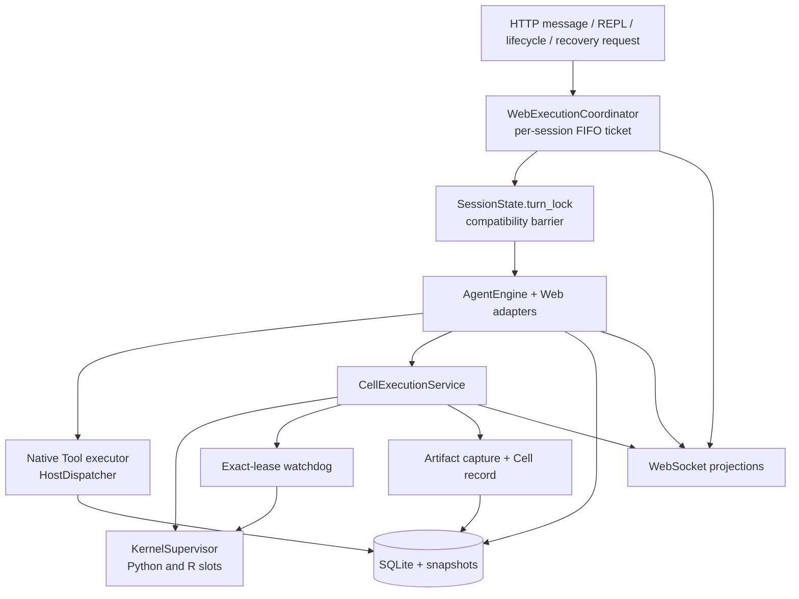

# Web runtime

The Web runtime adapts the same `AgentEngine` used by the CLI to durable sessions, a browser workbench, independent Python/R workers, and an observable FIFO execution queue. The browser is a projection client; canonical actions, attempts, Cells, messages, and artifacts are owned by the server and Store.

## Composition

Different sessions can make progress concurrently. Within one session, only one admitted execution owns mutation at a time.

## Session ownership

`SessionState` owns:

- the root frame, active branch, project, and workspace;
- a `KernelSupervisor` with independent Python and R slots;
- a lazy `SessionRuntime` containing the Host dispatcher;
- in-memory provider messages reconstructed from canonical history when needed;
- desired, pending, and active environment selection;
- a session-wide delegation runner;
- cancellation, stop-priority, and compatibility locks; and
- the last structured completion for the active turn.

The dispatcher is control-plane state, not a property of the Python worker. A tool-only turn builds no language worker. Stopping Python and R leaves the session dispatcher, conversation, approvals, workspace, and durable action history intact until the daemon itself exits or the session is dropped.

This separation is **Contract / Implemented**.

## FIFO admission and exact ownership

The protocol-neutral `SessionExecutionCoordinator` keeps one queue per session. Every ticket has:

- a globally unique `execution_id` within that session;
- an owner pair such as `agent/job-id`, `user_repl/request-id`, `lifecycle/operation-id`, or `recovery/operation-id`;
- optional branch, language, generation, resource, and reason metadata;
- a read-only cancellation signal; and
- a state: `queued`, `running`, `completed`, `failed`, or `cancelled`.

Submission appends to the session queue and promotes the head when no active ticket exists. User work and WebSocket delivery happen outside the coordinator's short-held condition lock, so a long Cell in one session does not block admission in another.

`WebExecutionCoordinator` adds browser-facing queue/execution events and binds the admitted ticket to the compatibility cancellation event. During a Cell it also binds a frozen `KernelLease` and an exact interrupt function.

### Cancellation rules

- Cancelling a queued ticket requires the exact session, execution ID, and owner. It removes only that ticket and never signals the current worker.
- Cancelling a running ticket requires the same exact identity. It sets that ticket's cancellation signal and the compatible session event.
- A process signal is delivered only if the running ticket currently has a bound frozen lease. The supervisor revalidates that lease before interrupting.
- A user-REPL Stop does not fall back to stopping an Agent execution when no exact REPL ticket exists.

Exact ownership is **Contract / Implemented**. Broad session-level interruption exists only as a legacy resolution helper that first resolves the current exact owner; new endpoints must require explicit identity.

## Why `turn_lock` still exists

FIFO admission is the authoritative ordering mechanism, but the older `SessionState.turn_lock` remains as a compatibility barrier around code paths that have not been decomposed into smaller services.

The lock order is strict:

1. submit or reuse the current FIFO ticket;
2. wait until that ticket is admitted; and only then
3. acquire `turn_lock`.

No path may hold `turn_lock` while waiting for FIFO admission. `_session_execution` also recognizes nested work on the current thread and reuses both the admitted ticket and barrier instead of deadlocking itself.

Stop has an additional `admission_lock`, `stop_requested`, and `stop_finished` handshake. It reserves lifecycle admission against new messages, exposes cancellation before waiting for `turn_lock`, then stops exact slots after the old protocol reader leaves. Idle release uses FIFO admission plus a non-blocking `turn_lock` attempt and rechecks every blocker; it skips cleanup rather than waiting behind legacy work.

This coexistence is **Implemented**, but the duplicate barrier is a **compatibility constraint**, not a second scheduling model. Contributors must preserve admission-before-lock ordering until all legacy holders are removed.

## Exact-lease watchdog

Each scientific Cell runs through the protocol-neutral watchdog against a frozen `KernelLease`. The default timeout is read from `OPENAI4S_CELL_TIMEOUT` (900 seconds when unset); a non-positive or non-finite effective value disables timeout handling.

While a human permission decision is pending, the watchdog pauses timeout-budget consumption. Cancellation still interrupts a paused execution. If the Cell exceeds the remaining budget or is cancelled, the watchdog applies this ladder:

1. send SIGINT to the lease if it is still current;
2. wait the interrupt grace period;
3. return the normal interrupted response if the worker unwinds;
4. otherwise kill that exact worker and wait again;
5. restart the slot when the reader has exited, or detach/abandon it if the reader remains wedged; and
6. raise `TimeoutError` after a hard recovery, explicitly reporting namespace loss.

Python bootstrap is rerun after a watchdog restart. R has no Python sidecar bootstrap callback. Completion signals, artifacts, SQLite, and WebSockets are intentionally outside the watchdog; it returns a Cell result or raises to `CellExecutionService`.

The timeout policy and lease checks are **Implemented**. Signal delivery and worker cleanup are **Best-effort** OS operations; stale-lease rejection is the hard safety property.

## Cell transaction order

`CellExecutionService` owns the normal Web Cell order. For a visible streaming Agent or developer-REPL Cell:

1. Increment the session's monotonic Cell/state revision and allocate a server Cell ID.
2. Allocate and mark a durable execution attempt before language preparation.
3. Prepare the requested language, acquire its generation, and bind that generation to the attempt.
4. Emit `notebook_cell_start` and compatible activity events.
5. Snapshot the workspace, protect current artifact versions, and run the agent-cell safety gate.
6. Execute through the watchdog, emitting bounded `notebook_cell_chunk` stdout events when the worker supports live chunks.
7. Mark that the worker response arrived.
8. Capture workspace changes and Python figures; register artifact versions and capture milestones.
9. Record the immutable Cell and finish the durable execution attempt.
10. Emit `notebook_cell_finished` with bounded transient output, generation ID, artifact references, and telemetry.
11. Return the observation to `AgentEngine`.

The ordering makes several truthfulness properties explicit:

- a worker spawn or environment failure still has a durable attempt;
- an Agent safety refusal is represented as a non-executed Cell transaction with a `safety_refused` terminal state;
- artifact capture and the durable Cell record complete before a Python submission can finish the outer run; and
- transient WebSocket output may be bounded without truncating the stored worker result.

### Completion-only submission Cells

A Python Cell that consists only of a direct `host.submit_output(...)` expression with no nested executable work in its arguments is protocol control rather than scientific analysis. It still receives an attempt, executes, captures, and records. Its stored Cell is marked system-visible and never-replay, while live/read-only Notebook `start` and `finished` projections are suppressed. A Cell that computes, reads, prints, or calls another function while constructing its submission remains visible.

### Failure boundaries

The normal sequence above is **Implemented**. A process/protocol failure after execution begins is converted into and records an immutable failed Cell when possible. A failure in projection or artifact capture can still occur after `notebook_cell_start` and before `notebook_cell_finished`; therefore clients must not use a missing finish event as the sole durable truth. Execution-ticket terminal state and stored execution attempts are the fallback boundaries. Fully reconstructing every transient event after an arbitrary process crash remains **Partial**.

## Model stream and Notebook stream

The Web event adapter separates three views of a model reply:

1. **Public prose:** only prose before the first executable action is streamed to chat. Top-level fenced content is hidden from the prose projection.
2. **Transient code draft:** while the model streams its first Python/R fence, one stable draft ID is updated in place. The draft is not a Cell, attempt, or history record. An incomplete fence is discarded and never executes.
3. **Immutable Cell:** after routing selects the CodeCell, the Cell service allocates the server ID and emits the actual Notebook lifecycle. The draft is cleared when the action begins or when native-call priority means it will not execute.

The Action Ledger event is persisted before the corresponding transient Web projection. If no model prose explains an action, deterministic narration supplies an in-progress message without exposing code, raw arguments, or hidden reasoning. After a non-terminal Cell, deterministic outcome narration reports only facts visible in the real observation.

These projections are **Implemented**. The WebSocket replay window is bounded and in-memory; reconnect replay is **Partial** relative to a complete event log. Completed conversation, Timeline, Notebook, and artifact views reload from durable REST projections.

## User-visible completion projection

Structured completion and visible assistant text are related but different records. On a successful `submitted` run, the Gateway:

1. appends the terminal Action Ledger fact with the actual completion record;
2. computes the artifact-version delta relative to the start of the user turn;
3. renders `output`, `completion_bullets`, and those actually changed artifacts into a deterministic final message;
4. avoids repeating summary text already streamed before the action;
5. persists each visible assistant prose block with ordering timestamps;
6. optionally runs the configured reviewer;
7. updates the durable frame status and emits an execution `finalizing` state;
8. leaves the inner session-execution scope; a direct invocation completes its FIFO ticket here, while a queued `MessageJob` still owns the outer ticket;
9. emits the historical terminal `frame_update`; and
10. for a queued `MessageJob`, completes the outer FIFO ticket immediately after the inner call returns.

For a visible scientific Cell, `notebook_cell_finished` occurs before control returns to the Engine and therefore before this final completion message. For a direct completion-only Cell, Notebook lifecycle is intentionally hidden, but its capture and durable record still finish before the message.

If the engine stops for cancellation, `max_turns`, plan mode, or runtime error, the Gateway persists and displays that terminal condition separately. It does not manufacture a successful completion. A normal Tool or Cell outcome can receive deterministic progress prose, but only an explicit completion signal enters the success projection.

This completion projection is **Contract / Implemented**. Artifact links reflect the actual per-turn version delta rather than artifact names claimed by the model.

## Native Tool writes in Web sessions

Native Tool classes that declare `writes_files=True` execute inside a per-call workspace capture wrapper. The wrapper diffs the workspace and immediately registers new artifact versions, including multiple edits of the same path across calls. This boundary is around model-originated control Tools, not the shared `HostDispatcher`, so a Python `host.write_file(...)` is captured by the surrounding Cell transaction exactly once.

This distinction is **Implemented** and must be preserved when adding a mutating Tool.

## Persistence and reopen behavior

| View | Live source | Reopen source |
|---|---|---|
| Chat prose | WebSocket `text_chunk` | Stored messages |
| Action status and queue | execution-state WebSocket events | Current coordinator snapshot while daemon is live; terminal facts in stored ledger/attempts |
| Notebook Cell | start/chunk/finished events | Stored immutable Cell records and execution attempts |
| Action Timeline | live semantic/action events | Redacted Action Ledger projection |
| Artifacts | capture events | Artifact/version repositories and immutable snapshots |
| Kernel status | supervisor events | live supervisor plus durable generation records |

A reopened session may recreate its in-memory `SessionState`, dispatcher, and workers from durable selections. It does not recreate arbitrary prior variables unless an explicit verified recovery action reports that it rebuilt and validated them.

## Operational controls

- `OPENAI4S_NOTEBOOK_REPL=1` enables developer Python/R entry. With it off, mutating Notebook kernel routes are rejected; the Notebook remains a read-only execution trace.
- `OPENAI4S_CELL_TIMEOUT` controls the Cell watchdog, not the total agent-turn duration.
- `OPENAI4S_KERNEL_IDLE_TTL` optionally releases both language slots only after barrier-safe blocker checks.
- Stopping a kernel preserves durable session content but clears live namespaces.
- The static UI is served directly from `openai4s/server/webui/`; JavaScript and CSS changes require reload, not a build step.

## Status summary

| Area | Status | Boundary |
|---|---|---|
| Per-session FIFO tickets | **Contract / Implemented** | One admitted execution per session; sessions remain independent. |
| `turn_lock` coexistence | **Implemented compatibility constraint** | Always admit before locking. |
| Exact ticket and lease cancellation | **Contract / Implemented** | No queued-to-running or stale-generation signal spillover. |
| Watchdog timeout ladder | **Implemented / Best-effort OS signaling** | Hard recovery clears namespace. |
| Cell transaction and durable attempts | **Implemented** | Attempt identity precedes worker preparation. |
| WebSocket ordering in a healthy turn | **Implemented** | Cell finish precedes successful completion text. The terminal frame update closes the response path; a queued MessageJob's execution-completed event may follow when its outer ticket exits. |
| Reconnect replay | **Partial** | Bounded live buffer; durable views reload separately. |
| Arbitrary namespace recovery | **Partial / not claimed** | Files and records survive; objects require verified rebuild. |
