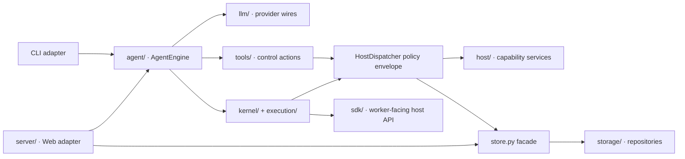

# Codebase map

OpenAI4S deliberately separates the provider-facing control plane from the
scientific runtime. Start a change in the module that owns its behavior; use
the large compatibility files only for composition and routing.

## Entry points

| Entry | Composition path | Runtime scope |
|---|---|---|
| `openai4s run "…"` | `cli/main.py` → `agent/loop.py` → `AgentEngine` | One in-process run; Python/R workers are lazy and close with the run |
| `openai4s serve` | `cli/main.py` → `server/__init__.py` → `server/gateway.py` | Long-lived Web workbench with persistent session runtimes |
| `python -m openai4s` | `__main__.py` → CLI | Same commands as the installed console script |
| Optional Jupyter bridge | `adapters/jupyter/` → existing kernel manager | Independent namespace; no Web-session Host or Artifact integration |

`server/daemon.py` is the preserved minimal compatibility server. It is not
the server started by the normal `serve` command.

## Ownership map

| Area | Owns | Primary modules | Required validation |
|---|---|---|---|
| Agent core | Provider-neutral state machine, action priority, terminal semantics | `agent/engine.py`, `agent/actions.py`, `agent/finalize.py`, `agent/ports.py` | `tests/test_agent_engine.py`, `tests/test_actions.py`, structured-finalize and provider tool-call tests |
| Local composition | CLI lifecycle, local transcript, lazy kernels | `agent/loop.py`, `agent/runtime.py` | `tests/test_agent.py`, `tests/test_agent_runtime.py`, CLI tests |
| Control tools | Schemas, side-effect taxonomy, validation, execution behavior | `tools/` and `tools/registry.py` | tool schema, native tool, permission, and capability-specific tests |
| Host policy | Permission, approval, audit, injection warnings, RPC routing | `host_dispatch.py`, `permissions.py` | Host contract, permission, security, and audit tests |
| Host capabilities | Files, LLM, completion, skills, MCP, delegation, compute | `host/` | focused `test_host_*` suites |
| Worker API | The injected `host` facade and compute handles | `sdk/` | Host contract and SDK tests |
| Kernel protocol | Worker process, single-reader protocol, R channel, lifecycle | `kernel/` | `tests/test_kernel.py`, R, supervisor, sandbox, and recovery suites |
| Execution ownership | FIFO admission, exact owner/lease cancellation, watchdog | `execution/`, `server/execution_coordinator.py` | coordinator and watchdog suites |
| Persistence | One SQLite owner, schema, repository composition | `store.py`, `storage/` | Store and repository suites |
| Web workbench | REST/WS composition, session services, artifact capture | `server/`, `server/webui/` | Gateway, session service, static contract, and browser smoke tests |
| Platform integration | Remote compute and sandboxed worker runtime | `compute/`, `openai4s_compute_provider/`, platform Skills | compute, capability probe, security, and opt-in external tests |
| Skills | Bundled recipes, user/project overlays, sidecar bootstrap | `skills/`, `skills_loader/` | skill discovery, product surface, version, and sidecar tests |

## Compatibility boundaries

Treat these files as composition facades and edit them surgically:

- `server/gateway.py`
- `host_dispatch.py`
- `store.py`
- `sdk/host.py`
- `server/webui/app.js`

They carry routing, wire shapes, saved-database compatibility, and legacy call
sites. Put new algorithms in the focused service, repository, or Tool class,
then add only the smallest adapter change to the facade.

## Where a new feature belongs

| Requirement | Owning extension seam |
|---|---|
| Deterministic orchestration or approval boundary | A named native `Tool` subclass |
| Scientific analysis or transformation | Python/R Code-as-Action, usually packaged as a Skill |
| Audited service callable from Python | A focused `host/` service plus SDK facade method |
| Persistent domain state | A `storage/` repository composed through `Store` |
| Web-session workflow | A focused `server/` service with Gateway adapter routes |
| New provider wire | `llm/` normalization and provider adapter |
| Remote execution backend | Compute provider/worker-runtime boundary; do not hide it in the engine |

Continue with the [backend extension guide](../backend-extension-guide.md) for
the concrete implementation sequence.
