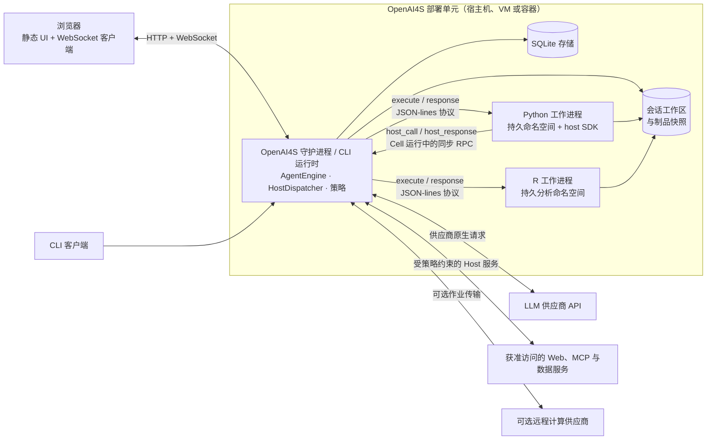

# 架构概览

OpenAI4S 拥有纯标准库 Python 控制平面核心：供应商原生 JSON 工具负责编排与权限，惰性启动且持久的 Python 和 R 子进程构成科学执行平面。R protocol worker 依赖 `jsonlite`，科学环境也可以包含可选第三方 package。

此页面继续作为历史链接 `docs/architecture.md` 的目标。它提供概览；各链接页面是相应运行时边界的规范细节文档。

## 状态词汇

架构陈述有意使用以下标签：

| 标签 | 含义 |
|---|---|
| **契约（Contract）** | 贡献者必须保留的行为，除非有意迁移相应协议及其测试。 |
| **已实现（Implemented）** | 当前代码中已存在，并已接入正常 CLI 或 Web 路径。 |
| **尽力而为（Best-effort）** | 已实现，但允许失败，或结果依赖操作系统或外部服务。 |
| **部分实现（Partial）** | 已具备基础或部分能力；调用方不得推断其超出明确范围的端到端保证。 |

## 运行时速览

系统不要求使用应用容器。图中的 `OpenAI4S 部署单元` 可以是宿主进程、虚拟机或由运维人员管理的容器。Python 和 R 在该单元内仍是彼此独立的子进程；容器边界不能代替内核沙箱。

面向模型的外层循环会为每个助手回复选择一个动作通道：

1. 一批按顺序执行的供应商原生 JSON 工具调用；
2. 一个且仅一个由 Engine 拥有的 `finalize_response` 动作；
3. 否则，首个完整的 Python 或 R 围栏 Cell；或
4. 没有可执行动作，此时产生纠正性观察，而不是完成运行。

在一个 Python Cell 内，注入的 `host` 单例可以在该 Cell 返回之前同步调用 Host 多次。R 使用相同的管理器级 execute/response 契约，但有意不提供 `host` 对象，也不支持 Cell 运行中的 Host RPC。

## 稳定不变量

以下清单是审查运行时变更时最短且有用的检查表：

1. **只有一个供应商中立的外层状态机。** CLI 和 Web 都组合使用 [`AgentEngine`](https://github.com/PKU-YuanGroup/OpenAI4S/blob/main/openai4s/agent/engine.py)，不会实现相互竞争的路由循环。
2. **原生调用拥有路由优先级。** 如果回复包含供应商原生调用，同一回复中的围栏代码不会执行。仅当 `finalize_response` 是唯一的原生调用时，才选择 `FinalizeAction`。
3. **每个模型步骤只执行一个 Cell。** 没有原生调用时，只运行文档顺序中的首个完整顶层 Python/R 围栏。未闭合的围栏绝不运行。
4. **完成必须显式发生。** 通过校验的唯一 `finalize_response` 或 Python `host.submit_output(...)` 可以完成一次运行。普通文本、普通工具结果、成功的 Python/R Cell、取消和轮数耗尽都不能完成运行。
5. **每个工作进程只有一个协议读取者。** 具体 `Kernel` 拥有其工作进程的同步帧循环。监督器绝不读取帧，Python 工作进程只允许一个正在进行的 Host RPC 事务。
6. **工作进程惰性启动且在进程存活期间持久，但并不会自动恢复。** 只用工具/完成动作的工作不会启动语言工作进程。存活的工作进程保留其命名空间；停止、替换、崩溃、空闲释放或重启会清除内存变量。工作区和持久记录彼此独立，并会保留。
7. **Web 控制平面的生命周期长于语言工作进程。** 会话调度器、审批、动作历史、消息和委派状态不归 Python 或 R 进程所有。
8. **供应商历史是规范且完备的。** 每个已声明的原生调用都恰好获得一个规范工具结果，包括格式错误、被拒绝、受限、被取消或被中断的调用。结果保持供应商给出的顺序。
9. **每个 Web 会话一次只接纳一个写入者。** 智能体轮次、开发者 REPL Cell、生命周期操作和恢复变更均使用 FIFO 执行票据。取消必须针对确切的执行所有者；Cell 运行期间还必须针对冻结的内核租约。
10. **核心导入保持零依赖。** 引擎、传输、内核管理器和 Web 服务器只使用 Python 标准库。可选科学软件包在核心导入位置必须继续保持可选。

## 阅读路径

### 面向贡献者

建议按以下顺序阅读：

1. [系统上下文与边界](architecture/system-context.md)——进程、信任边界、持久状态和外部系统。
2. [动作路由与完成](architecture/action-routing.md)——精确的外层循环决策表和规范历史规则。
3. [内核与 Host RPC](architecture/kernels-and-host-rpc.md)——工作进程生命周期、帧所有权、Python/R 差异和资源计量。
4. [Web 运行时](architecture/web-runtime.md)——FIFO 接纳、`turn_lock` 共存、看门狗恢复、Cell 事务顺序和面向用户的投影。
5. [后端扩展指南](backend-extension-guide.md)——新 Tool、Host 能力、存储库或 Web 服务应放在哪里。

修改内核协议后，请运行 `uv run pytest tests/test_kernel.py`。修改路由时，先运行 `tests/test_agent.py` 以及动作/账本测试。涉及 Web、看门狗、流式传输或制品的变更，还必须针对 `./start.sh` 启动的实例执行真实浏览器检查；单元测试无法端到端证明 WebSocket 顺序或图形捕获。

### 面向部署与运维

请阅读[系统上下文与边界](architecture/system-context.md)、[Web 运行时](architecture/web-runtime.md)、[安全](security.md)和[配置](configuration.md)。对运维尤为重要的边界包括：

- 守护进程默认绑定回环地址，不是面向不可信用户的多租户服务；
- `auto` 沙箱模式可以报告降级边界，而 `enforce` 会以关闭方式失败；
- SQLite、工作区和制品快照是持久的；Python/R 内存不是；
- 配置内核空闲 TTL 会释放进程，而不会删除会话历史；
- Web 控制平面无需分配科学工作进程即可处理纯工具工作。

## 当前实现状态

| 区域 | 状态 | 范围 |
|---|---|---|
| 外层动作引擎 | **契约 / 已实现** | 通过端口与适配器由 CLI 和 Web 共享。 |
| 原生工具与结构化完成路由 | **契约 / 已实现** | 原生调用优先、唯一完成规则、每个调用一个规范结果。 |
| Python 持久工作进程与 Cell 内 Host RPC | **契约 / 已实现** | 通过隔离的 JSON-lines 协议进行同步 RPC。 |
| R 持久工作进程 | **已实现** | 独立分析命名空间；无 Host RPC 或 Cell 内完成。 |
| Web FIFO 接纳与精确取消 | **已实现** | 与兼容性 `turn_lock` 共存；以确切票据/租约身份为准。 |
| 资源测量与自动清理 | **尽力而为** | 测量语义随语言和操作系统而异；空闲释放需显式启用。 |
| 工作进程丢失后的命名空间恢复 | **部分实现** | 已验证的方案可重建选定状态；从不宣称能恢复任意 Python/R 对象。 |
| 重连事件重放 | **部分实现** | 可重放有界的当前轮次 WebSocket 窗口；持久的已完成视图来自已存储投影。 |
