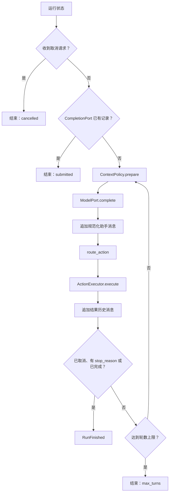

# 动作路由与完成

外层循环有意保持精简：准备上下文、请求模型、选择一个动作通道、执行动作、追加规范结果，然后重复，直到出现显式终止条件。

规范路由实现在 [`agent/actions.py`](https://github.com/PKU-YuanGroup/OpenAI4S/blob/main/openai4s/agent/actions.py) 中；状态机位于 [`agent/engine.py`](https://github.com/PKU-YuanGroup/OpenAI4S/blob/main/openai4s/agent/engine.py)。CLI 和 Web 的投影与生命周期可以不同，但不能改变此处描述的路由优先级。

## 外层循环契约



引擎在执行前追加助手声明，在执行后追加执行器的历史消息。此顺序对供应商重放很重要：原生工具声明之后必须跟随其结果消息，Cell 声明之后必须跟随其观察。

系统会在请求模型前和每次执行后检查取消。适配器还会阻止阻塞式供应商调用的迟到响应在取消后分派新动作。

## 路由决策表

`route_action(content, tool_calls)` 按顺序应用以下规则：

| 单个助手回复中的条件 | 选择的动作 | 不会运行的内容 |
|---|---|---|
| 恰好一个名为 `finalize_response` 的原生调用 | `FinalizeAction` | 同一回复中的任何围栏代码 |
| 其他任何组合中的一个或多个原生调用 | 有序 `NativeToolBatch` | 同一回复中的任何围栏代码 |
| 没有原生调用；至少有一个闭合的可执行围栏 | 文档顺序中的第一个 `CodeCell` | 后续所有 Python/R 围栏 |
| 没有原生调用；没有闭合的可执行围栏 | 无动作 | 普通文本与未闭合围栏不会执行 |

这是一个**契约 / 已实现**边界。

重要结论：

- 即使原生调用中的 JSON 格式错误，原生调用仍然优先。解析失败会变成规范工具错误，不会回退到代码。
- `finalize_response` 仅在它是唯一原生调用时才具有特殊含义。如果它与其他调用同时出现，整个回复会作为普通原生批次处理。由于完成由 Engine 拥有，而不是已注册 Tool，普通执行器会拒绝该批次中的完成项，而不会完成运行。
- Python 围栏接受空信息字符串、`python` 或 `py`。R 要求 `r`（围栏扫描器会统一大小写）。
- 只有反引号围栏可执行。扫描器能识别嵌套示例，并选择闭合的顶层块；未终止的动作围栏绝不执行。
- 如果模型输出多个完整 Cell，只执行第一个。观察中会包含系统说明，指出后续 Cell 未运行。
- 历史围栏 `tool` 语法是兼容性回退，仅在没有路由任何原生调用或 Python/R Cell 后使用。它不是公开推荐的主要控制界面。

## 原生调用为何优先

供应商原生调用是供应商助手消息中的声明。如果还执行同一消息中的代码，就会对一个模型步骤产生两种并行解释，并使供应商重放产生歧义。优先级让每个回复只映射到一个动作通道：

```text
助手原生声明 -> 每个调用一个有序的规范结果

或

助手围栏 Cell -> 一个执行观察
```

优先级是为了确定性，而不是能力差异。原生 Tool 用于有界编排与受策略控制的操作；Cell 提供语言控制流、库、持久内存，以及 Python 中的同步 Host RPC。

## 原生批量执行

`NativeToolBatch` 保留供应商给出的顺序与调用身份。每个规范化调用都会保留：

- 本地调用 ID 和可选的供应商线路 ID；
- 名称和原始序号；
- 原始参数文本；
- 已解析参数对象或解析错误；以及
- 不透明的供应商元数据。

执行器必须为每个声明恰好生成一条 `role=tool` 历史消息。此完备性规则涵盖：

- 有效调用；
- 格式错误的 JSON 或非对象参数；
- 模式校验失败和未知工具；
- 超出单轮上限的调用；
- 权限拒绝；
- 剩余调用开始前发生取消；以及
- 执行器异常。

每个结果都包含调用 ID、线路 ID、工具名称、有界文本和 `is_error`。缺失结果会由 Action Ledger 归约器显式合成，而不是留下未闭合的供应商组。

### 调度

除非某个 Tool 类明确声明调用是只读的并提供资源键，否则执行均为顺序执行。当键不冲突时，开头的只读区段可以分成有界并行波次运行。第一个会写入或未分类的可执行调用构成屏障；该调用及后续调用保持顺序执行。预检错误仍留在原位置，且不会阻止为后续调用生成规范结果。

实际完成顺序绝不改变历史顺序。执行器始终按供应商的原始序号写入结果。

此调度行为是**已实现**的。并行是一种优化，不是 Tool 的语义契约；Tool 不得依赖线程完成顺序。

## Cell 执行结果

路由得到的 `CodeCell` 会经过适配器的安全门控，然后进入且只进入一个语言运行时。其响应会被格式化为 `[Observation]`，包含捕获的 stdout、stderr、错误/跟踪信息，以及可用时的用量数据。该观察作为 `role=user` 消息追加到供应商历史，供下一步推理使用。

Cell 错误是一条观察，不会自动成为终止运行错误。模型可以在下一轮发出修复动作。同样，Cell 成功也不会自动代表完成。

Web Cell 执行包含更大的事务——持久尝试、工作进程代际、流式传输、制品捕获和不可变 Cell 记录——但向 `AgentEngine` 返回的概念性观察相同。参见 [Web 运行时](web-runtime.md)。

## 完成契约

有两条有效的完成路径。

### Engine 拥有的 `finalize_response`

`finalize_response` 是 Engine 提供的供应商元数据，而不是 Tool 注册表中的实例。唯一的原生调用会成为 `FinalizeAction`。执行器会：

1. 用恰好一个规范工具结果闭合供应商声明；
2. 校验解析成功以及封闭的完成模式；
3. 校验 `completion_bullets` 描述的是已经完成的工作；以及
4. 仅在校验成功时返回完成记录。

必需参数包括非空 `summary` 以及一至四条 `completion_bullets`；发现、指标、制品、限制和后续步骤是可选结构化字段。未知属性会被拒绝。格式错误的完成会产生可修复的工具错误，不会完成运行。

`FinalizeAction` 不会启动内核，可用于结束纯工具对话，也可以结束前面轮次曾使用科学 Cell 的运行。

### Python `host.submit_output(...)`

注入的 Python `host` SDK 通过普通的 Cell 内 Host RPC 路径发送 `submit_output`。Host 校验并记录完成载荷。仅当 Cell 事务返回后，外层适配器才观察调度器的完成信号；因此在 Web 路径中，文件/图形捕获和持久 Cell 记录会先于 Engine 接受完成而结束。

R 没有 Host RPC，不能直接提交完成。一次 R 分析之后必须跟随一个 Python 提交 Cell，或后续唯一的 `finalize_response` 动作。

### 不代表完成的事件

以下事件绝不表示成功：

- 助手普通文本，包括看似最终答案的文本；
- 普通原生 Tool 结果；
- 没有错误的 Python 或 R 响应；
- 任何 R Cell；
- 取消；
- 安全拒绝；
- 计划模式捕获；或
- 达到 `max_turns`。

取消和轮数耗尽都是没有完成记录的终止原因。这一区分可以防止 UI 将部分执行呈现为成功的科学结果。

## 规范 Action Ledger

实时消息列表不是历史的唯一来源。运行时适配器会向仅追加的 Action Ledger 发出带类型事件：

1. 围绕助手声明打开一个动作组；
2. 记录规范化声明与经过脱敏的规范参数；
3. 追加每个原生结果或 Cell 观察；
4. 分别关联执行尝试与代际生命周期；以及
5. 在终止组中记录运行的停止原因和完成记录（如有）。

归约器以完整单元重建供应商历史。对于原生/完成组，它输出助手声明，随后每个调用输出一个结果。对于 Cell/无动作组，它输出助手消息，随后输出观察。损坏或结构不完整的组会被省略，以免泄漏有歧义的部分供应商消息。

上下文压缩会将助手声明及其 Tool 结果作为原子组保留。大型输出可以外部化，但压缩不得将供应商调用与其结果拆开。

## 状态与限制

| 行为 | 状态 | 限制 |
|---|---|---|
| 路由优先级与首个完整 Cell 规则 | **契约 / 已实现** | 每个助手回复只有一个动作通道。 |
| 唯一结构化完成 | **契约 / 已实现** | 无效或混合完成不代表完成。 |
| 规范原生结果 | **契约 / 已实现** | 按供应商顺序为每个声明生成一个结果。 |
| 只读前缀并行 | **已实现** | 仅限类声明且资源兼容的调用；最大并发受限。 |
| 旧版围栏 Tool 解析 | **仅兼容** | 为已保存提示词/旧客户端保留；不是公开推荐的界面。 |
| 上下文压缩 | **尽力而为** | 归档或摘要失败时保留实时上下文；低收益断路器避免反复进行无效压缩。 |
| 普通文本回退 | **已实现为提示** | 它要求模型发出有效的完成/动作；绝不会静默地将普通文本作为终止接受。 |
