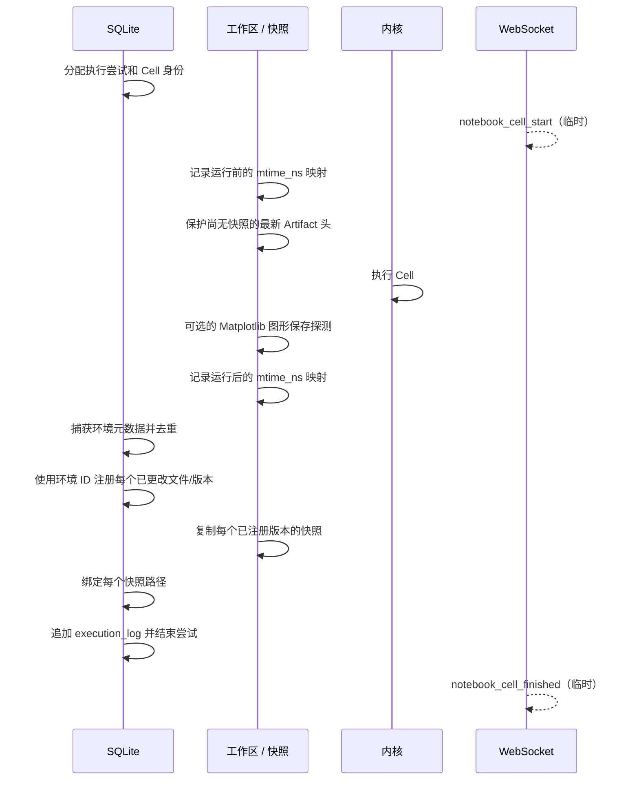

# Artifact 与来源追踪

OpenAI4S Artifact 是逻辑交付物，而不只是文件路径。一个 `artifact_id` 拥有一系列版本行；
`latest_version_id` 选出当前头。一个版本会记录文件名、内容类型、大小、校验和、实时路径、
可选的不可变 `snapshot_path`、生成该版本的 Cell、环境快照以及血缘边。

该实现提供了强身份标识和校验和，但工作区捕获与对象级来源追踪均采用尽力而为方式。缺少
Artifact 或血缘边，不能证明没有发生文件写入或依赖关系。

## 逻辑对象、实时文件与冻结字节

以下几种表示可以同时存在：

| 表示 | 用途 | 可变性 |
|---|---|---|
| `artifacts` 行 | 逻辑名称、所有权、优先级和当前头。 | 头和显示元数据会变化。 |
| `artifact_versions` 行 | 版本身份、校验和/大小、生成者和存储元数据。 | 内容身份不会被替换，但可以补填快照绑定，并且当前仅元数据重命名操作会改写已存储的文件名。 |
| 工作区 `path` | 代码和用户当前编辑的文件。 | 可变，并且可能在 OpenAI4S 之外被覆盖。 |
| `snapshot_path` | 受信任 Artifact 存储中某个版本的冻结字节。 | 视为不可变；恢复在使用前会验证根路径、大小和 SHA-256。 |

缺少 `snapshot_path` 的已记录版本不等同于不可变快照：其 `path` 仍可能指向可变工作区。
`protect_latest()` 会尝试在之后的 Cell 或原生文件工具将其覆盖之前，为这样的头补填快照。
这是一种修复辅助措施；当需要达到可恢复级别的不可变性时，它不能替代对 `snapshot_path`
的检查。

Artifact 恢复绝不会把 `latest_version_id` 回退到旧行。它会验证历史快照，保护并验证当前头，
原子替换实时文件，追加一个全新版本，并从历史源版本向新恢复版本添加一条血缘边。如果数据库
比较并交换失败，它会尝试恢复此前的实时字节，并删除尚未提交的新快照。

## 工作区自动捕获

`server/cell_run.py` 和 `server/artifacts.py` 中的 Web Cell 事务采用以下顺序：

该图表示执行顺序，而不是一个事务。具体而言，自动捕获会先注册版本，再由
`write_version_snapshot()` 复制并绑定其快照。在此窗口内发生崩溃或复制错误，可能留下一个
只有可变实时路径的版本。快照复制采用尽力而为方式并捕获文件系统错误；如果实时字节仍然匹配
且尚未被替换，下一次 `protect_latest()` 可能会修复这个缺口。

运行前/后的扫描会为工作区下的普通文件记录 `st_mtime_ns`。它排除隐藏路径、
`node_modules`、`site-packages` 和 `venv` 等依赖树、字节码、软件包元数据目录以及嵌套的
Git 仓库。当路径为新路径或其 mtime 发生变化时，就会被捕获。

这存在明确的限制：

- 保持相同 mtime 的覆盖操作无法被发现；
- 删除不会形成版本，因为运行后扫描只遍历仍然存在的文件；
- 重命名会表现为一个新路径，而旧路径的消失不会成为删除事件；
- 此扫描无法发现会话工作区之外的写入；
- worker 或捕获失败可能留下真实的工作区字节，却没有对应的 Artifact 行；
- 声明 `writes_files=True` 的原生 Tool 会在 `finally` 块中接受扫描，但捕获失败只会被记录，
  不会替换该 Tool 的结果；
- 只有在已更改文件被捕获时，才会附加环境与远程计算来源信息；这些信息的收集本身也采用
  尽力而为方式。

Matplotlib 探测仅针对 Python Cell 运行。R 输出通过同一个文件差异路径捕获，但绝不会经过
Python 图形探测。

## 写入路径顺序

不同入口有意采用不同的暂存顺序。在修改恢复能力声明前，请先审阅相关路径。

| 入口 | 当前顺序 | 失败影响 |
|---|---|---|
| Cell 或 `writes_files=True` 原生 Tool | 预扫描 → 保护旧头 → 执行 → 后扫描 → SQLite 版本 → 快照复制/绑定 | 已提交版本可能暂时或永久缺少快照。捕获失败不会撤销原始文件写入。 |
| Python 来源追踪写入器 | 写入器关闭/保存 → `prov_record` 注册临时版本和血缘 → Cell 结束时的捕获可以使用快照/环境数据最终确定同一个匹配版本 | 来源信息可以先于正常捕获存在，但失败会被吞掉，最终捕获仍可能缺失。 |
| `host.save_artifact()` | 读取源 → 复制快照 → 使用快照路径注册/最终确定版本 → 之后的 Cell 捕获会在身份、校验和、Cell 与路径匹配时复用它 | 如果注册失败，快照会被删除；清理仍然只是文件系统层面的尽力而为操作。 |
| Web 上传 | 写入实时上传内容 → 保存版本行 → 写入/绑定快照 | 数据库失败可能留下未注册的上传；之后的快照失败可能留下只有实时路径的版本。 |
| Web 文本编辑 | 尽力保护当前字节 → 写入实时文本 → 追加版本 → 写入/绑定新快照 | 如果数据库追加失败，文件系统成功写入不会回滚。 |
| Artifact 恢复 | 验证历史与当前字节 → 创建经过验证的新快照 → 原子替换实时文件 → SQLite 比较并交换以及新版本 | 持久化失败时，服务会显式回滚实时字节并删除新快照；回滚失败会单独报告。 |

## 重命名与编辑语义

Web 重命名操作只修改元数据。它会验证提议的相对名称仍位于工作区内，然后更新逻辑 Artifact
以及每个版本的 `filename`。它**不会**移动实时文件、修改已存储的 `path` 或
`snapshot_path`，也不会追加版本。代码绝不能将此操作表述为 POSIX 重命名。

这一区别会影响后续编辑：编辑器根据当前逻辑文件名解析实时路径。仅元数据重命名之后，该路径
可能不同于历史版本中存储的实时路径，从而让旧的物理文件留在原处。运维人员应在协调一个重命名
后的 Artifact 前同时检查元数据和路径。

Web 编辑仅限公认的文本扩展名，或文本/JSON/CSV/XML/类 JavaScript 媒体类型；图像和已知
二进制格式会被拒绝。它会追加一个版本，但如上所述，实时文件写入与 SQLite 追加并不属于同一个
事务。直接编辑工作区会绕过此 API，只有后续捕获检测到 mtime 变化时才可见。

## 对象级来源追踪实际观察什么

`openai4s/kernel/provenance.py` 在 Python worker 内运行。当可导入相应可选库时，它会对有限的
API 集合进行 monkeypatch：

- 内置 `open()` 的读取与写入；
- `json.loads()`；
- pandas CSV、Parquet、JSON、pickle 和 Excel 读取器；
- pandas `DataFrame`/`Series` 切片和选定的 `to_*` 写入器；
- NumPy `load()` 和 `save()`；
- Matplotlib `Figure.savefig()`。

在受支持的读取路径上，worker 会把物理路径解析到已知的最新 Artifact 版本，并将该
`version_id` 附加到返回对象。部分选定操作会保留标签。在受支持的写入路径上，worker 会报告
仍然存在于正在写入的确切对象或字符串上的标签。随后，Host 注册输出，并在记录该版本的同一个
SQLite 事务中插入 `input_version_id → output_version_id` 边。

该机制并不是通用的 Python 污点追踪：

- 它只安装在 Python worker 中；R 没有等价的对象标签器；
- 任意库、序列化器、构造器、复制、连接、归约、标量运算、容器索引和用户自定义变换都可能
  丢失标签；
- `json.loads()` 会标记返回的根对象，但不会检测对所有后代值的通用遍历；
- 内置文件写入只会看到传给 `write()` 或 `writelines()` 的字符串/字节上的标签；
- pandas 标签传播覆盖 `__getitem__`，而不是每一项 pandas 操作；
- 路径解析与 Host 记录失败会被有意吞掉，避免来源追踪破坏科学计算代码；
- `OPENAI4S_PROVENANCE_OFF=1` 会禁用该检测机制；
- Cell 执行记录目前无法发现完整、通用的 `files_read` 列表；血缘图依赖已观察到的版本边。

因此，一条血缘边是某条受支持路径观察到标签的正向证据。缺少边表示“未观察到”，而不是
“相互独立”。不要仅凭此图满足监管可复现性、安全无干扰性或完整的数据依赖清单要求。

## 血缘与环境记录

对于每个被捕获的输出版本，OpenAI4S 还可以关联：

- `producing_cell_id`，链接到不可变的 Cell 源代码与结果；
- 参与者 `frame_id` 和根会话作用域；
- `env_snapshot_id`，其中包含本地运行时/软件包快照以及已排空的远程计算来源信息；
- 来源追踪观察到的显式输入版本边；
- 历史版本成为新头时产生的一条恢复边。

环境快照采用内容寻址并会去重。它们描述生成捕获时观察到的环境；不会复现容器，也不能证明
其中包含了每一个动态加载的库。

## 贡献者与运维人员规则

- 保持逻辑 Artifact 身份、可变实时路径和已验证快照字节之间的区分。
- 绝不能仅因为版本的实时 `path` 存在就宣称该版本可恢复；必须要求一个受信任且校验和有效的
  `snapshot_path`。
- 添加写入器集成时，应准确记录标签在哪里读取、可能在哪里丢失，以及其文件写入发生在持久化
  之前还是之后。
- 将 Artifact 版本插入与血缘边插入保持在同一个 SQLite 事务中。
- 不要让来源追踪异常导致用户计算失败。
- 测试同名版本管理、快照失败、工作区漂移、预期头竞争、回滚失败、重命名路径分歧，以及临时
  来源版本的捕获最终确定过程。

对应模块为 `openai4s/server/artifacts.py`、`openai4s/storage/artifacts.py`、
`openai4s/artifact_restore.py`、`openai4s/kernel/provenance.py` 和
`openai4s/host/data.py`。
