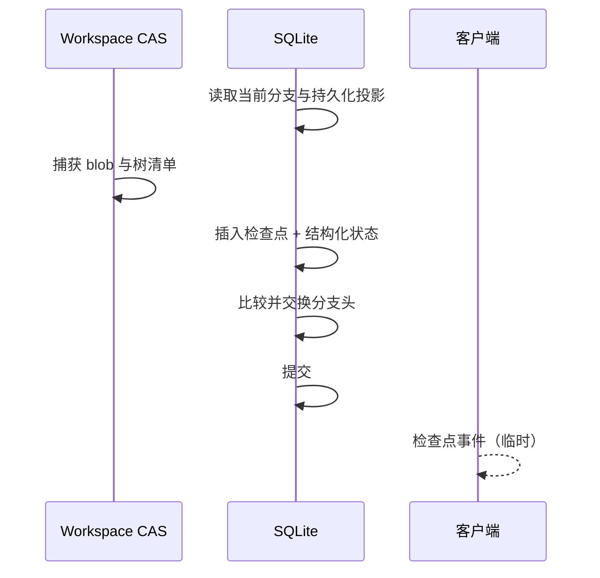
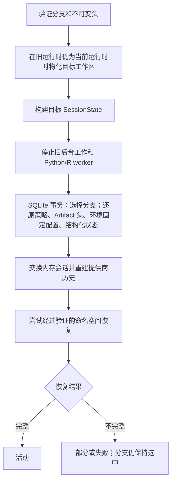

# 检查点与恢复

OpenAI4S 检查点是一个持久化重建边界。它标识逻辑历史前缀、内容寻址的工作区树、选定的
Artifact 版本、环境与策略状态、运行时引导清单，以及用于重建 Python/R 命名空间的配方。
它不是内存转储，也不会冻结正在运行的进程。

因此，还原检查点是一项分阶段操作：

1. 还原持久化投影和文件系统投影；
2. 构建全新的内核候选项；
3. 只重放被分类为安全的 Cell；
4. 验证重建后的状态；
5. 仅在验证完整时发布候选项。

在整个过程中，工作区字节、SQLite 状态、内核内存与 WebSocket 投递仍属于彼此独立的提交域。
由此产生的崩溃窗口请参阅[故障边界](failure-boundaries.md)。

## 检查点包含什么

| 字段 | 用途 |
|---|---|
| 历史游标 | 包含端点的动作账本与 Cell 边界，以及分支投影使用的公开消息边界。 |
| `workspace_tree_id` | Workspace CAS 树清单的 SHA-256 身份。 |
| `artifact_versions` | 应当成为逻辑 Artifact 头的版本身份。 |
| `environment_pins` | 为未来 worker 选定的 Python/R 环境名称。 |
| `generation_refs` | 源代次身份和冻结的引导清单。 |
| 能力与权限状态 | 会话能力覆盖配置和对话作用域的权限规则。 |
| 恢复配方 | 水合、安全 Cell 重放、所需符号、预期 Artifact 哈希、环境要求和命名空间覆盖状态。 |
| 元数据 | 原因、源边界、回退投影和其他有界控制数据。 |
| 结构化状态快照 | 针对计划、审阅步骤与注释、审阅设置和项目记忆，单独计算校验和的主体。 |

检查点创建会在同一个 SQLite 事务中插入检查点行、捕获其结构化状态快照并推进分支头。分支头
比较并交换可以防止两个进程内写入方悄然为同一个头发布不同的后继。

检查点有意排除：

- 实时 Python 和 R 对象；
- 打开的文件、套接字、子进程、线程和后台作业；
- 提供商连接和 WebSocket 投递状态；
- Workspace CAS 捕获所排除或跳过的文件；
- 任意外部服务状态；
- 对于未被有限的来源追踪和静态分析层观察到的代码，不包含完整的依赖图。

`generation_id` 记录哪个 worker 实例提供了引导清单或成为恢复来源。它是生命周期证据，
不能证明旧命名空间仍然存在。

## Workspace CAS

`WorkspaceCAS` 按 SHA-256 存储不可变 blob 和树清单。捕获会遍历会话工作区而不跟随符号链接，
并且默认记录每个不超过 64 MiB 的普通文件。它会排除 `.git`、`.openai4s`、`.venv`、
`__pycache__`、`node_modules`，以及 `.env`、私钥/证书容器和常见凭据文件名等形似机密信息的
文件。被跳过的条目及其原因仍会保留在树清单中。

从树捕获到插入 SQLite 检查点期间，检查点捕获会一直持有 CAS 的进程内生命周期锁。CAS 垃圾
回收会获取同一把锁，因此无法在这一进程内发布窗口中删除新写入的树。这不是跨进程事务，也不是
数据库/文件系统事务：数据库失败可能留下未被引用的内容寻址 blob 或树清单，而不受支持的第二个
守护进程也不会由这把锁协调。

恢复首先计算三方预览：

- **目标**——请求的检查点树；
- **基线**——预计工作区应当匹配的树；
- **观察值**——对当前工作区进行的新捕获。

从基线之后被修改的受管理文件会成为冲突。新增的未跟踪文件会被保留。只有当基线中存在、目标中
有意缺失的文件未被外部修改时，才会将其删除。

每个恢复文件都会写入同级临时文件、刷新，然后通过 `os.replace` 发布；单个文件的替换是原子的。
整棵树并不是原子的：先顺序执行写入，再执行删除。因此，进程故障可能留下部分物化的树。

## 检查点创建边界

手动检查点捕获当前状态。Web 运行时还会尝试在精确的公开消息边界之后，以及在持久化记录智能体/
用户 Cell 之后创建与来源绑定的检查点。来源身份使这项操作具备幂等性：针对同一个根/
来源类型/来源 ID 元组发出请求，会返回已有检查点。

自动检查点采用尽力而为方式。如果捕获来源绑定检查点失败，不会追溯性地使已经完成的消息或 Cell
失败。由于不存在匹配的检查点身份，从那个精确 UI 边界进行分叉随后会失败关闭；OpenAI4S 不会
猜测一个相邻状态。

Workspace CAS 捕获先于 SQLite 发布：

以上只有三个 SQLite 变更共享一个事务。CAS 树在该事务之前就已经存在，而 UI 事件则在持久化
发布之后投递。

## 分叉、回退与激活

这些操作会复用检查点数据，但发布规则不同。

### 分叉

分叉会先把源检查点树物化到一个全新、隔离的分支工作区，然后才创建分支行。新分叉的分支最初
指向其父分支的不可变检查点，并处于非活动/只读状态，直到被激活。物化后、插入 SQLite 前发生
失败可能留下孤立的分支工作区；但不会创建活动分支。

### 回退并继续

回退不会删除历史，也不会把分支头向后移动。它会追加新记录：

1. 根据当前检查点树预览目标树；
2. 捕获当前状态的**撤销检查点**，推进分支头；
3. 再次预览以消除编辑竞态；
4. 应用目标工作区树；
5. 追加包含目标游标与状态的**回退检查点**，并附带历史投影描述符，告知读取器从何处继续写入
   新的物理行；
6. 以事务方式激活回退检查点的 SQLite 投影；
7. 停止现有内核，并要求先恢复命名空间才能继续实时工作。

被放弃的消息、动作账本和 Cell 行会继续以物理形式保留，供审计使用。分支感知读取器会展示目标
前缀，随后展示在新续写边界之后写入的工作。

撤销检查点会有意在应用目标字节前发布。如果后续阶段失败，它就是先前状态的持久化恢复点。不过，
由于多文件目标恢复不是全局原子操作，实时工作区仍可能需要根据该头重新物化。

### 分支激活

激活在会话的精确 FIFO 生命周期 ticket 下运行：

准备工作在停止旧 worker 前完成。SQLite 激活会在第一次变更前验证每一条目标记录，然后在一个
事务中选择分支，并还原会话能力、对话权限规则、Artifact 头、Python 环境固定配置以及可用的
结构化状态。它无法涵盖已经物化的工作区或之后的内存交换。

命名空间恢复为部分成功或失败时，所选分支仍会保持选中。这是有意设计：在旧分支的 worker
与投影已被替换后，API 绝不能将旧分支报告为活动状态。调用方必须检查返回的 `status` 和命名
空间维度；仅有 `current_branch_id` 并不意味着存在可用内核。

## 结构化领域状态

对于当前的本地检查点，`checkpoint_state_snapshots` 会存储计划、审阅步骤与注释、审阅设置和
项目记忆的规范 JSON 以及 SHA-256 摘要。激活会在还原其他检查点投影的同一个 SQLite 事务内
验证并还原此快照。

兼容策略有意保持保守：

- 没有结构化状态快照的历史检查点会在该维度上报告为部分/不可用；当前实时结构化状态会保留，
  而不会被错误归因到旧检查点；
- 如果目标的确切快照存在，回退会克隆它；当目标早于此功能时，不会凭空制造快照；
- 导入的快照会在参与受信任运行时之前接受验证、身份重映射和隔离；
- 当前分支激活响应还会评估计划与记忆的旧版元数据摘要。因此，即使检查点拥有确切的结构化
  快照，只要这些旧版摘要存在，它仍可能获得保守的 `partial` 激活状态。

即使底层数据可用，也应将 `partial` 视为真实的运维信号：检查各维度结果，而不是根据单个数据库
行覆盖它。

## 恢复配方与重放策略

`server/recovery_recipe.py` 根据持久化 Cell 记录而不是实时命名空间派生带版本的配方。静态分析
会跟踪变量读取、写入、删除、不确定变更、源代码哈希和生成者依赖关系。工作区和 Artifact 水合
是独立步骤，绝不能成为重放副作用的理由。

只有所有检查都通过时，影响命名空间的 Cell 才会被标记为可安全重放，其中包括：

- 其记录的源代码哈希与所存储的源代码匹配；
- 它成功完成，并且其策略允许重放；
- 所需变量生成者可解析；
- 其语言有冻结的引导清单；
- 它只使用公认安全的 Host 调用；
- 未检测到直接的文件系统、进程、网络、非确定性或文件写入影响。

不安全或不确定的 Cell 会留在配方中，带有 `replay_policy: never` 和说明。恢复会跳过它们；
绝不会把“有条件”或未知代码转换为运行许可。

命名空间覆盖状态有三个取值：

| 值 | 含义 | 恢复结果 |
|---|---|---|
| `empty` | 没有持久化 Cell 影响该语言的命名空间。 | 一个全新、已引导的命名空间可以是完整的。 |
| `verified` | 最终符号所需的每个影响命名空间的 Cell 都拥有可安全重放的链。 | 所有其他验证通过后，候选项可以发布。 |
| `unverified` | 至少一个影响命名空间的 Cell 是手动、不安全、失败、不确定或因其他原因无法重建的。 | 验证记录 `namespace_unverified`；候选项被关闭，状态为 `partial`。 |

这是正向验证模型。由于静态分析和依赖观测范围有限，配方仍然可能保守。绝不能仅因为存在旧的
代次行，就声称恢复完整。

## 构建优先的恢复流水线

针对每个语言清单，恢复会执行以下阶段，并将有界、脱敏的日志条目作为独立 SQLite 提交写入：

1. **恢复开始**——冻结恢复身份与源代次；
2. **构建**——创建尚未发布的候选 worker；
3. **引导**——验证解释器/运行时预期，并加载冻结的 sidecar/init hook；
4. **水合**——验证已经物化在所选工作区中的检查点树与 Artifact 版本；
5. **重放**——仅执行明确安全且哈希匹配的 Cell；
6. **验证**——检查命名空间覆盖、所需符号、Artifact 哈希与环境要求；
7. **发布**——将候选项采纳为分支的实时代次。

只要验证存在任何问题，尚未发布的候选项就会被关闭。在普通恢复尝试中，此前已发布的 worker
保持不变。在分支激活过程中，旧分支 worker 已在 SQLite 发布前停止，因此目标恢复为部分成功时，
新选中的分支可以合理地不存在实时 worker。

Python 和 R 候选项按清单顺序恢复。只有每一种预期语言都成功发布时，会话结果才是 `active`；
如果前一种语言成功、后一种语言失败，则结果为 `partial`，不会虚构一个全有或全无的内核事务。

公开的恢复动作包括：

- `restore`——尝试所选检查点配方；
- `retry`——使用新的恢复 ID，重复一次可恢复的部分成功/失败尝试；
- `inspect_log`——读取有界恢复日志；
- `continue_view_only`——使用持久化投影，但不声称存在实时命名空间；
- `restart_fresh`——经显式确认后，发布一个有意为空的全新命名空间，而不宣称发生了恢复。

已导入/隔离的会话只允许通过经过显式确认的全新重启来建立受信任运行时。

## 重启时对账

守护进程启动时，旧守护进程实例留下的 `active` 或 `busy` 内核代次会被标记为
`abandoned`，未完成的执行尝试也会以 abandoned 状态关闭。OpenAI4S 绝不会连接到未知的
幸存进程，也不会推断其内存有效。后续可用命名空间必须来自经过验证的恢复，或显式选择的全新
重启。

对应模块为 `openai4s/storage/snapshots.py`、
`openai4s/storage/checkpoint_state.py`、`openai4s/storage/activation.py`、
`openai4s/server/session_branching.py`、`openai4s/server/recovery_recipe.py`、
`openai4s/kernel/recovery.py` 和 `openai4s/server/recovery_runtime.py`。
