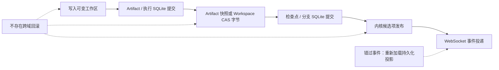

# 故障边界

OpenAI4S 会协调多个有状态系统，但不会假装它们构成一个事务。SQLite 记录、实时工作区文件、
Workspace CAS blob、Artifact 快照、Python/R 进程和浏览器事件分别拥有自己的发布点。正确恢复
首先需要辨明故障前跨越了哪一个边界。

安全的默认做法是保留持久化审计记录，对语义含糊的重放采用失败关闭，并重建派生视图。不要通过
删除物理历史来“修复”会话，也不要仅仅因为某个代次的进程曾经存在，就宣称该代次处于活动状态。

## 权威来源

请根据问题使用作用域恰当且足够窄的权威来源：

| 问题 | 权威来源 | 不足以作为依据的内容 |
|---|---|---|
| 选中了哪个逻辑分支/头？ | SQLite 中的分支选择与检查点头。 | 内存中的 `SessionState`、浏览器标签页或工作区目录名。 |
| 应发送哪些提供商历史记录？ | 分支感知的动作账本归约器。 | 公开聊天消息或原始提供商载荷片段。 |
| Chat/Notebook 应显示什么？ | 分支感知的 `messages` 和 `execution_log` 投影。 | 单个客户端保留的 WebSocket 事件。 |
| 哪些字节定义检查点工作区？ | 校验和有效的 Workspace CAS 树与 blob。 | 当前可变工作区。 |
| 哪些字节定义可恢复的 Artifact 版本？ | 大小/校验和匹配的受信任 `snapshot_path`。 | 只有可变 `path` 的版本行。 |
| 内核命名空间是否可用？ | 当前已发布的精确代次/租约，或成功且经过验证的恢复。 | `kernel_generations` 行、PID 或仅仅选择了分支。 |
| 客户端是否收到更新？ | 客户端确认/重新加载行为。 | 底层数据库事务已提交这一事实。 |

实际模型是一条带显式补偿的局部提交链，而不是一根回滚箭头：

实际路径并不总是采用这一精确顺序——例如，`host.save_artifact()` 会先于其版本行暂存快照字节，
而自动捕获会先注册版本、再复制快照。下表明确列出这些差异。

## 故障与修复矩阵

| 中断窗口 | 持久化事实 | 可能的残留/症状 | 安全的后续操作 |
|---|---|---|---|
| 存储库提交前发生 SQLite 异常 | 当前事务回滚；此前提交仍然有效。 | 该事务计划写入的行不存在，但此前的文件系统工作可能残留。 | 仅在检查外部副作用后重试。绝不能假设 SQL 回滚也回滚了文件或提供商调用。 |
| SQLite 提交成功，但 WebSocket 投递失败 | 已提交投影是权威来源。 | 某个浏览器中的 Chat、Notebook、Timeline、Files、检查点或恢复视图过时。 | 重新加载 HTTP/读取投影或重新连接。不要仅为重新生成事件而重复变更操作。 |
| 崩溃后动作组或执行尝试不完整 | 已存在的账本事件和单调递增的尝试里程碑仍然保留。 | 缺少原生工具观测、一个未关闭的尝试，或一次被中断的提供商轮次。 | 启动时对账会关闭过期尝试；账本归约器会补充规范的中断/取消观测。检查 Timeline，必要时开始新动作——绝不能仅根据参数重新执行变更操作。 |
| worker 在 Cell 执行期间退出 | 已分配的尝试和此前已提交的所有里程碑仍然保留；任何实时命名空间都不可信。 | 部分 stdout、工作区写入、子进程副作用，或从未被捕获为 Artifact 的文件。 | 停止/重启，或使用经过验证的恢复。重新运行前先检查工作区；有意识地注册或清除残留。重跑可能重复外部副作用。 |
| 工作区文件写入成功，但 Artifact 尚未注册 | 文件存在，但 SQLite 中没有相应的逻辑/版本记录。 | 未注册的上传、编辑、工具或 Cell 输出。 | 检查字节后通过受支持路径重新保存/注册，或重新执行捕获。不要使用杜撰的校验和或生成者来创建版本行。 |
| Artifact 自动版本先于快照复制/绑定提交 | 版本行是有效元数据，但其实时 `path` 可变。 | `snapshot_path` 缺失；后续覆盖可能破坏历史字节。 | 如果实时校验和仍然匹配，`protect_latest()` 或受支持的重新保存操作可以补填快照。在受信任快照验证通过前，不要宣称它可恢复。 |
| 在版本注册前暂存了快照字节 | 如果注册失败，没有任何版本引用这些字节。 | 来自 `host.save_artifact()` 或 Artifact 恢复尝试的孤立快照；正常路径会尝试删除它。 | 让具体路径的补偿逻辑运行。如果清理也失败，请检查受信任快照存储，并且只删除能够证明未被引用的字节。 |
| Workspace CAS 树先于检查点发布写入 | 没有检查点引用尚未发布的树。 | 数据库失败后留下未被引用的内容寻址 blob/树。 | 重试创建检查点。只能在 CAS 生命周期锁下通过引用扫描式垃圾回收进行回收；必须保留共享 blob。 |
| 与来源绑定的自动检查点捕获失败 | 已完成的消息/Cell 仍然持久；不存在对应来源的精确检查点。 | 该边界处的分叉控制不可用或失败关闭。 | 创建一个稍后的手动检查点，或重新运行明确安全的动作。绝不能凭猜测把 UI 边界映射到附近的检查点。 |
| 分叉工作区先于分支行插入完成物化 | SQLite 中不存在该分支。 | 一个包含有效检查点字节的隔离孤立目录。 | 确认没有分支引用该目录，然后通过分叉工作流将其删除或重新物化。不要通过手动编辑 SQLite 来激活它。 |
| 多文件 Workspace CAS 恢复在应用过程中停止 | 除非之后发生过提交，否则此前的 SQLite 分支/检查点仍是权威来源。 | 部分目标文件已替换，后续写入/删除尚未应用，未跟踪文件仍保留。 | 暂停写入方，根据观察到的工作区预览权威头，解决受管理文件冲突，然后重新物化。单文件 `os.replace` 保证并不会使整棵树具备原子性。 |
| 回退发布撤销检查点后，应用目标工作区或创建回退检查点失败 | 在新的回退检查点提交前，分支头都是撤销检查点。 | 工作区可能包含部分或全部目标字节，而 SQLite 投影仍处于撤销状态。 | 将撤销头视为恢复点。检查回退操作与预览，还原该头的树，然后重试回退。 |
| 回退检查点提交成功，但投影发布失败 | 新分支头已经存在；选定的能力、权限、Artifact 头或结构化状态可能仍反映先前投影。 | 分支感知历史头与物化的“当前”表不一致。 | 在生命周期 ticket 下，针对该精确分支头重试检查点激活。不要仅为强制更新投影而追加另一次回退。 |
| 分支激活在 SQLite 发布前物化了目标工作区或停止了旧 worker | 如果激活未提交，此前选中的分支仍是权威来源。 | 目标工作区已存在；旧 worker 可能已经终止；内存运行时可能不可用。 | 重试激活，或根据此前分支的持久化头重新打开其运行时。不要根据哪个工作区存在来推断选择状态。 |
| 分支激活 SQLite 提交成功，但内存交换/历史填充/恢复尚未完成 | 目标分支及其 SQLite 投影已选中。 | 进程本地会话过时或缺失；没有目标内核；浏览器可能显示失败。 | 重新创建/加载目标 `SessionState`，根据分支感知账本重建提供商历史，然后运行恢复。命名空间验证成功前应报告 `partial`/`failed`。 |
| 恢复候选项在发布前失败 | 没有候选代次处于实时状态；在普通恢复中，此前发布的 worker 保持不变。 | 持久化恢复日志以 `partial`、`failed` 或 `cancelled` 结束；临时候选项被关闭。 | 检查问题，纠正环境/字节/配方输入，然后使用 `retry`。在分支激活期间，请记住旧 worker 已经停止。 |
| 一种语言发布成功，但之后的语言恢复失败 | 已成功发布的语言处于实时状态；会话恢复并不完整。 | Python 活动而 R 缺失，或另一种混合语言部分状态。 | 将会话视为 `partial`，检查每种语言的结果，然后重试或显式选择全新重启。不要把多个语言代次合并成一个虚构事务。 |
| 候选项已发布，但终结日志/事件写入失败 | 即使缺少最终状态事件，精确候选项租约也可能已处于实时状态。 | 日志停留在较早阶段或报告 `publish_journal_failed`；UI 看起来过时。 | 采取操作前先检查当前精确租约/代次行和有界日志。重新加载客户端。不要盲目启动第二个 worker。 |
| 守护进程退出，但留下实时代次/尝试行 | 这些行描述的是最后一个已知所有者，而不是可复用命名空间。 | 死亡守护进程留下的 `active`/`busy` 代次和进行中的尝试。 | 启动时对账会将其标记为 `abandoned`。从检查点恢复或确认 `restart_fresh`；绝不能仅根据 PID 或行状态进行连接。 |
| 两个进程写入同一个数据目录 | 不存在受支持的全局所有者；进程本地 `RLock` 与 CAS 锁不会协调它们。 | SQLite 争用、分支比较并交换失败、文件系统竞态，或快照绑定到意外字节。 | 停止多余进程，保留所有文件，并离线审计 SQLite 头、工作区、CAS 和 Artifact 快照。仅使用一个守护进程恢复服务。 |

## 内核与执行的故障语义

内核管理器使用单个协议 frame 读取器和精确代次租约。重新拉起会递增代次身份。来自旧代次的
迟到响应、中断或后台完成事件，绝不能被当作替代 worker 的事件接受。

在 Python worker 内，一把锁会覆盖完整的 `host_call` 请求和响应事务。如果 worker 或管理器
在调用期间失败，双方都不能仅凭没有收到响应，就推断远程能力执行过或没有执行过。能够作为证据的
是能力专属审计记录，以及可用时的外部幂等键。正因如此，恢复配方会拒绝含有副作用或未知 Host
调用的 Cell。

Cell 完成也具有严格含义。一次成功的结构化完成或 `host.submit_output()`，不能与一个已执行的
Cell、原生 Tool 结果、达到最大轮次后停止、取消或模型纯文本互换。故障处理必须保留这些终结
状态之间的差别，而不能从部分执行中凭空生成答案。

## 运维恢复步骤

当报告的状态与可见文件不一致时：

1. **暂停写入方。** 停止更多用户执行、后台作业和任何第二个守护进程。守护进程运行时不要编辑
   SQLite。
2. **记录身份。** 记录 `root_frame_id`、选中的 `branch_id`、头 `checkpoint_id`、当前代次
   租约、最近一次执行尝试和最近一个恢复 ID。
3. **读取持久化投影。** 检查分支/头、动作时间线、恢复日志和各维度激活结果。重新加载浏览器，
   避免把错过 WebSocket 事件误认为持久化丢失。
4. **验证字节。** 检查头 Workspace CAS 树与 blob，然后检查 Artifact 快照根路径、大小和
   校验和。将可变工作区文件视为观察到的状态，而不是历史权威来源。
5. **恢复前预览。** 使用冲突感知的工作区预览。保留未跟踪文件，并显式解决受管理文件的分歧。
6. **选择一个语义动作。** 重试精确恢复、激活精确持久化头、从撤销检查点还原、以只读方式继续，
   或显式确认全新命名空间。不要通过手动编辑行来组合这些动作。
7. **重新读取所有投影。** 恢复执行前，确认分支选择、工作区树、Artifact 头、提供商历史重建、
   结构化状态和精确内核租约。

如果修复可能重复外部影响——shell 命令、文件上传、远程计算、提供商侧写入或凭据操作——请停止
并要求人工确认。数据库重试并不能保证另一个系统中的幂等性。

## 备份与还原边界

仅复制 SQLite 数据库并不是完整的 OpenAI4S 备份。一个会话一致的备份至少需要包含数据库、
会话工作区、Workspace CAS、Artifact 快照存储，以及部署所需的配置/用户编写内容。内核内存
不能作为受支持的持久表示进行备份。

为了获得一致的离线副本，请停止单个守护进程和后台写入方，然后把完整数据目录作为一个集合进行
复制。实时文件系统副本可能会在不同发布点观察到 SQLite、工作区、CAS 和快照。还原后，请运行
正常的启动时对账和经过验证的检查点恢复；不要把过期代次行重新标记为活动。

## 新变更操作的贡献者检查清单

对于每一项跨越提交域的操作，请记录并测试：

1. 持久化权威来源；
2. 文件系统、SQLite、worker、外部服务与事件动作的确切顺序；
3. 在每个动作后发生故障时留下的残留；
4. 是否能够补偿，以及如何呈现补偿失败；
5. 幂等键或比较并交换保护；
6. 重启协调与客户端重新加载行为；
7. 部分状态是否必须阻止未来执行；
8. 逻辑分支投影后，审计历史是否仍然可用。

最相关的实现包括 `openai4s/store.py`、`openai4s/storage/snapshots.py`、
`openai4s/storage/activation.py`、`openai4s/server/artifacts.py`、
`openai4s/artifact_restore.py`、`openai4s/server/session_branching.py`、
`openai4s/server/recovery_execution.py`、`openai4s/kernel/recovery.py` 和
`openai4s/kernel/manager.py`。
