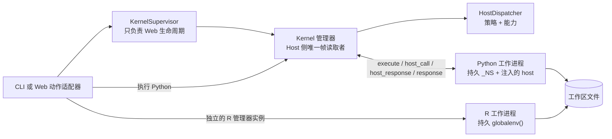
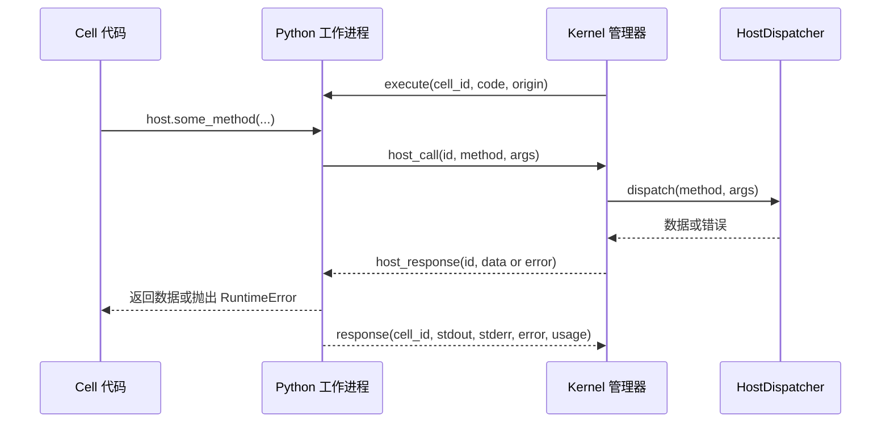

# 内核与 Host RPC

OpenAI4S 在长生命周期子进程中执行科学 Cell。Host 侧 `Kernel` 管理器拥有一个工作进程和一个同步逐行 JSON 协议事务；Web `KernelSupervisor` 拥有语言槽位生命周期，但绝不读取帧。

## 进程模型

Web 运行时中，`python` 和 `r` 各有一个独立的惰性槽位。每个槽位包含自己的具体 `Kernel` 管理器和子进程。为便于阅读，图中合并了这两个管理器实例。

工作进程命名空间是进程内存：

- 导入、变量和函数会在同一工作进程代际的后续 Cell 中保留；
- Python 和 R 命名空间绝不直接共享对象；
- 会话工作区中的文件是两种语言之间受支持的交换机制；以及
- 重启、替换、崩溃、超时重置、空闲释放或守护进程退出都会销毁受影响的命名空间。

## 惰性且持久的生命周期

### 一次性 CLI

本地智能体用 `LazyKernel` 包装 Python。纯 Tool 和 `FinalizeAction` 轮次不会启动它。首个 Python Cell 启动一个工作进程、运行一次引导程序，并在同一次 `Agent.run(...)` 调用中的后续 Python Cell 复用该命名空间。R 也只在首个 R Cell 时启动，并在该次运行期间复用。一次性运行关闭时，两者都会关停。

此行为是**契约 / 已实现**。CLI 中的“持久”是指在一次运行内部跨模型轮次持久，而不是跨不同 CLI 调用持久。

### Web 会话

Web 会话仅在控制平面工作需要时，才首次创建会话范围的 `HostDispatcher`。调度器独立于任一语言槽位，并可在守护进程进程内跨内核停止或替换继续存在。

`KernelSupervisor.ensure(language, key, factory)` 会在实时工作进程的运行时键仍匹配时复用它。槽位缺失、工作进程死亡或环境不匹配时，`ensure` 会先构建并记录一个可用的替代进程，再发布它并关闭旧进程。因此候选进程构建失败时，已经可用的旧环境工作进程仍会保留。相反，显式 `restart` 会重启现有管理器并创建新命名空间；它不等同于先构建后切换的环境更换路径。

每个已发布的 Web 工作进程代际除管理器的内存代际计数器和授权代际外，还会获得一个持久 UUID 与生命周期记录。守护进程重启会把旧守护进程留下的实时记录标记为 abandoned；不会声称相应进程或命名空间仍然存活。

手动停止、会话关闭和可选的 `OPENAI4S_KERNEL_IDLE_TTL` 可以在不删除消息、Cell、工作区或制品的情况下释放工作进程。TTL 为零时禁用自动释放。存在活跃轮次、待审批、恢复操作或活跃后台执行时，空闲清理不会释放工作进程。

这些 Web 生命周期规则是**已实现**的。通用命名空间恢复为**部分实现**：经过验证的恢复方案可以重建并校验选定状态，但不会序列化任意实时对象。

## 语言中立的帧协议

管理器发送一个包含 Cell ID、源代码与来源的 `execute` 帧。随后，它在单一读取循环中阻塞，直到收到匹配的最终 `response`。在该循环中，它可能收到：

- 用于 Python 实时输出的 `stdout_chunk` 帧；
- 来自 Python 的 `host_call` 帧；
- 有界诊断 `log` 帧；以及
- 一个最终 `response` 帧。

响应契约包括 Cell ID、捕获的 `stdout`、捕获的 `stderr`、`error`、`interrupted`、跟踪信息、门控信息和一个 `usage` 对象。Web 调用方提供持久 Cell ID，使工作进程响应、溯源、制品和执行尝试引用同一身份。

`Kernel._protocol_transaction_lock` 一次只允许一个 Host 线程向工作进程写入请求并消费帧。空闲变量检查使用专用请求，但不会等待该锁；若锁已占用，它会以 Busy 失败，而不会成为第二个读取者。`KernelSupervisor` 只协调身份和信号——不会代理 `execute` 或检查管道。

此单读取者规则是一个**契约**。添加其他读取线程、在监督器中读取响应，或在某个 Cell 拥有事务期间发送第二个 execute 请求，都可能使工作进程协议失去同步。

### 协议与用户输出

协议管道与普通进程 stdout 隔离：

- Python 工作进程把真正的协议流移到受保护描述符，并将原始 fd 1 关联到进程 stderr；
- R 启动器将协议输出放在 fd 3、输入放在 fd 4，把 stdin 重定向到 `/dev/null`，并将 fd 1 关联到进程 stderr；以及
- 语言级 Cell 输出被捕获并作为结构化数据返回（Python stdout 还可作为帧流式发送）。

这可以保护 JSON 线路免受 `print` 和许多原生杂散写入干扰。但它不保证每个 C 层原始写入都能归因到 Cell 输出：管理器会持续把进程 stderr 排入有界诊断尾部，避免吵闹的子进程填满操作系统管道并使工作进程死锁。

## Python Host RPC

Python 命名空间会收到一个由工作进程 `host_call` 函数构建并注入的 `host` 单例。正常顺序严格如下：

正常流程中没有 `host_ack` 步骤。工作进程会把 ID 匹配的 `host_ack` 作为兼容性预响应接受并继续等待，但当前管理器会直接发送 `host_response`。因此，文档或集成必须将契约建模为 `host_call → host_response`，并将 `host_ack` 仅视为兼容功能。

### RPC 事务纪律

工作进程有两种不同的锁：

- 协议写入锁一次保护一个帧写入；以及
- `_HOST_CALL_LOCK` 从写入 `host_call` 开始一直持有，直到读取匹配的 `host_response`。

一个工作进程中最多只能有一个正在进行的 Host RPC。如果用户代码创建线程，这一点尤其重要：并发 SDK 调用会由工作进程事务锁串行化。Host 侧 execute 循环始终是唯一读取者，会同步处理每个 `host_call`，然后继续等待 Cell 响应。

调用 ID 用于路由响应。在报告协议失去同步之前，工作进程会容忍数量有限的畸形或 ID 错误入站帧。序列化 Host 调用载荷超过 15 MB 时，工作进程会在传输前拒绝。

管理器会将调度器返回的单键 `{"error": message}` 软失败值转换成带错误的 `host_response`；SDK 调用会抛出 `RuntimeError`。如果映射除 `error` 外还包含其他键，则视为普通数据。调度器异常也会变成错误响应，而不会终止读取循环。

### 能力边界

`host.*` 是 RPC 门面，而不是对守护进程对象的直接访问。能力系列包括文件、Web/数据访问、子模型与委派、制品、Skills、环境、只读查询、进度、MCP、凭据和远程计算。Host 会在返回前应用相应能力的权限与审计策略。

`host.submit_output(...)` 也是一个 Host RPC。它记录科学完成信号，但不会使工作进程短路。Cell 事务其余部分——包括 Web 制品捕获和持久记录——会在外层引擎接受完成前结束。

对象级溯源钩子仅适用于 Python，并覆盖受支持的已检测操作。它们属于**部分覆盖**，不是任意扩展模块或副作用的通用数据流证明。

## R 执行通道

R 是一个一等的持久分析工作进程，由同一个 `Kernel` 管理器类以不同 `argv` 驱动。其结果形状有意兼容 Python，但执行能力有所不同：

| 能力 | Python | R |
|---|---|---|
| 持久命名空间 | 是，工作进程 `_NS` | 是，R `globalenv()` |
| Cell 内 `host.*` RPC | **已实现** | 有意不提供 |
| Cell 内完成 | `host.submit_output(...)` | 不提供 |
| 实时 stdout 分块 | **已实现** | 最终捕获输出；没有等价的流式 Host RPC 循环 |
| 变量检查器 | 仅空闲时，安全有界摘要 | 仅空闲时，安全有界摘要 |
| 对象级谱系钩子 | 仅 Python，部分覆盖 | 不提供 |
| 制品发现 | 工作区差异加 Python 图形捕获 | 工作区差异；绘图必须保存到文件 |
| 运行时依赖 | 选定的 Python 解释器 | 真正的 `Rscript`；工作进程解析通常使用预备 R 环境中的 `jsonlite` |

R 解释器解析会依次检查选定环境、发现的具备 R 能力的环境（优先名为 `r` 的环境），最后检查 `PATH` 上的 `Rscript`。它绝不会静默地用 Python 替代。如果没有可用 R 运行时，适配器会返回软错误观察，让模型选择其他动作。

## 中断、超时与重启语义

`Kernel.interrupt()` 向确切工作进程 PID 发送一次 SIGINT。Python 只在用户代码执行期间启用一次性处理器；外部发出的 SIGINT 会报告为 `interrupted=True`，而不会假装它是普通用户异常。R 会将信号映射到其中断条件。如果语言能够干净展开，中断可能保留工作进程及其先前命名空间。

Web 看门狗会在运行 Cell 前冻结一个 `KernelLease`。超时或取消时，它会：

1. 只中断当前租约；
2. 等待宽限期；
3. 如果仍卡住，只终止该租约；
4. 如果读取线程退出，则重启它；如果读取线程仍然僵死，则放弃它；以及
5. 抛出超时，并明确说明硬恢复后先前变量已被清除。

每个破坏性的监督器操作都会检查租约是否仍匹配语言、键、代际和工作进程身份。过期看门狗不能终止较新的替代进程（即 ABA 安全属性）。

中断传递与强制终止在操作系统边界上必然是**尽力而为**。精确身份检查是**契约 / 已实现**。

## 资源计量因语言和平台而异

共享响应键并不表示测量实现相同。

### Python

- 墙钟时间是每个 Cell 的耗时增量；
- CPU 时间是 `getrusage` 自身与子进程用户/系统时间之和的增量；以及
- 峰值 RSS 在可用时使用 Linux `VmHWM`，否则使用 `ru_maxrss`，并对 macOS 单位进行转换。

工作进程会尝试通过 `/proc/self/clear_refs` 重置 Linux 峰值 RSS，但其可用性和内核行为各异。在回退平台上，`ru_maxrss` 是进程生命周期高水位，而不是精确的单 Cell 峰值。

### R

- 墙钟时间是 `Sys.time()` 增量；
- CPU 时间是包含自身与子进程字段的 `proc.time()` 增量；以及
- 峰值 RSS 读取 Linux `VmHWM`；在非 Linux 系统上，如果没有受支持的数据源，当前工作进程报告 `0`。

R 不会按 Cell 重置其进程高水位。因此 `peak_rss_kb` 可能反映先前的 R Cell。

三项指标均为**尽力而为的遥测**，不是计费或隔离保证。贡献者必须保留响应键和非负值，但不得将峰值 RSS 描述成在所有平台上都精确的单 Cell 内存用量。

## 贡献者检查清单

修改工作进程或管理器代码时：

- 每个具体 `Kernel` 保持一个同步帧读取者；
- 在完整请求/响应事务期间持续持有 `_HOST_CALL_LOCK`；
- 保持协议写入串行化，原始 stdout 不得进入协议描述符；
- 为每个 execute 请求保留显式 Cell ID 和一个最终响应；
- 不要增加正常 ACK 依赖；
- 跨重启保留 `argv`，避免 R 以 Python 进程重生；
- 不要在工作进程中自动关闭 matplotlib 图形——Web 制品层会在响应后捕获未保存图形；以及
- 运行 `uv run pytest tests/test_kernel.py`；涉及流式传输、图形捕获、中断或 Host RPC 的变更还需执行真实 Web Cell 冒烟测试。

## 状态摘要

| 区域 | 状态 |
|---|---|
| 单读取者 JSON-lines 协议 | **契约 / 已实现** |
| Python `host_call → host_response` RPC | **契约 / 已实现** |
| `host_ack` | **仅兼容** |
| 惰性 Python/R 工作进程槽位 | **契约 / 已实现** |
| 同一实时代际内的持久命名空间 | **已实现** |
| R Host RPC | **有意不提供** |
| 墙钟/CPU/RSS 遥测 | **尽力而为** |
| 溯源覆盖 | **部分实现** |
| 任意命名空间恢复 | **部分实现 / 不作保证** |
