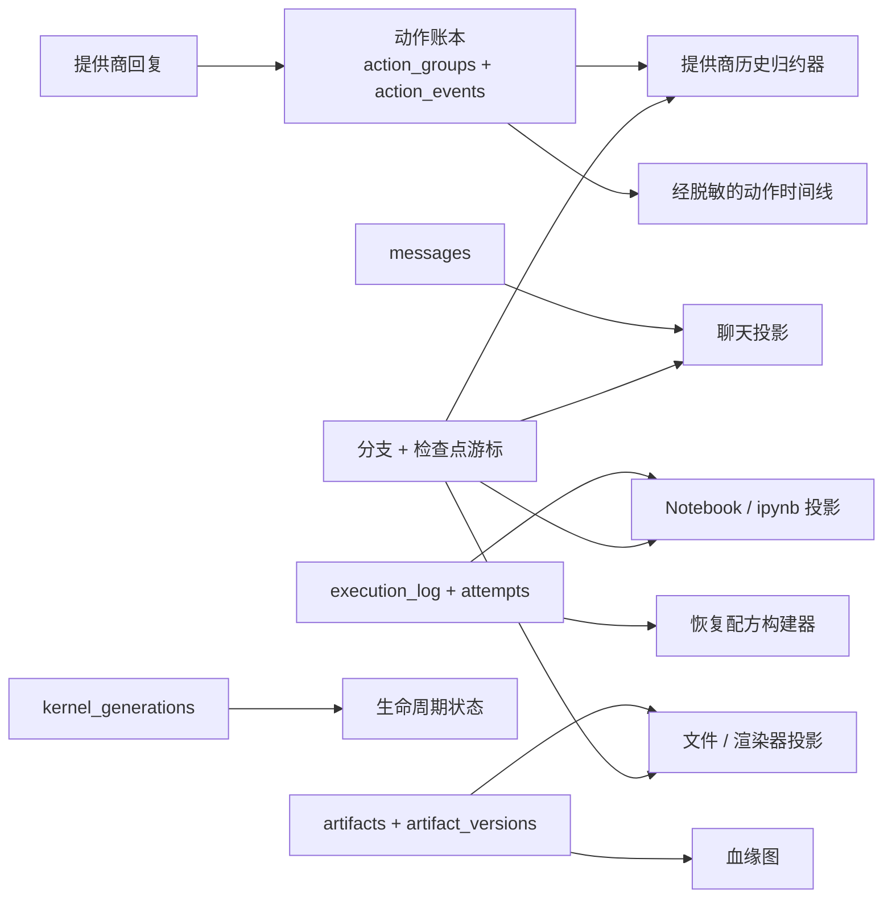

# 投影与持久化

OpenAI4S 并不存在一个序列化的“会话对象”。系统根据多个持久化记录和实时资源重建会话，
其中每一种记录或资源都有更明确、范围更窄的用途。动作账本（Action Ledger）为提供商历史记录
和动作时间线（Action Timeline）提供数据；公开消息为聊天提供数据；执行记录为 Notebook 提供
数据；Artifact 行与快照为文件界面提供数据；内核代次行则描述进程生命周期。这些视图通过稳定
的标识符相关联，但不能互相替代。

最重要的运维规则是：

> SQLite、工作区文件、Artifact 快照、内核内存和 WebSocket 投递属于彼此独立的提交域。
> OpenAI4S 没有跨越这些域的分布式事务。

## 身份标识与作用域

| 标识符 | 含义 | 特别需要澄清的不含义 |
|---|---|---|
| `project_id` | 将根会话以及上下文、记忆等部分项目级状态归为一组。 | 它不是内核、工作区或事务边界。 |
| `frame_id` | 标识一条持久化的参与者记录。一个 Web 会话从根 frame 开始；被委派的智能体会获得子 frame。 | 子 frame 并不是独立的 Web 会话。 |
| `root_frame_id` | 标识由子 frame 继承的规范会话边界。在根 frame 上，它等于该 frame 自身的 `frame_id`。它限定消息、Cell、Artifact、权限和委派预算的作用域。 | 它不标识当前选中的分支。 |
| `branch_id` | 在一个根会话内选择一条逻辑历史。初始分支通常使用 `root_frame_id`；分叉使用 `br-…` 身份标识。 | 它不是复制出来的数据库，也不是 Git 分支。 |
| `generation_id` | 一个持久化 UUID，标识某条分支上一次 Python 或 R worker 的实例化。重启、替换、恢复或重新拉起都会创建新代次。 | 它不能证明内存中的命名空间已被恢复。 |

其他身份标识的作用域经过刻意收窄。`group_id` 和 `event_id` 对动作账本进行排序；
`producing_cell_id` 标识一次物理 Cell 尝试；`state_revision` 是会话内单调递增的 Cell
边界；`artifact_id` 命名一个逻辑交付物；`version_id` 则命名一组已记录的字节。不要用
其中一个标识符代替另一个。

旧版执行和 UI 载荷中的 `kernel_id` 是用于显示/运行时的标签。需要表达生命周期身份时，
请使用 `generation_id` 或精确的 `KernelLease`。

## 持久化记录及其使用方

### 动作账本与提供商历史记录

`action_groups` 和 `action_events` 是面向模型的动作与观测的规范记录。组会保留提供商声明、
规范化动作、规范结果、线协议重建状态、用量与顺序。对于一批原生 Tool 调用，组和每个拟议调用
事件会在同一个 SQLite 事务中插入。结果事件随着执行进展追加。守护进程重启后，
`openai4s/agent/ledger.py` 中的归约器会把该批次重建为对提供商安全的消息。

归约器采用防御性设计。如果崩溃导致一个动作组缺少预期观测，它会补充规范的中断或取消观测；
不会把半开放的工具调用批次重新发送给提供商。执行尝试与账本组相关联，但并不是不可变事件行：
它们在工作开始前分配，并以单调方式填充此前为空的里程碑。

提供商历史记录会在新组合出的系统提示词之后重建。因此，系统提示词可以反映当前项目上下文、
已启用的 Skill、记忆、连接器和环境，同时此前的动作/观测组仍保持其持久化顺序。公开的
`messages` 表不用于提供商历史重放。

### 聊天、Notebook、时间线与 Artifact

这些都是面向特定用途的投影：

- `messages` 存储公开的用户/助手文本。Web 消息路由会投影选中的分支，并在存在精确的
  分叉检查点身份时将其一并纳入。
- `execution_log` 存储完整的 Cell 源代码、结果、资源核算、依赖元数据和生成的文件名。
  Notebook 会过滤掉未固定的隐藏系统/暂存 Cell，并隐藏仅用于协议完成的 Cell。
  `.ipynb` 导出是按语言拆分、确定性且只读的投影。
- 动作时间线是动作账本的有界、脱敏视图。它有意省略原始参数和提供商线协议状态。
- `artifacts` 存储逻辑头；`artifact_versions` 存储版本元数据和路径。文件视图不是工作区
  目录列表。
- `frame_steps`、计划、审阅状态、压缩归档、权限请求、恢复日志条目和委派行分别服务于
  各自的 UI 与审计视图。它们的存在并不会使其成为提供商历史记录。

写入一个投影不会隐式更新所有其他投影。例如，即使错过了一次临时 Notebook 事件，一个 Cell
仍然可以拥有持久的执行记录；如果捕获失败，工作区文件也可能存在，却没有注册为 Artifact。

## 分支感知历史

分支不会复制历史行。`project_branch_records()` 会组合继承而来的检查点前缀和分支本地的
仅追加行：

1. 递归投影父检查点或回退目标检查点；
2. 纳入截至该检查点游标的本地行；
3. 追加在分支头的物理续写游标之后写入的行。

不同投影使用不同的游标单位，不能混用：

| 投影 | 检查点游标 | 解释 |
|---|---|---|
| 动作组 | `action_cursor` | 包含端点的动作账本序号。 |
| 公开消息 | `message_cursor` | 物理行数边界，会规范化为最后一条被纳入记录的、从零开始的 `seq`。 |
| Cell / Notebook | `cell_cursor` | 包含端点的 `state_revision`（对历史数据回退使用 `cell_index`）。 |

回退会追加一个带有 `history_projection` 描述符的新检查点。被放弃区间的行仍留在 SQLite
中用于审计，但分支感知读取器会排除它们，只追加在所记录恢复边界之后产生的新行。因此，直接
读取 `messages`、`execution_log` 或 `action_groups` 的代码可能会看到活动分支有意隐藏的
物理历史。面向产品的读取器必须使用分支投影器。

## SQLite 所有权与并发

在当前进程内，`Store` 针对每个解析后的数据库路径持有一个 `sqlite3.Connection`。每个
存储库都接收同一个连接和同一个 `threading.RLock`。连接使用
`check_same_thread=False`；进程内访问由共享锁串行化，而不是由 SQLite 默认的线程检查完成。

该设计为复合存储库提供了一个有用边界：检查点行、其结构化状态快照和分支头更新可以
一起提交；分支激活可以在一个 SQLite 事务中更新选中分支、对话策略、Artifact 头、环境固定
配置以及可恢复的结构化状态。

这项保证止于进程边界：

- `RLock` 只协调同一个守护进程内的线程；
- `get_store()` 是进程本地单例，不是分布式锁；
- 当前 Store 没有配置 WAL 模式或跨进程繁忙处理策略；
- 守护进程 pidfile 会阻止正常 CLI 启动第二个守护进程，但这只是运维保护，而不是数据库级租约。

不要让多个 OpenAI4S 守护进程使用同一个数据目录。外部读取方应使用受支持的读取 API 或离线
副本，而不是独立的写入连接。

`Store.close()` 是幂等的，并且只会移除被缓存的那个确切 Store。之后针对同一路径调用
`get_store()` 会创建新的连接代次。因此，长生命周期服务必须通过当前所有者解析 Store
支持的存储库，而不能保留来自已关闭 Store 的存储库。

## SQLite 提交不覆盖的内容

| 资源 | 所有者 | 提交/发布点 |
|---|---|---|
| SQLite 记录 | `Store` 和 `storage/` 存储库 | 存储库或复合服务事务提交。 |
| 实时工作区 | 内核、文件工具、Artifact 管理器、Workspace CAS 恢复 | 单个文件系统写入或 `os.replace`；多文件操作并非全有或全无。 |
| Artifact 快照字节 | Artifact 管理器或 Host 数据服务 | 根据具体路径，在单独的 SQLite 绑定之前或之后复制/写入文件。 |
| Python/R 命名空间 | worker 进程和 `KernelSupervisor` | 指向实时 worker 的指针；命名空间状态随该 worker 消失。 |
| 恢复候选项 | 恢复编排器 | 仅在候选项验证后发布；日志条目单独提交。 |
| Web 客户端状态 | WebSocket hub 和浏览器 | 向每个已连接客户端投递事件；断开连接不会回滚持久化写入。 |

关于崩溃窗口与修复指引，请参阅[故障边界](failure-boundaries.md)。关于字节级 Artifact
规则，请参阅 [Artifact 与来源追踪](artifacts-and-provenance.md)。关于检查点发布和命名空间
恢复，请参阅[检查点与恢复](checkpoints-and-recovery.md)。

## 贡献者不变量

添加持久化或新投影时：

1. 选择一个规范的持久化来源，并命名每个派生视图；
2. 在分支敏感的读写中显式传递 `root_frame_id` 和 `branch_id`；
3. 在可能的情况下，将跨多行的不变量保持在同一个存储库事务中；
4. 绝不能把文件系统、worker 或 WebSocket 动作描述成该 SQLite 事务的一部分；
5. 让重放与修复具备幂等性，否则应采用失败关闭；
6. 修改逻辑分支投影时保留物理审计行；
7. 为重启重建、不完整记录、投影过滤以及每个外部提交边界上的故障添加测试。

对应实现位于 `openai4s/store.py`、`openai4s/storage/`、
`openai4s/agent/ledger.py`、`openai4s/storage/branch_projection.py`，以及
`openai4s/server/` 下的读取服务。
