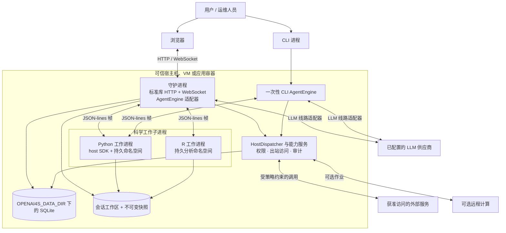

# 系统上下文与边界

OpenAI4S 是一个可选接入外部供应商的单主机科学智能体系统。其核心部署单元拥有编排、策略、持久化和工作进程生命周期；语言内核是隔离的子进程，而不是独立服务。

## 范围与状态

| 陈述 | 状态 |
|---|---|
| 一个守护进程提供静态 UI、REST 端点和 WebSocket 流量 | **已实现** |
| 同一个供应商中立引擎被组合用于 CLI 和 Web 运行 | **契约 / 已实现** |
| Python 和 R 在独立子进程中执行，并拥有彼此独立的内存 | **契约 / 已实现** |
| 核心启动与导入只需要 Python 标准库 | **契约 / 已实现** |
| 在所有受支持宿主机上强制实施操作系统级约束 | `auto` 模式下为**尽力而为**；仅当运维人员选择 `enforce` 且启动成功时才是**契约** |
| 多节点主动-主动守护进程运行 | **部分实现 / 不作为部署保证受到支持** |

## 人员与外部系统

| 参与者或系统 | 与 OpenAI4S 的交互 | 信任含义 |
|---|---|---|
| 研究人员或开发者 | 使用浏览器工作台或一次性 CLI；可以批准带有风险的动作 | 用户输入是任务数据，但审批是显式的授权边界。 |
| 运维人员 | 选择绑定地址、模型凭据、沙箱模式、存储位置、环境和远程计算 | 运维人员控制宿主机，系统信任其正确配置。 |
| LLM 供应商 | 接收供应商历史，并返回普通文本、原生工具调用和代码 Cell | 模型输出是路由、模式校验、权限检查和安全门控的不可信输入。 |
| Web、数据、MCP 和连接器服务 | 通过 Host 侧能力访问 | 返回内容是不可信数据，可能经过提示注入筛查；访问仍受策略约束。 |
| 远程计算供应商 | 可选执行显式提交的作业 | 它位于本地内核边界之外，拥有自己的传输、凭据和结果校验规则。 |
| 本地文件系统与 SQLite | 保存会话状态、制品、快照、审批和审计记录 | 它们是产品投影的持久数据源；内核内存不是。 |

## 部署与进程视图

该图展示的是可选方式，并不要求 Web 守护进程和一次性 CLI 共享同一个活跃会话。本地 CLI 运行在该次运行期间拥有其惰性工作进程。Web 会话则拥有可长期使用的惰性工作进程槽位。

## 运行时组件与所有权

| 组件 | 拥有 | 不拥有 |
|---|---|---|
| `agent/engine.py` | 轮次状态、上下文准备、模型调用、动作路由、执行结果、终止原因 | 具体工具、内核、SQLite、WebSocket 或 UI 文本 |
| `agent/actions.py` | 无损的规范化调用类型与路由决策 | 工具行为或完成渲染 |
| `tools/` | 原生 JSON 模式、工具策略元数据和具体内置行为 | Shell 执行或科学 Cell 完成 |
| `host_dispatch.py` 与 `host/` | 共享 Host 封套和能力服务：权限、审计、文件、模型、委派、数据与计算 | 工作进程帧读取或 Web 会话接纳 |
| `kernel/manager.py` | 一个工作进程及其同步协议事务 | 会话级生命周期策略或持久代际身份 |
| `kernel/supervisor.py` | Web 会话 Python/R 槽位、精确租约、替换、停止和代际生命周期 | 协议帧和 Cell 执行 |
| `server/cell_run.py` | 从身份分配、捕获到持久记录的一次 Cell 事务 | 判断整个智能体运行是否完成 |
| `server/execution_coordinator.py` | 面向 Web 的 FIFO 接纳、取消绑定和执行状态投影 | 代码执行，或在没有注入精确租约操作的情况下发送进程信号 |
| `store.py` 与 `storage/` | 一个 SQLite 连接门面与领域存储库 | 内核变量或配置的存储/工作区范围之外的文件 |
| `server/webui/` | 静态浏览器呈现 | 规范运行时状态 |

`gateway.py`、`host_dispatch.py`、`store.py` 和 `sdk/host.py` 等兼容性门面负责组合这些组件。新算法应放入负责它的服务或存储库，而不是加入门面。

## 信任边界

### 1. 从模型输出到动作执行

模型回复默认不可执行。路由器只接受经供应商规范化的原生调用，或首个完整的 Python/R 围栏。系统会解析并校验原生参数；智能体编写的 Cell 会经过配置的执行前安全门控。完成使用独立的封闭模式。

这是一个**契约**。新的供应商适配器必须规范化调用，且不得丢弃调用 ID、原始参数、解析失败、序号或供应商元数据。

### 2. 从守护进程到语言工作进程

工作进程收到的是重新构建的许可列表环境，而不是守护进程环境的副本。供应商密钥、云凭据、OAuth 数据和加载器注入变量不得通过普通继承泄漏。管理器通过与用户 stdout 隔离的逐行 JSON 管道通信。

子进程环境许可列表和单读取者协议是**契约 / 已实现**。操作系统沙箱行为取决于部署：`auto` 可继续运行，同时把 sandbox status 报告为 `unavailable`；如果约束不可用，`enforce` 会在工作进程启动前失败；`off` 是在可信宿主机上的显式选择。参见[安全](../security.md)。

### 3. 从工作进程代码到特权 Host 能力

Python 会收到注入的 `host` SDK。调用返回守护进程后，`HostDispatcher` 会应用能力特定的策略、审批、审计、出站访问、提示注入筛查和路径规则。`host.bash` 较为特殊：Host 会授权一个绑定到命令和工作进程代际的短时、一次性令牌，但子进程由工作进程而非 Host 启动。

共享 Host 策略封套是**已实现**的。它不是针对存在缺陷的可信 Tool 类的进程内沙箱；内置扩展仍然是可信应用代码。

R 没有 `host` SDK，不能在 Cell 运行过程中跨越此边界。

### 4. 从 Web 客户端到守护进程

默认绑定地址是 `127.0.0.1`。产品设计面向可信本地用户，或通过受保护隧道访问。绑定非回环接口会扩大威胁模型，必须使用文档中说明的访问令牌与反向代理控制；这不会让守护进程变成经过加固的多租户服务。

回环默认值和可选访问令牌检查是**已实现**的。安全的公网多租户能力为**部分实现 / 不作保证**。

### 5. 从持久记录到实时运行时

SQLite 记录、工作区文件、内容寻址快照、制品版本和仅追加的动作组都是持久的。它们可以重建产品视图与供应商历史，但不会序列化任意 Python 或 R 对象。

持久投影是**已实现**的。经过验证的恢复可以根据清单和安全方案重建选定状态，但通用命名空间恢复为**部分实现**。运维人员必须将守护进程重启、内核替换、超时重置和空闲释放视为内存丢失边界。

## 持久状态与临时状态

| 状态 | 生命周期 | 运维影响 |
|---|---|---|
| 消息与规范 Action Ledger 组 | 由 SQLite 支撑 | 浏览器和守护进程重启后仍然保留；必要时会用规范的合成结果归约未完成的原生组。 |
| 权限与审批记录 | 由 SQLite 支撑 | 重启后的审批会记录决议，但无法恢复已经消失的调用栈，也不会重放存储的参数。 |
| 制品元数据与版本 | SQLite 加不可变文件快照 | 持久且可按版本寻址；工作区变更和制品登记是两个不同步骤。 |
| 会话工作区 | 文件系统 | 工作进程重启后仍保留，除非运维人员将其删除或还原。 |
| Python/R 命名空间 | 工作进程内存 | 仅在同一个工作进程代际存活期间跨 Cell 保留。 |
| WebSocket 重放缓冲区 | 守护进程内存，有界 | 有助于重新连接活跃轮次；已完成历史必须从持久 REST 投影重新加载。 |
| 会话调度器 | Web 守护进程内存，惰性创建 | 在守护进程进程内可跨语言工作进程停止/重启保留；守护进程重启后根据持久配置重建。 |

## 部署影响

- 一个数据目录只运行一个守护进程。守护进程通过 pidfile 进行单例管理，当前架构不宣称支持协调式主动-主动写入者。
- 按配置布局同时备份 `OPENAI4S_DATA_DIR` 以及项目/会话工作区。仅备份 SQLite 并不能完整备份制品。
- HTTP 监听器应保持在回环地址，除非已特意配置可信反向代理、传输安全和访问策略。
- 如果要求工作进程在无法启用沙箱时拒绝启动，请选择 `OPENAI4S_KERNEL_SANDBOX=enforce`。由于各工作进程独立启动，应分别监控所报告的 Python 和 R 沙箱状态。
- 仅当释放空闲工作进程内存值得牺牲实时 Python/R 变量时，才设置 `OPENAI4S_KERNEL_IDLE_TTL`。零表示禁用自动释放。
- 不要通过向工作进程环境注入模型或云凭据来绕过约束。应添加或使用 Host 能力，让凭据留在可信边界一侧。

## 已知限制

- **部分实现：** 独立的可选 Jupyter 桥接器使用单独命名空间，不会接入 Web 会话 Host RPC、制品捕获、FIFO 接纳或恢复。
- **部分实现：** 远程计算供应商使用各自特定的约束和校验；本地工作进程保证不会自动延伸到远端。
- **尽力而为：** 外部服务、LLM 端点和操作系统沙箱适配器可能不可用；适配器能呈现失败，但无法保证这些依赖可靠。
- **不作保证：** 在共享守护进程上执行来自任意不可信多用户的代码。
