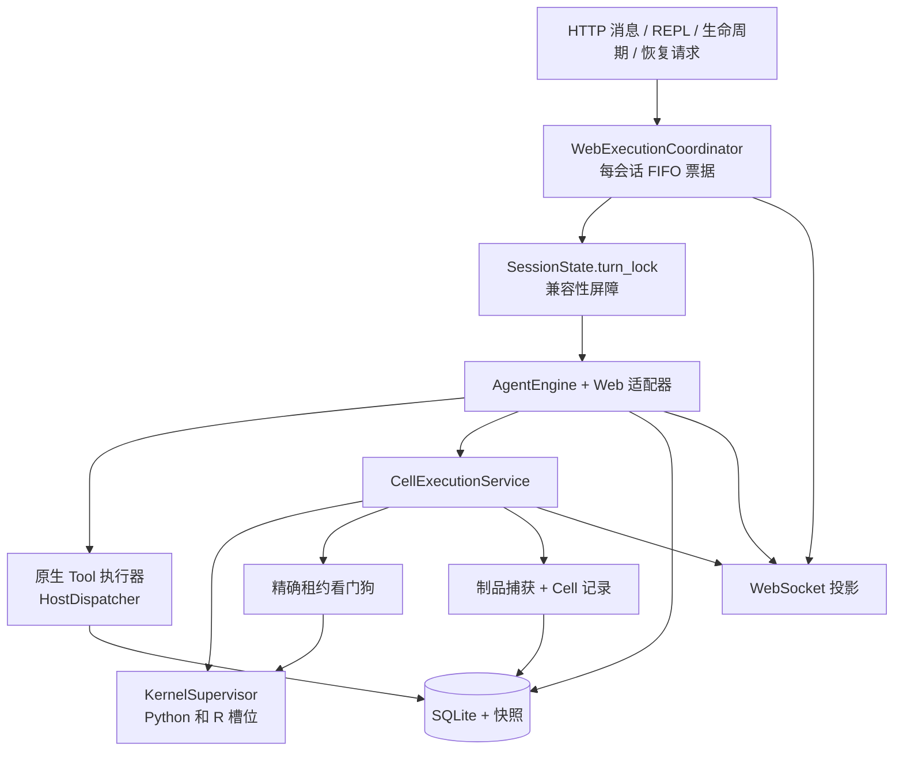

# Web 运行时

Web 运行时将 CLI 使用的同一个 `AgentEngine` 适配到持久会话、浏览器工作台、独立 Python/R 工作进程和可观测的 FIFO 执行队列。浏览器是投影客户端；规范动作、尝试、Cell、消息和制品归服务器与 Store 所有。

## 组合关系

不同会话可以并行推进。同一会话中，一次只允许一个已接纳执行拥有变更权限。

## 会话所有权

`SessionState` 拥有：

- 根 frame、活跃分支、项目和工作区；
- 一个带独立 Python 与 R 槽位的 `KernelSupervisor`；
- 一个包含 Host 调度器的惰性 `SessionRuntime`；
- 必要时从规范历史重建的内存供应商消息；
- 期望、待定和活跃环境选择；
- 一个会话范围的委派运行器；
- 取消、停止优先级和兼容性锁；以及
- 当前轮次最后一次结构化完成。

调度器是控制平面状态，不是 Python 工作进程的属性。纯 Tool 轮次不会构建语言工作进程。停止 Python 和 R 后，会话调度器、对话、审批、工作区和持久动作历史仍然存在，直到守护进程本身退出或会话被丢弃。

这种分离是**契约 / 已实现**。

## FIFO 接纳与精确所有权

协议中立的 `SessionExecutionCoordinator` 为每个会话维护一个队列。每张票据包含：

- 在该会话中全局唯一的 `execution_id`；
- 所有者对，例如 `agent/job-id`、`user_repl/request-id`、`lifecycle/operation-id` 或 `recovery/operation-id`；
- 可选的分支、语言、代际、资源和原因元数据；
- 一个只读取消信号；以及
- 一种状态：`queued`、`running`、`completed`、`failed` 或 `cancelled`。

提交会把票据追加到会话队列；没有活跃票据时，将队首提升为运行状态。用户工作和 WebSocket 传递发生在协调器短时持有的条件锁之外，因此一个会话中的长时间 Cell 不会阻止另一会话接纳请求。

`WebExecutionCoordinator` 额外提供面向浏览器的队列/执行事件，并将已接纳票据绑定到兼容性取消事件。执行 Cell 期间，它还会绑定一个冻结的 `KernelLease` 和精确中断函数。

### 取消规则

- 取消排队票据需要确切的会话、执行 ID 与所有者。它只移除该票据，绝不会向当前工作进程发信号。
- 取消运行中票据需要同样精确的身份。它会设置该票据的取消信号和兼容会话事件。
- 只有当运行中票据当前绑定了冻结租约时，才会传递进程信号。监督器在中断前会再次校验该租约。
- 没有找到确切 REPL 票据时，用户 REPL Stop 不会回退为停止 Agent 执行。

精确所有权是**契约 / 已实现**。广义会话级中断仅作为旧版解析辅助功能存在，它会先解析当前的确切所有者；新端点必须要求显式身份。

## `turn_lock` 为何仍然存在

FIFO 接纳是权威排序机制，但较早的 `SessionState.turn_lock` 仍作为兼容性屏障，包裹尚未拆分为更小服务的代码路径。

锁顺序必须严格如下：

1. 提交或复用当前 FIFO 票据；
2. 等到该票据获准接纳；然后才
3. 获取 `turn_lock`。

任何路径都不得在等待 FIFO 接纳期间持有 `turn_lock`。`_session_execution` 还会识别当前线程上的嵌套工作，复用已接纳票据和屏障，而不是让自身死锁。

Stop 还使用额外的 `admission_lock`、`stop_requested` 和 `stop_finished` 握手。它会保留生命周期接纳以阻止新消息，在等待 `turn_lock` 前公开取消，然后在旧协议读取者离开后停止确切槽位。空闲释放使用 FIFO 接纳加非阻塞 `turn_lock` 尝试，并重新检查所有阻塞条件；它会跳过清理，而不会在旧版工作之后等待。

这种共存是**已实现**的，但重复屏障是**兼容性约束**，不是第二种调度模型。在移除所有旧版锁持有者之前，贡献者必须保持“先接纳，后加锁”的顺序。

## 精确租约看门狗

每个科学 Cell 都会通过协议中立的看门狗，针对一个冻结的 `KernelLease` 运行。默认超时时间来自 `OPENAI4S_CELL_TIMEOUT`（未设置时为 900 秒）；有效值非正数或非有限数时禁用超时处理。

等待人工权限决策期间，看门狗会暂停消耗超时预算。取消仍然会中断暂停中的执行。如果 Cell 超过剩余预算或被取消，看门狗会执行以下阶梯：

1. 如果租约仍为当前租约，则向其发送 SIGINT；
2. 等待中断宽限期；
3. 如果工作进程能够展开，返回普通中断响应；
4. 否则只终止该工作进程并再次等待；
5. 读取线程退出时重启槽位；若读取线程仍然僵死，则分离/放弃槽位；以及
6. 硬恢复后抛出 `TimeoutError`，明确报告命名空间已丢失。

看门狗重启后会重新运行 Python 引导程序。R 没有 Python sidecar 引导回调。完成信号、制品、SQLite 和 WebSocket 有意位于看门狗之外；它向 `CellExecutionService` 返回 Cell 结果或抛出异常。

超时策略与租约检查是**已实现**的。信号传递与工作进程清理是**尽力而为**的操作系统操作；拒绝过期租约才是硬安全属性。

## Cell 事务顺序

`CellExecutionService` 拥有正常 Web Cell 顺序。对于可见的流式 Agent 或开发者 REPL Cell：

1. 递增会话的单调 Cell/状态修订号，并分配服务器 Cell ID。
2. 在语言准备之前，分配持久执行尝试并将其标记。
3. 准备所请求语言、获取其代际，并将该代际绑定到执行尝试。
4. 发出 `notebook_cell_start` 和兼容活动事件。
5. 对工作区取快照，保护当前制品版本，并运行智能体 Cell 安全门控。
6. 通过看门狗执行；工作进程支持实时分块时，发出有界 `notebook_cell_chunk` stdout 事件。
7. 标记已收到工作进程响应。
8. 捕获工作区变更和 Python 图形；登记制品版本与捕获里程碑。
9. 记录不可变 Cell，并结束持久执行尝试。
10. 发出 `notebook_cell_finished`，其中包含有界临时输出、代际 ID、制品引用和遥测。
11. 将观察返回给 `AgentEngine`。

该顺序明确保证以下真实性属性：

- 即使工作进程启动或环境失败，仍会有持久执行尝试；
- Agent 安全拒绝表示为带有 `safety_refused` 终止状态的未执行 Cell 事务；
- Python 提交能够完成外层运行之前，制品捕获与持久 Cell 记录已经结束；以及
- 临时 WebSocket 输出可以受到限制，而不会截断已存储的工作进程结果。

### 仅完成提交 Cell

如果 Python Cell 只包含一个直接的 `host.submit_output(...)` 表达式，且其参数中没有嵌套可执行工作，那么它属于协议控制，而不是科学分析。它仍会获得执行尝试，完成执行、捕获和记录。其存储 Cell 被标记为系统可见且禁止重放，同时抑制实时/只读 Notebook 的 `start` 和 `finished` 投影。若 Cell 在构造提交内容时进行计算、读取、打印或调用其他函数，它仍然可见。

### 故障边界

上述正常顺序是**已实现**的。执行开始后出现的进程/协议故障会在可能时被转换并记录为不可变失败 Cell。在 `notebook_cell_start` 后、`notebook_cell_finished` 前，投影或制品捕获仍可能失败；因此客户端不能将缺少 finish 事件作为唯一持久事实。执行票据终止状态和已存储执行尝试是后备边界。在任意进程崩溃后完整重建所有临时事件仍为**部分实现**。

## 模型流与 Notebook 流

Web 事件适配器将模型回复分为三个视图：

1. **公开文本：** 仅将首个可执行动作之前的普通文本流式传输到聊天。顶层围栏内容在文本投影中隐藏。
2. **临时代码草稿：** 模型流式生成首个 Python/R 围栏期间，用同一个稳定草稿 ID 原地更新。草稿不是 Cell、执行尝试或历史记录。未闭合围栏会被丢弃，绝不执行。
3. **不可变 Cell：** 路由选择 CodeCell 后，Cell 服务分配服务器 ID 并发出真正的 Notebook 生命周期。当动作开始，或原生调用优先意味着其不会执行时，草稿会被清除。

Action Ledger 事件会先于相应临时 Web 投影持久化。如果没有模型文本解释动作，确定性叙述会提供进行中消息，而不暴露代码、原始参数或隐藏推理。非终止 Cell 结束后，确定性结果叙述只报告真实观察中可见的事实。

这些投影是**已实现**的。WebSocket 重放窗口有界且仅在内存中；相对于完整事件日志，重连重放是**部分实现**。已完成的对话、Timeline、Notebook 和制品视图从持久 REST 投影重新加载。

## 面向用户的完成投影

结构化完成与可见助手文本彼此相关，但属于不同记录。成功进入 `submitted` 运行状态后，Gateway 会：

1. 用真实完成记录追加终止 Action Ledger 事实；
2. 相对于用户轮次开始时计算制品版本差异；
3. 将 `output`、`completion_bullets` 和这些实际变化的制品渲染成确定性最终消息；
4. 避免重复动作前已经流式发送的摘要文本；
5. 按顺序时间戳持久化每个可见助手文本块；
6. 可选运行已配置的审阅器；
7. 更新持久 frame 状态，并发出执行 `finalizing` 状态；
8. 离开内部会话执行作用域；直接调用会在此完成其 FIFO 票据，而排队的 `MessageJob` 仍拥有外层票据；
9. 发出历史终止 `frame_update`；以及
10. 对于排队的 `MessageJob`，内部调用返回后立即完成外层 FIFO 票据。

对于可见科学 Cell，`notebook_cell_finished` 会先于控制返回 Engine，因而也先于最终完成消息。对于直接的仅完成 Cell，Notebook 生命周期会被有意隐藏，但其捕获和持久记录仍会在消息之前结束。

如果引擎因取消、`max_turns`、计划模式或运行时错误而停止，Gateway 会单独持久化并显示该终止条件。它不会伪造成功完成。普通 Tool 或 Cell 结果可以获得确定性进度文本，但只有显式完成信号才进入成功投影。

此完成投影是**契约 / 已实现**。制品链接反映真实的单轮版本差异，而不是模型声称的制品名称。

## Web 会话中的原生 Tool 文件写入

声明 `writes_files=True` 的原生 Tool 类在单次调用的工作区捕获包装器中执行。包装器对工作区做差异比较，并立即登记新制品版本，包括同一路径跨调用的多次编辑。该边界包裹模型发起的控制 Tool，而不是共享 `HostDispatcher`，因此 Python `host.write_file(...)` 只会被外层 Cell 事务捕获一次。

此区别是**已实现**的，添加可变更 Tool 时必须保留。

## 持久化与重新打开行为

| 视图 | 实时来源 | 重新打开时的来源 |
|---|---|---|
| 聊天文本 | WebSocket `text_chunk` | 已存储消息 |
| 动作状态与队列 | 执行状态 WebSocket 事件 | 守护进程存活时的当前协调器快照；已存储账本/尝试中的终止事实 |
| Notebook Cell | start/chunk/finished 事件 | 已存储的不可变 Cell 记录与执行尝试 |
| Action Timeline | 实时语义/动作事件 | 经过脱敏的 Action Ledger 投影 |
| 制品 | 捕获事件 | 制品/版本存储库与不可变快照 |
| 内核状态 | 监督器事件 | 实时监督器加持久代际记录 |

重新打开的会话可以根据持久选择重新创建内存 `SessionState`、调度器和工作进程。除非显式、经过验证的恢复动作报告已重建并校验变量，否则不会重新创建任意先前变量。

## 运维控制

- `OPENAI4S_NOTEBOOK_REPL=1` 启用开发者 Python/R 输入。关闭时，可变更 Notebook 内核路由会被拒绝；Notebook 仍是只读执行轨迹。
- `OPENAI4S_CELL_TIMEOUT` 控制 Cell 看门狗，而不是整个智能体轮次时长。
- `OPENAI4S_KERNEL_IDLE_TTL` 可选地仅在安全通过屏障阻塞检查后释放两个语言槽位。
- 停止内核会保留持久会话内容，但清除实时命名空间。
- 静态 UI 直接从 `openai4s/server/webui/` 提供；JavaScript 和 CSS 变更需要重新加载，而不需要构建步骤。

## 状态摘要

| 区域 | 状态 | 边界 |
|---|---|---|
| 每会话 FIFO 票据 | **契约 / 已实现** | 每个会话一次接纳一个执行；不同会话相互独立。 |
| `turn_lock` 共存 | **已实现的兼容性约束** | 始终先接纳再加锁。 |
| 精确票据与租约取消 | **契约 / 已实现** | 不会向其他排队/运行状态或过期代际泄漏信号。 |
| 看门狗超时阶梯 | **已实现 / 操作系统信号尽力而为** | 硬恢复会清除命名空间。 |
| Cell 事务与持久尝试 | **已实现** | 执行尝试身份先于工作进程准备。 |
| 健康轮次中的 WebSocket 顺序 | **已实现** | Cell finish 先于成功完成文本。终止 frame update 关闭响应路径；排队 MessageJob 的 execution-completed 事件可能在其外层票据退出时跟随。 |
| 重连重放 | **部分实现** | 有界实时缓冲区；持久视图分别重新加载。 |
| 任意命名空间恢复 | **部分实现 / 不作保证** | 文件与记录会保留；对象需要经验证的重建。 |
