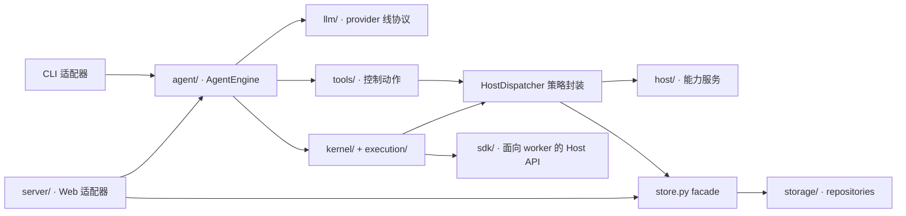

# 代码库地图

OpenAI4S 有意分离面向 provider 的控制平面和科学运行时。变更应从真正持有该行为的模块开始；大型兼容性文件只负责组合与路由。

## 入口

| 入口 | 组合路径 | 运行时作用域 |
|---|---|---|
| `openai4s run "…"` | `cli/main.py` → `agent/loop.py` → `AgentEngine` | 单次进程内运行；Python/R worker 按需启动，并随本次运行关闭 |
| `openai4s serve` | `cli/main.py` → `server/__init__.py` → `server/gateway.py` | 长期运行的 Web 工作台，含持久会话运行时 |
| `python -m openai4s` | `__main__.py` → CLI | 与安装后的 console script 相同的命令 |
| 可选 Jupyter bridge | `adapters/jupyter/` → 既有 kernel manager | 独立 namespace；不接入 Web 会话 Host 或 Artifact |

`server/daemon.py` 是为兼容保留的最小服务器，不是正常 `serve` 命令启动的服务器。

## 职责地图

| 区域 | 持有的行为 | 主要模块 | 必需验证 |
|---|---|---|---|
| Agent 核心 | provider-neutral 状态机、动作优先级、终态语义 | `agent/engine.py`、`agent/actions.py`、`agent/finalize.py`、`agent/ports.py` | `tests/test_agent_engine.py`、`tests/test_actions.py`、structured-finalize 与 provider tool-call 测试 |
| 本地组合 | CLI 生命周期、本地 transcript、lazy kernels | `agent/loop.py`、`agent/runtime.py` | `tests/test_agent.py`、`tests/test_agent_runtime.py`、CLI 测试 |
| 控制工具 | Schema、副作用分类、校验、执行行为 | `tools/`、`tools/registry.py` | 工具 schema、native tool、权限和具体能力测试 |
| Host 策略 | 权限、审批、审计、注入警告、RPC 路由 | `host_dispatch.py`、`permissions.py` | Host 契约、权限、安全和审计测试 |
| Host 能力 | 文件、LLM、completion、Skills、MCP、委派、compute | `host/` | 聚焦的 `test_host_*` 测试集 |
| Worker API | 注入的 `host` facade 和 compute handle | `sdk/` | Host 契约与 SDK 测试 |
| Kernel 协议 | Worker 进程、单 reader 协议、R 通道、生命周期 | `kernel/` | `tests/test_kernel.py`、R、supervisor、sandbox 与 recovery 测试 |
| 执行所有权 | FIFO 准入、精确 owner/lease 取消、watchdog | `execution/`、`server/execution_coordinator.py` | coordinator 与 watchdog 测试 |
| 持久化 | 单一 SQLite owner、schema、repository 组合 | `store.py`、`storage/` | Store 与 repository 测试 |
| Web 工作台 | REST/WS 组合、会话服务、Artifact 捕获 | `server/`、`server/webui/` | Gateway、会话服务、静态契约与浏览器冒烟测试 |
| 平台集成 | 远程计算和沙箱化 worker runtime | `compute/`、`openai4s_compute_provider/`、平台 Skills | compute、capability probe、安全及显式启用的外部测试 |
| Skills | 内置配方、user/project overlay、sidecar bootstrap | `skills/`、`skills_loader/` | Skill discovery、产品表面、版本和 sidecar 测试 |

## 兼容性边界

以下文件是组合 facade，只做小范围手术式修改：

- `server/gateway.py`
- `host_dispatch.py`
- `store.py`
- `sdk/host.py`
- `server/webui/app.js`

它们承载路由、线协议形状、已保存数据库的兼容性和 legacy call site。新算法应放入聚焦的 service、repository 或 Tool class，再向 facade 添加最小的适配改动。

## 新功能应该放在哪里

| 需求 | 所属扩展接缝 |
|---|---|
| 确定性编排或审批边界 | 命名的原生 `Tool` subclass |
| 科学分析或转换 | Python/R Code-as-Action，通常封装为 Skill |
| Python 可调用的审计服务 | 聚焦的 `host/` service 加 SDK facade method |
| 持久领域状态 | 通过 `Store` 组合的 `storage/` repository |
| Web 会话工作流 | 聚焦的 `server/` service 与 Gateway adapter route |
| 新 provider 线协议 | `llm/` normalization 与 provider adapter |
| 远程执行后端 | Compute provider/worker-runtime 边界；不要藏进 engine |

具体实现顺序见[后端扩展指南](../backend-extension-guide.md)。
