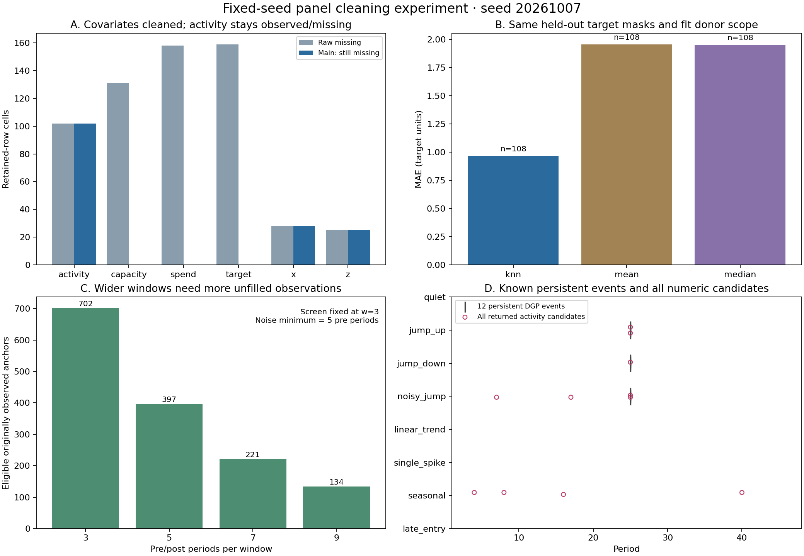

# Random-data Skill test report

[中文说明](REPORT_zh.md)

The fixed-seed `20261007` experiment completes cleaning, encoding, panel
construction, window assessment and visual event exploration. The main run
fills **448 covariate cells** and leaves the outcome unfilled. Its screen
returns **11 numeric candidates: five matching persistent changes and six
unmatched candidates**. Seven other true events lack complete screening
windows. Recovery of all eligible events here is not a general detection rate.

## Data and prespecified design

The [raw input](inputs/raw.csv) contains **1,462 rows and 32 entities**, with
string IDs `001`–`032`. [Complete generated measurements](inputs/truth.csv)
contain 32 × 48 = **1,536 rows**, including generated measurement noise.
Four late entrants account for 32 structurally absent rows before period 9;
42 additional rows were randomly deleted from the other seven scenarios with
prespecified probability 2.5%. Retained records contain **603 masked numeric
cells**. Calendar deletions, structural absence and cell masks are recorded
separately in [generation.json](inputs/generation.json).

| Scenario / entities | Prespecified change | Activity noise SD |
| --- | --- | ---: |
| Quiet / 001–004 | No persistent level change | 0.4 |
| Upward shift / 005–008 | +8 from period 25 | 0.4 |
| Downward shift / 009–012 | −7 from period 25 | 0.4 |
| Noisy shift / 013–016 | +5 from period 25 | 3.0 |
| Linear trend / 017–020 | +0.2 each period | 0.3 |
| Single spike / 021–024 | +8 only at period 25 | 0.4 |
| Seasonal / 025–028 | Sine amplitude 3, period 8 | 0.4 |
| Late entry / 029–032 | Observations from period 9, no persistent level change | 0.4 |

Generation, masking and later category changes use separate random streams.
Cell masks are MCAR in this artificial design; this says nothing about a real
study's missingness mechanism. Complete measurements enter evaluation only
after methods and models are fixed. No seed search or post-result tuning occurs.

## Cleaning, encoding and errors

The actual Skill's `profile_cleaning` reads only **465 rows** from periods
1–16. Fit positions, measurement roles, baseline evidence and decisions are
preserved in [method_decisions.json](results/method_decisions.json). Numeric
statistics, scales and donors stay within entity, with 8–16 fit rows per
entity. Category and vocabulary maps pool that baseline sample across
entities. Later records and truth values do not train the model.

| Variable | Prespecified method / rationale | Fills | Later masked cells | Later MAE | Later RMSE |
| --- | --- | ---: | ---: | ---: | ---: |
| capacity | Mean; stable continuous measurement with approximately symmetric within-entity variation | 131 | 85 | 3.475748 | 4.681962 |
| spend | Median; nonnegative, skewed heavy-tailed measurement | 158 | 110 | 16.109398 | 23.184526 |
| correlated_metric | KNN; meaningful numeric similarity features | 159 | 108 | 0.967829 | 1.451019 |

Errors have different measurement units across variables and cannot rank
methods across these rows. Each fill carries `_imputed_columns`; original
input and observed values remain intact. The main run retains 102 missing
activity cells and 28/25 missing signal_x/signal_z cells. Absent period rows
are not recreated.

KNN uses signal_x and signal_z, entity-specific baseline scaling, five
neighbors and distance weights. Baseline correlations after entity demeaning
are **0.825025/−0.558171**, based on 407/410 paired values. Entity-specific
observed target donor counts range from 6 to 16. All 159 fills use five
neighbors, without fitted-mean fallback; 151 recipients have both features
and eight have one. Of 795 selected neighbor distances, 731 have both common
features and 64 have one, with the Skill's missing-dimension adjustment.

Mean and median comparators use the same target masks, fit rows and
entity-specific donor scope. Truth does not reselect the main method. Results
for the same 108 later target cells are:

| Method | MAE | RMSE | Mean signed error |
| --- | ---: | ---: | ---: |
| KNN | 0.967829 | 1.451019 | 0.121092 |
| Mean | 1.956801 | 2.510993 | 0.135971 |
| Median | 1.952750 | 2.543658 | 0.087503 |

This is consistent with a realization deliberately generated with correlated
predictors; it does not establish KNN superiority for other data. Complete
fit/later/overall errors, mask and fill counts are in
[evaluation.json](results/evaluation.json), with cell-level checks in
[imputation_errors.csv](results/imputation_errors.csv).

Encoding creates **28 columns**: region one-hot, plan's declared
bronze/silver/gold order, nominal channel label codes, and TF-IDF features for
presegmented Chinese/English comments while preserving original text.
Category and text changes starting at period 35 test frozen mappings:
57 unknown region values receive an unknown indicator, and 40 comments contain
120 OOV tokens from three new terms. They do not enter fitted dictionaries.
Encoded columns stay as covariates; the event screen examines only activity.

## Windows, variation and event discovery

The prespecified screen uses three periods before/after, threshold 3, minimum
absolute change 2 and activity noise budget 0.5. Widths 3/5/7/9 are audited.
The change/pre-sample-SD score is a heuristic, not a p-value. Window advice
never changes the configured screen.

| Periods on each side | Complete, unfilled eligible anchors | Entities with eligible anchors |
| --- | ---: | ---: |
| 3 | 702 | 32 |
| 5 | 397 | 30 |
| 7 | 221 | 23 |
| 9 | 134 | 14 |

Three periods are below the five-period noise baseline minimum. Of 702
eligible anchors, 544 receive short-baseline status and 158 trend review.
At the requested anchors, 301 receive advice to consider a longer baseline,
243 remain short, 158 require trend review and 760 fail coverage. Among
eligible width-5 anchors, 266 meet the budget conditional on independent,
stable noise, 90 have high noise and 41 require trend review. Width 9 still
has 34 high-noise, 18 dependence-review and 11 trend-review anchors. Widening
reduces usable data and does not ensure the budget or a better detection score.

The generation registry has **12 persistent events**, all at period 25.
Twelve supplied dates and twelve exposure starts are preserved separately
and excluded from numeric detections. Matching requires the same entity,
activity, change direction and one-to-one dates, evaluated exactly and within
one period:

| Date match | TP | FP | FN | Precision | Recovery of all truth events |
| --- | ---: | ---: | ---: | ---: | ---: |
| Exact | 5 | 6 | 7 | 45.45% | 41.67% |
| ±1 period | 5 | 6 | 7 | 45.45% | 41.67% |

Only five true anchors have complete three-period windows; all five are
recovered: 005, 008, 010, 014 and 015. The other seven have calendar or
activity missingness, which the outcome-fill branch does not turn into
originally observed screening data. Read the **5/5 conditional recovery**
together with the **5/12 unconditional recovery**.

All returned activity candidates by scenario are two upward, one downward,
four noisy and four seasonal; quiet, linear trend, single spike and late entry
have zero. The six unmatched candidates are four seasonal movements and two
noise changes. They require visual review before scientific event interpretation.
Here false positives mean unmatched prescribed persistent level events; the
observed movements themselves are real generated patterns. All candidates
returned after the Skill's internal overlap suppression are retained in
[candidate_events.csv](results/main/candidate_events.csv).

## Outcome-fill comparison and visualization

The [main trajectories](results/main/metric-1.png) and
[filled-outcome comparison](results/filled-outcome/metric-1.png) show eight
prespecified entities: 001, 005, 009, 013, 017, 021, 025 and 029. The other
24 IDs are explicitly listed as excluded in `visualization.json`; coverage
and readiness plots use the whole sample. Selection is independent of
candidates/recovery, so these eight do not represent all correct detections.
All seven PNGs were visually inspected. True events within a scenario share
dates, so some overview markers overlap; exact counts are in the matching table
and complete candidate records.

The comparison additionally fills **102 activity cells** with entity-specific
baseline means. Observed trajectories break at missing or imputed positions,
with hollow diamonds for fills. Post-change fills can fall back to the old
level; later activity MAE is 2.546728 and RMSE 3.993443. Markers exclude these
values from screening: every anchor's eligibility and all 11 candidates are
identical across branches. Covariate cleaning alone also preserves original
activity values, missingness, candidates and window eligibility.

## Verification and scope

All 11 preservation, isolation, JSON model restoration and screening
invariants pass. The independent [verify_experiment.py](verify_experiment.py)
imports no generator or Skill calculation functions. It recalculates fitted
statistics, donor distances/fills, every encoded value, windows and baseline
noise, candidate evidence, truth errors, event matching and file hashes.
**All 298,130 independent checks pass**, followed by a fresh run.
**All 49 deterministic artifacts reproduce byte-for-byte**:
nine CSV, 18 JSON, seven PNG, seven SVG and eight Markdown files. A repeated
output is refused while preserving original files. Full check counts and
verifier identity are in [verification.json](results/verification.json).

The recorded environment uses Python 3.13.9 and matplotlib 3.10.9; generator,
Skill recipe and sidecar hashes are in [environment.json](results/environment.json).
Other environments need not reproduce image bytes. The full offline project
suite reports **11,413 passed and 97 skipped**; all 22 panel replays and
38 harness contracts pass, as do formatting/lint/mypy and directory docs checks.

This is a functional and interpretation-boundary test on one fixed synthetic
realization. It does not include Monte Carlo draws, detection-power calibration,
confidence intervals or DiD causal estimation. Real research still needs
independent event information, a missingness assessment and a design addressing
seasonality, drift and noise.
